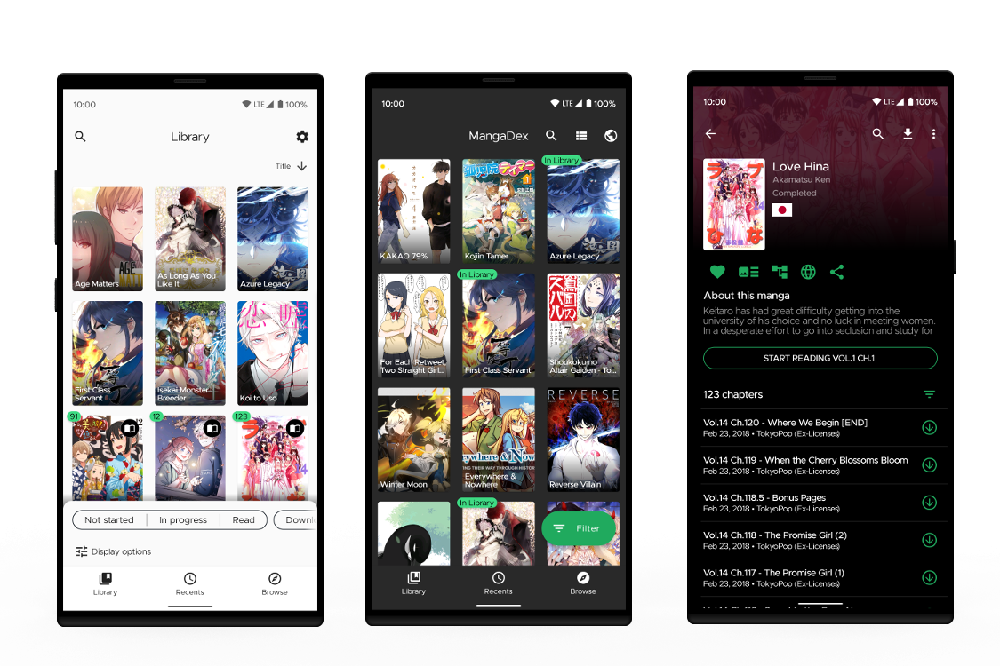

<h1 align="center">
   
  
   
  Neko
   
</h1>

---

A Free, Open source unofficial manga reader for MangaDex and a fork of <a href="https://github.com/inorichi/tachiyomi">Tachiyomi</a>

---

Need info? Check the [Wiki](https://github.com/CarlosEsco/Neko/wiki)
 | or [Create an issue](https://github.com/CarlosEsco/Neko/issues/new/choose)
 | For [Feature Request](https://github.com/CarlosEsco/Neko/issues/new?assignees=&labels=Feature+Request&template=feature_request.md&title=%5BFeature+Request%5D)
 | Check [our project Board](https://github.com/CarlosEsco/Neko/projects/1)
 
 [)](https://github.com/CarlosEsco/Neko/releases)
 
 

---

## Screenshots:

## Goal:
Using Tachiyomi as a base to add MangaDex specific features.

## Features:
* Supports login to MangaDex
* Local reading of downloaded manga
* [MyAnimeList](https://myanimelist.net/), [AniList](https://anilist.co/), [Kitsu](https://kitsu.io/explore/anime) and [Shikimori](https://shikimori.org/) support.
* Schedule updating your library for new chapters.
* Create backups locally to read offline or to your desired cloud service. 

* features compared to standard tachiyomi
Built in login with 2FA support
Different theme
Minor UI changes
- flags for source language in manga info page
- select chapters between option
- all the mangadex statuses
- sort library by date added
- view mdlist follows
- reorder and delete downloads in download queue
-  ability skip chapters that are hidden or read
- manga covers update when a manga info update is triggered
- tri state filter when filtering in library
- ability to lock with biometrics
-  Filter out your library by searching for tags (ex. "Comedy" or "Slice of Life") or exclude mangas by a tag (ex. "-Shounen" or "-Romance"). Tapping on these tags also performs a local search
- range select chapters with select between

## Download
Get the app from our [releases page](https://github.com/CarlosEsco/Neko/releases).

## License

    Copyright 2015 Javier Tomás

    Licensed under the Apache License, Version 2.0 (the "License");
    you may not use this file except in compliance with the License.
    You may obtain a copy of the License at

    http://www.apache.org/licenses/LICENSE-2.0

    Unless required by applicable law or agreed to in writing, software
    distributed under the License is distributed on an "AS IS" BASIS,
    WITHOUT WARRANTIES OR CONDITIONS OF ANY KIND, either express or implied.
    See the License for the specific language governing permissions and
    limitations under the License.
    
    Modifications copyright (C) 2019 Carlos Escobedo

## Disclaimer

The developer of this application does not have any affiliation with the content providers available.
