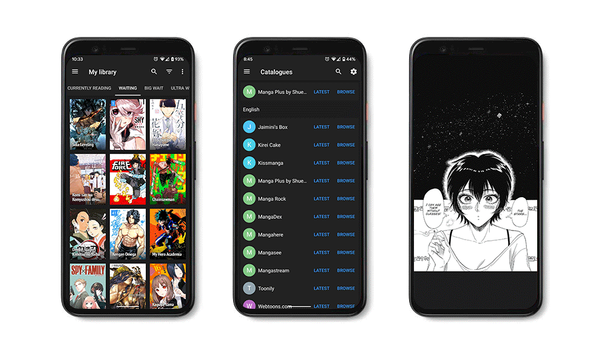

# Tachiyomi
Tachiyomi is a free and open source manga reader for Android.

## Newest Release
[v0.9.2](https://github.com/Jays2Kings/tachiyomi/releases)

## Features

Features of Tachiyomi include:
* Online reading from sources such as KissManga, MangaDex, [and more](https://github.com/inorichi/tachiyomi-extensions)
* Local reading of downloaded manga
* Configurable reader with multiple viewers, reading directions and other settings
* [MyAnimeList](https://myanimelist.net/), [AniList](https://anilist.co/), and [Kitsu](https://kitsu.io/explore/anime) support
* Categories to organize your library
* Light and dark themes
* Schedule updating your library for new chapters
* Create backups locally to read offline or to your desired cloud service 

Plus some new features in this fork such as:
* Android 10 Dark Theme support: You can have Tachiyomi follow the system theme as well as customize which dark theme to use for dark mode
* Android 10 edge to edge support (and a translucent nav bar for older versions): no more small ugly bar for the gesture navigation
* Automatic background based on manga page: For those that like having a white background to match the content, this will automatically set the background to match for moments such as a flashback section of a manga
* [Richer New chapters notifications](https://raw.githubusercontent.com/Jays2Kings/tachiyomi/master/.github/readme-images/new%20notifcations%20collasped.png): Now as a group of notifications, [expanding out to show more information](https://raw.githubusercontent.com/Jays2Kings/tachiyomi/master/.github/readme-images/new%20notifcations.png) about the new chapters (like chapter name and manga cover). Tapping on it will bring you right into the chapter or expand it to mark it as read or view all chapters
* [New material snackbar](https://raw.githubusercontent.com/Jays2Kings/tachiyomi/master/.github/readme-images/material%20snackbar.png): Removing manga now auto deletes chapters and has an undo button in case you change your mind
* Multi Source Migration from library
* Notification separation of updating library and new chapters
* [Share sheets upgrade for Android 10](https://raw.githubusercontent.com/Jays2Kings/tachiyomi/master/.github/readme-images/share%20menu.png)
* Reader seekbar overrides switch app gesture in Android 10, so no more accidents for that
* Option to hide manga titles in grid view
* Filter out your library by searching for tags (ex. "Comedy" or "Slice of Life") or exclude mangas by a tag (ex. "-Shounen" or "-Romance"). Tapping on these tags also performs a local search
* Android X Support (**Becasue of this change needed for Android 10 features, extension preferences are currently disabled**)

## Issues, Feature Requests and Contributing

Please make sure to read the full guidelines. Your issue may be closed without warning if you do not.

Issues

1. **Before reporting a new issue, take a look at the [FAQ](https://github.com/inorichi/tachiyomi/wiki/FAQ), the [changelog](https://github.com/inorichi/tachiyomi/releases) and the already opened [issues](https://github.com/inorichi/tachiyomi/issues).**
2. If you are unsure, ask here: 

Bugs

* Include version (Setting > About > Version)
 * If not latest, try updating, it may have already been solved
 * Dev version is equal to the number of commits as seen in the main page
* Include steps to reproduce (if not obvious from description)
* Include screenshot (if needed)
* If it could be device-dependent, try reproducing on another device (if possible)
* For large logs use http://pastebin.com/ (or similar)
* Don't group unrelated requests into one issue

DO: https://github.com/inorichi/tachiyomi/issues/24 https://github.com/inorichi/tachiyomi/issues/71

DON'T: https://github.com/inorichi/tachiyomi/issues/75

Feature Requests

* Write a detailed issue, explaning what it should do or how. Avoid writing just "like X app does"
* Include screenshot (if needed)

Catalogue requests should be created at https://github.com/inorichi/tachiyomi-extensions, they do not belong in this repository.

## FAQ

[See our website.](https://tachiyomi.org/)
You can also reach out to us on [Discord](https://discord.gg/tachiyomi).

## License

    Copyright 2015 Javier Tomás

    Licensed under the Apache License, Version 2.0 (the "License");
    you may not use this file except in compliance with the License.
    You may obtain a copy of the License at

    http://www.apache.org/licenses/LICENSE-2.0

    Unless required by applicable law or agreed to in writing, software
    distributed under the License is distributed on an "AS IS" BASIS,
    WITHOUT WARRANTIES OR CONDITIONS OF ANY KIND, either express or implied.
    See the License for the specific language governing permissions and
    limitations under the License.

## Disclaimer

The developer of this application does not have any affiliation with the content providers available.
