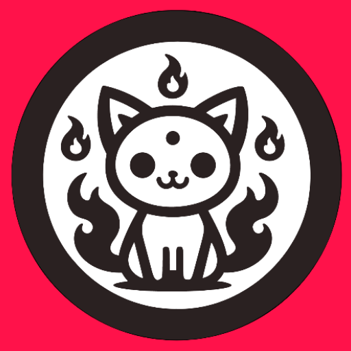

# Neko

A Free, Open source unofficial manga reader for MangaDex

If you got any questions, [join our Discord server](https://discord.gg/4vmK42QuKG).

## Download

## Features include

- [MangaDex](https://mangadex.org/) manga reader for Android 7+
- Offline reading Supports native login to MangaDex
- MDList support
- Tracker support: <a target="_blank" href="https://myanimelist.net/">MyAnimeList</a>, <a target="_blank" href="https://anilist.co/">AniList</a>, <a target="_blank" href="https://kitsu.app/">
  Kitsu</a>, <a target="_blank" href="https://mangaupdates.com">MangaUpdates</a>
- Custom computer generated similar manga recommendations, as well as user recommendations from MyAnimeList, MangaUpdates, AniList
- Syncing manga, and read statuses to and from MangaDex and Neko
- Ability to merge missing chapters from MangaDex with other sources including <a target="_blank" href="https://toonily.com/">Toonily</a>, <a target="_blank" href="https://comick.io/">
  Comick</a>, <a target="_blank" href="https://weebcentral.com/">
  Weeb Central</a>,<a target="_blank" href="https://github.com/Suwayomi/Suwayomi-Server">Suwayomi</a> and <a target="_blank" href="https://komga.org/">Komga</a>
- Plus much more...

## A big thanks to all who have contributed

## Disclaimer

The developer(s) of this application do not have any affiliation with the content providers available, and this application hosts zero content.

## License

<pre>
Copyright 2015 Javier Tomás
Licensed under the Apache License, Version 2.0 (the "License");
you may not use this file except in compliance with the License.
You may obtain a copy of the License at

http://www.apache.org/licenses/LICENSE-2.0

Unless required by applicable law or agreed to in writing, software
distributed under the License is distributed on an "AS IS" BASIS,
WITHOUT WARRANTIES OR CONDITIONS OF ANY KIND, either express or implied.
See the License for the specific language governing permissions and
limitations under the License.

Modifications copyright (C) 2019 NekoMangaOrg
</pre>

