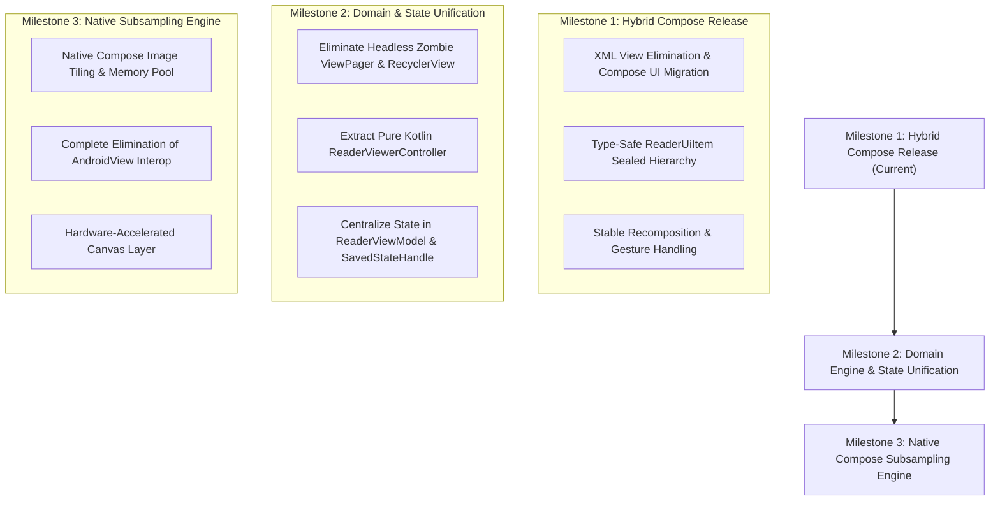

# Compose Reader Migration Roadmap

> **Document Type**: Architecture & Engineering Migration Strategy  
> **Status**: Active (Phase 1 In Progress / Ready for Finalization)  
> **Target**: `compose-reader` → `main`

---

## 🗺️ Migration Overview

The Compose Reader migration transitions Neko's core reading experience from a legacy Android `View`/`ViewBinding` architecture to a modern, declarative Jetpack Compose engine. 

To eliminate regression risks in high-performance image decoding, tile subsampling, and memory management, this migration follows a **3-Milestone Phased Strategy**:

---

## 📍 Phase 1: Hybrid Compose Release (Current Milestone)

### Objective
Replace all legacy XML layouts and UI dialogs with Jetpack Compose while retaining the proven, high-performance `SubsamplingScaleImageView` and page decoding pipeline via Compose `AndroidView` interop.

### Scope & Delivered Features
- [x] **Complete XML UI Elimination**:
  - Replaced `activity_reader.xml`, `reader_chapters_sheet.xml`, `reader_settings_sheet.xml`, `reader_color_filter.xml`, and `reader_nav.xml` with Compose equivalents.
  - Implemented `ReaderAppBar`, `ReaderBottomControls`, `ReaderChaptersSheet`, `ReaderSettingsSheet`, and `GestureNavigationOverlay`.
- [x] **Type-Safe Domain Modeling**:
  - Extracted `ReaderUiItem` sealed interface (`Page`, `SplitPage`, `Transition`) to eliminate untyped `List<Any>` and runtime `Pair<*, *>` casts.
- [x] **Recomposition Stability & Performance**:
  - Stabilized item keys in `HorizontalPager` and `LazyColumn` (removed positional index dependencies).
  - Fixed double initialization and eager loading overlay triggers.
  - Converted touch and overscroll thresholds to density-aware tokens (`Size.huge.toPx()`).
- [x] **High-Performance Touch Interaction**:
  - Optimized Webtoon zoom/pan by reading mutable state within `Modifier.graphicsLayer` to eliminate high-frequency coroutine flooding.
  - Propagated gesture touch consumption in `PagerPageHolder.dispatchTouchEvent`.

### Phase 1 Exit Criteria
- [x] Zero compilation errors with `./gradlew compileStandardDebugKotlin`.
- [x] All Kotlin files formatted with `./gradlew ktfmtFormat`.
- [x] Continuous reading, double-page layouts, Webtoon smooth scrolling, and chapter transitions verified functional.

---

## 📍 Phase 2: Domain Logic Extraction & State Unification (Current Milestone)

### Objective
Decouple page chunking, double-page shifting, and chapter transition math from legacy `android.view.*` classes, eliminating headless "zombie" view hierarchies and centralizing all activity state in `ReaderViewModel`.

### Scope & Delivered Features
- [x] **Dismantle Headless Zombie View Trees**:
  - Deleted invisible instances of `Pager`, `PagerViewerAdapter`, `WebtoonRecyclerView`, `WebtoonLayoutManager`, and `WebtoonAdapter`.
  - Removed `getView(): View` from `BaseViewer`.
  - Decoupled `WebtoonBaseHolder` and `PagerPageHolder` from legacy `RecyclerView.ViewHolder` and `ViewPagerAdapter`.
- [x] **Extract Pure Domain Controllers**:
  - Created `ReaderPagerController` and `ReaderWebtoonController` as pure Kotlin classes responsible solely for page positioning, joined item lists, split pages, and transition calculations.
  - Decoupled controllers from Android View and ViewPager hierarchies with 100% pure unit test coverage.
- [x] **State Hoisting & Process Death Resilience**:
  - Migrated loose `mutableStateOf` fields in `ReaderActivity` (`viewerItems`, `overlayVisible`, `chapterTitle`, `showShiftDoublePage`, sheet visibility states) into `ReaderViewModel.state` (`StateFlow<ReaderUiState>`).
  - Isolated `SavedStateHandle` page index restoration to cold-start initial load.
- [x] **Reactive Download Observation**:
  - Connected `ReaderTransitionPage` to observe `DownloadManager.queueState` reactively using `collectAsStateWithLifecycle()` for real-time download status updates.

### Phase 2 Exit Criteria
- [x] Zero instances of `android.view.View` or `RecyclerView` allocated for navigation logic.
- [x] 100% of reader UI state hoisted into `ReaderViewModel`.
- [x] All Kotlin files formatted with `./gradlew ktfmtFormat` and validated with `./gradlew ktfmtCheck`.

---

## 📍 Phase 3: Pure Native Compose Reader Engine (Delivered Milestone)

### Objective
Eliminate `AndroidView` interop entirely by creating a native Jetpack Compose image tiling, subsampling, and zoom engine powered by Saket's Telephoto library (`me.saket.telephoto:zoomable-image-coil3:0.19.0`).

### Scope & Delivered Features
- [x] **Telephoto Native Subsampling Engine Integration**:
  - Integrated `me.saket.telephoto:zoomable-image-coil3:0.19.0` with Coil 3 image loader pipeline.
  - Added `ReaderPageFetcher` and `ReaderPageSplitFetcher` to feed `ReaderPage.stream` sources directly to Coil and Telephoto.
- [x] **Native Jetpack Compose Page Items**:
  - Replaced legacy `AndroidView` and `PagerPageHolder` with pure Compose `PagerPageItem` using `ZoomableAsyncImage`.
  - Replaced legacy `AndroidView` and `WebtoonPageHolder` with pure Compose `WebtoonPageItem` using `ZoomableAsyncImage`.
  - Implemented stateless Compose `ReaderPageLoadingOverlay` and `ReaderPageErrorOverlay` observing `page.statusFlow` and `page.progressFlow` via `collectAsStateWithLifecycle()`.
- [x] **Extinction of Legacy View Hierarchy**:
  - Safely deleted `PagerPageHolder.kt`, `WebtoonPageHolder.kt`, `ReaderPageImageView.kt`, `ReaderProgressBar.kt`, `GestureDetectorWithLongTap.kt`, and `PagerButton.kt`.
  - Removed `com.github.nekomangaorg:subsampling-scale-image-view` and `com.github.chrisbanes:PhotoView` dependencies.

### Phase 3 Exit Criteria
- [x] 100% pure Compose rendering tree from root activity to leaf image pixels with zero `AndroidView` interop.
- [x] All Kotlin files formatted with `./gradlew ktfmtFormat` and validated with `./gradlew ktfmtCheck`.

---

## 📊 Summary Table of Migration Phases

| Attribute | Phase 1 (Hybrid Release) | Phase 2 (Domain Refactor) | Phase 3 (Pure Native Engine) |
| :--- | :--- | :--- | :--- |
| **UI Components** | Jetpack Compose (100%) | Jetpack Compose (100%) | Jetpack Compose (100%) |
| **Navigation Math** | Legacy View Adapter stubs | Pure Kotlin Controllers | Pure Kotlin Controllers |
| **Image Rendering** | `AndroidView` (`SubsamplingScaleImageView`) | `AndroidView` (`SubsamplingScaleImageView`) | Native Compose Tile Canvas (Telephoto) |
| **State Management** | Hybrid (ViewModel + Activity) | Centralized (`ReaderViewModel`) | Centralized (`ReaderViewModel`) |
| **Status** | **Completed** | **Completed** | **Completed** |
