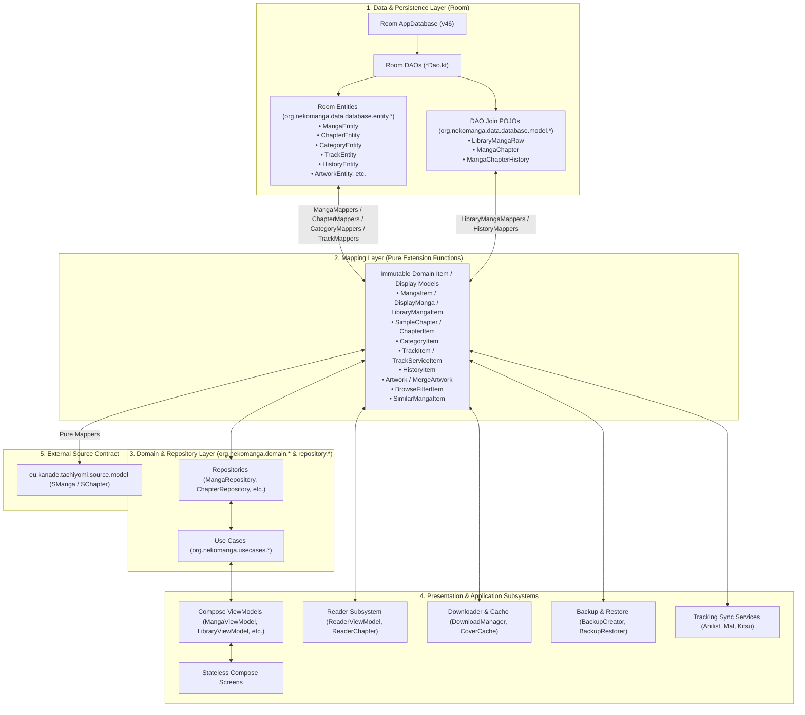

# Architectural Migration Plan: Legacy Database Models to Room Entities & Domain Item Models

## 1. Executive Summary & Objective

The Neko codebase previously operated on legacy Tachiyomi/StorIO-based database models located in `eu.kanade.tachiyomi.data.database.models.*` ([Manga.kt](file:///run/media/nonproto/WD4T/programming/workspace-android/Neko/app/src/main/java/eu/kanade/tachiyomi/data/database/models/Manga.kt), [Chapter.kt](file:///run/media/nonproto/WD4T/programming/workspace-android/Neko/app/src/main/java/eu/kanade/tachiyomi/data/database/models/Chapter.kt), [Category.kt](file:///run/media/nonproto/WD4T/programming/workspace-android/Neko/app/src/main/java/eu/kanade/tachiyomi/data/database/models/Category.kt), [Track.kt](file:///run/media/nonproto/WD4T/programming/workspace-android/Neko/app/src/main/java/eu/kanade/tachiyomi/data/database/models/Track.kt), etc.).

Under this updated architecture, **Room entities (`org.nekomanga.data.database.entity.*`) will map directly to domain Item/Display models (`org.nekomanga.domain.*`)** such as [`MangaItem`](file:///run/media/nonproto/WD4T/programming/workspace-android/Neko/app/src/main/java/org/nekomanga/domain/manga/MangaItem.kt), [`DisplayManga`](file:///run/media/nonproto/WD4T/programming/workspace-android/Neko/app/src/main/java/org/nekomanga/domain/manga/Manga.kt), [`LibraryMangaItem`](file:///run/media/nonproto/WD4T/programming/workspace-android/Neko/app/src/main/java/org/nekomanga/domain/manga/Manga.kt), [`SimpleChapter`](file:///run/media/nonproto/WD4T/programming/workspace-android/Neko/app/src/main/java/org/nekomanga/domain/chapter/Chapter.kt) / [`ChapterItem`](file:///run/media/nonproto/WD4T/programming/workspace-android/Neko/app/src/main/java/org/nekomanga/domain/chapter/Chapter.kt), [`CategoryItem`](file:///run/media/nonproto/WD4T/programming/workspace-android/Neko/app/src/main/java/org/nekomanga/domain/category/CategoryItem.kt), [`TrackItem`](file:///run/media/nonproto/WD4T/programming/workspace-android/Neko/app/src/main/java/org/nekomanga/domain/track/Track.kt), and [`Artwork`](file:///run/media/nonproto/WD4T/programming/workspace-android/Neko/app/src/main/java/org/nekomanga/domain/manga/Manga.kt).

### Core Goals:
1. **Total Eradication of Legacy Package**: Delete all **23 legacy files** in `app/src/main/java/eu/kanade/tachiyomi/data/database/models/`.
2. **Entity-to-Item Mapping Contract**: Room DAOs emit Room Entities $\rightarrow$ Data Mappers convert Entities to Domain Items $\rightarrow$ Repositories expose Domain Items to Use Cases, ViewModels, Services, and UI.
3. **Immutability & Compose Recomposition Stability**: All domain models are immutable Kotlin `data class`es with `val` properties and `@Immutable` annotations, eliminating mutable `var` state leaks.
4. **Decoupled Source Models**: `SManga` and `SChapter` interfaces are decoupled from database persistence via explicit pure mappers.

---

## 2. Architecture: End-to-End Layer Flow



---

## 3. Comprehensive Entity-to-Domain Item Mapping Inventory

The table below specifies the direct mapping from Room entities to Domain Item models, replacing each of the **23 legacy files**:

| # | Legacy Model File | Room Entity / DAO POJO | Target Domain Item / Display Model | Direct Mapper Functions |
|---|---|---|---|---|
| 1 | [Manga.kt](file:///run/media/nonproto/WD4T/programming/workspace-android/Neko/app/src/main/java/eu/kanade/tachiyomi/data/database/models/Manga.kt), [MangaImpl.kt](file:///run/media/nonproto/WD4T/programming/workspace-android/Neko/app/src/main/java/eu/kanade/tachiyomi/data/database/models/MangaImpl.kt) | [`MangaEntity`](file:///run/media/nonproto/WD4T/programming/workspace-android/Neko/app/src/main/java/org/nekomanga/data/database/entity/MangaEntity.kt) | [`MangaItem`](file:///run/media/nonproto/WD4T/programming/workspace-android/Neko/app/src/main/java/org/nekomanga/domain/manga/MangaItem.kt), [`DisplayManga`](file:///run/media/nonproto/WD4T/programming/workspace-android/Neko/app/src/main/java/org/nekomanga/domain/manga/Manga.kt), [`SimpleManga`](file:///run/media/nonproto/WD4T/programming/workspace-android/Neko/app/src/main/java/org/nekomanga/domain/manga/Manga.kt) | `MangaEntity.toMangaItem(): MangaItem`<br>`MangaItem.toEntity(): MangaEntity`<br>`MangaEntity.toDisplayManga(): DisplayManga` |
| 2 | [LibraryManga.kt](file:///run/media/nonproto/WD4T/programming/workspace-android/Neko/app/src/main/java/eu/kanade/tachiyomi/data/database/models/LibraryManga.kt) | [`LibraryMangaRaw`](file:///run/media/nonproto/WD4T/programming/workspace-android/Neko/app/src/main/java/org/nekomanga/data/database/model/LibraryMangaRaw.kt) | [`LibraryMangaItem`](file:///run/media/nonproto/WD4T/programming/workspace-android/Neko/app/src/main/java/org/nekomanga/domain/manga/Manga.kt) | `LibraryMangaRaw.toLibraryMangaItem(...): LibraryMangaItem` |
| 3 | [Chapter.kt](file:///run/media/nonproto/WD4T/programming/workspace-android/Neko/app/src/main/java/eu/kanade/tachiyomi/data/database/models/Chapter.kt), [ChapterImpl.kt](file:///run/media/nonproto/WD4T/programming/workspace-android/Neko/app/src/main/java/eu/kanade/tachiyomi/data/database/models/ChapterImpl.kt) | [`ChapterEntity`](file:///run/media/nonproto/WD4T/programming/workspace-android/Neko/app/src/main/java/org/nekomanga/data/database/entity/ChapterEntity.kt) | [`SimpleChapter`](file:///run/media/nonproto/WD4T/programming/workspace-android/Neko/app/src/main/java/org/nekomanga/domain/chapter/Chapter.kt), [`ChapterItem`](file:///run/media/nonproto/WD4T/programming/workspace-android/Neko/app/src/main/java/org/nekomanga/domain/chapter/Chapter.kt) | `ChapterEntity.toSimpleChapter(): SimpleChapter`<br>`SimpleChapter.toEntity(): ChapterEntity`<br>`SimpleChapter.toChapterItem(): ChapterItem` |
| 4 | [Category.kt](file:///run/media/nonproto/WD4T/programming/workspace-android/Neko/app/src/main/java/eu/kanade/tachiyomi/data/database/models/Category.kt), [CategoryImpl.kt](file:///run/media/nonproto/WD4T/programming/workspace-android/Neko/app/src/main/java/eu/kanade/tachiyomi/data/database/models/CategoryImpl.kt) | [`CategoryEntity`](file:///run/media/nonproto/WD4T/programming/workspace-android/Neko/app/src/main/java/org/nekomanga/data/database/entity/CategoryEntity.kt) | [`CategoryItem`](file:///run/media/nonproto/WD4T/programming/workspace-android/Neko/app/src/main/java/org/nekomanga/domain/category/CategoryItem.kt) | `CategoryEntity.toCategoryItem(): CategoryItem`<br>`CategoryItem.toEntity(): CategoryEntity` |
| 5 | [Track.kt](file:///run/media/nonproto/WD4T/programming/workspace-android/Neko/app/src/main/java/eu/kanade/tachiyomi/data/database/models/Track.kt), [TrackImpl.kt](file:///run/media/nonproto/WD4T/programming/workspace-android/Neko/app/src/main/java/eu/kanade/tachiyomi/data/database/models/TrackImpl.kt) | [`TrackEntity`](file:///run/media/nonproto/WD4T/programming/workspace-android/Neko/app/src/main/java/org/nekomanga/data/database/entity/TrackEntity.kt) | [`TrackItem`](file:///run/media/nonproto/WD4T/programming/workspace-android/Neko/app/src/main/java/org/nekomanga/domain/track/Track.kt), [`TrackSearchItem`](file:///run/media/nonproto/WD4T/programming/workspace-android/Neko/app/src/main/java/org/nekomanga/domain/track/Track.kt), [`TrackServiceItem`](file:///run/media/nonproto/WD4T/programming/workspace-android/Neko/app/src/main/java/org/nekomanga/domain/track/Track.kt) | `TrackEntity.toTrackItem(): TrackItem`<br>`TrackItem.toEntity(): TrackEntity` |
| 6 | [History.kt](file:///run/media/nonproto/WD4T/programming/workspace-android/Neko/app/src/main/java/eu/kanade/tachiyomi/data/database/models/History.kt), [HistoryImpl.kt](file:///run/media/nonproto/WD4T/programming/workspace-android/Neko/app/src/main/java/eu/kanade/tachiyomi/data/database/models/HistoryImpl.kt) | [`HistoryEntity`](file:///run/media/nonproto/WD4T/programming/workspace-android/Neko/app/src/main/java/org/nekomanga/data/database/entity/HistoryEntity.kt) | `org.nekomanga.domain.history.HistoryItem` | `HistoryEntity.toHistoryItem(): HistoryItem`<br>`HistoryItem.toEntity(): HistoryEntity` |
| 7 | [ArtworkImpl.kt](file:///run/media/nonproto/WD4T/programming/workspace-android/Neko/app/src/main/java/eu/kanade/tachiyomi/data/database/models/ArtworkImpl.kt) | [`ArtworkEntity`](file:///run/media/nonproto/WD4T/programming/workspace-android/Neko/app/src/main/java/org/nekomanga/data/database/entity/ArtworkEntity.kt) | [`Artwork`](file:///run/media/nonproto/WD4T/programming/workspace-android/Neko/app/src/main/java/org/nekomanga/domain/manga/Manga.kt), `SourceArtwork` | `ArtworkEntity.toArtwork(): Artwork`<br>`Artwork.toEntity(): ArtworkEntity` |
| 8 | [BrowseFilterImpl.kt](file:///run/media/nonproto/WD4T/programming/workspace-android/Neko/app/src/main/java/eu/kanade/tachiyomi/data/database/models/BrowseFilterImpl.kt) | [`BrowseFilterEntity`](file:///run/media/nonproto/WD4T/programming/workspace-android/Neko/app/src/main/java/org/nekomanga/data/database/entity/BrowseFilterEntity.kt) | `org.nekomanga.domain.filter.BrowseFilterItem` | `BrowseFilterEntity.toBrowseFilterItem(): BrowseFilterItem`<br>`BrowseFilterItem.toEntity(): BrowseFilterEntity` |
| 9 | [MergeMangaImpl.kt](file:///run/media/nonproto/WD4T/programming/workspace-android/Neko/app/src/main/java/eu/kanade/tachiyomi/data/database/models/MergeMangaImpl.kt) | [`MergeMangaEntity`](file:///run/media/nonproto/WD4T/programming/workspace-android/Neko/app/src/main/java/org/nekomanga/data/database/entity/MergeMangaEntity.kt) | `org.nekomanga.domain.manga.MergeMangaItem`, [`MergeArtwork`](file:///run/media/nonproto/WD4T/programming/workspace-android/Neko/app/src/main/java/org/nekomanga/domain/manga/Manga.kt), `MergeType` | `MergeMangaEntity.toMergeMangaItem(): MergeMangaItem`<br>`MergeMangaItem.toEntity(): MergeMangaEntity` |
| 10 | [MangaSimilar.kt](file:///run/media/nonproto/WD4T/programming/workspace-android/Neko/app/src/main/java/eu/kanade/tachiyomi/data/database/models/MangaSimilar.kt), [MangaSimilarImpl.kt](file:///run/media/nonproto/WD4T/programming/workspace-android/Neko/app/src/main/java/eu/kanade/tachiyomi/data/database/models/MangaSimilarImpl.kt) | [`MangaSimilarEntity`](file:///run/media/nonproto/WD4T/programming/workspace-android/Neko/app/src/main/java/org/nekomanga/data/database/entity/MangaSimilarEntity.kt) | `org.nekomanga.domain.similar.SimilarMangaItem` | `MangaSimilarEntity.toSimilarMangaItem(): SimilarMangaItem`<br>`SimilarMangaItem.toEntity(): MangaSimilarEntity` |
| 11 | [ScanlatorGroupImpl.kt](file:///run/media/nonproto/WD4T/programming/workspace-android/Neko/app/src/main/java/eu/kanade/tachiyomi/data/database/models/ScanlatorGroupImpl.kt) | [`ScanlatorGroupEntity`](file:///run/media/nonproto/WD4T/programming/workspace-android/Neko/app/src/main/java/org/nekomanga/data/database/entity/ScanlatorGroupEntity.kt) | `org.nekomanga.domain.scanlator.ScanlatorGroup` | `ScanlatorGroupEntity.toScanlatorGroup(): ScanlatorGroup`<br>`ScanlatorGroup.toEntity(): ScanlatorGroupEntity` |
| 12 | [UploaderImpl.kt](file:///run/media/nonproto/WD4T/programming/workspace-android/Neko/app/src/main/java/eu/kanade/tachiyomi/data/database/models/UploaderImpl.kt) | [`UploaderEntity`](file:///run/media/nonproto/WD4T/programming/workspace-android/Neko/app/src/main/java/org/nekomanga/data/database/entity/UploaderEntity.kt) | `org.nekomanga.domain.uploader.Uploader` | `UploaderEntity.toUploader(): Uploader`<br>`Uploader.toEntity(): UploaderEntity` |
| 13 | [MangaAggregate.kt](file:///run/media/nonproto/WD4T/programming/workspace-android/Neko/app/src/main/java/eu/kanade/tachiyomi/data/database/models/MangaAggregate.kt) | [`MangaAggregateEntity`](file:///run/media/nonproto/WD4T/programming/workspace-android/Neko/app/src/main/java/org/nekomanga/data/database/entity/MangaAggregateEntity.kt) | `org.nekomanga.domain.manga.MangaAggregateItem` | `MangaAggregateEntity.toAggregateItem(): MangaAggregateItem`<br>`MangaAggregateItem.toEntity(): MangaAggregateEntity` |
| 14 | [MangaCategory.kt](file:///run/media/nonproto/WD4T/programming/workspace-android/Neko/app/src/main/java/eu/kanade/tachiyomi/data/database/models/MangaCategory.kt) | [`MangaCategoryEntity`](file:///run/media/nonproto/WD4T/programming/workspace-android/Neko/app/src/main/java/org/nekomanga/data/database/entity/MangaCategoryEntity.kt) | Handled directly via `categoryId` & `mangaId` pairings in `CategoryRepository` | Replaced |
| 15 | [MangaChapter.kt](file:///run/media/nonproto/WD4T/programming/workspace-android/Neko/app/src/main/java/eu/kanade/tachiyomi/data/database/models/MangaChapter.kt) | [`MangaChapter`](file:///run/media/nonproto/WD4T/programming/workspace-android/Neko/app/src/main/java/org/nekomanga/data/database/model/MangaChapter.kt) | Pair/Tuple of (`DisplayManga`, `SimpleChapter`) | `MangaChapter.toDisplayPair()` |
| 16 | [MangaChapterHistory.kt](file:///run/media/nonproto/WD4T/programming/workspace-android/Neko/app/src/main/java/eu/kanade/tachiyomi/data/database/models/MangaChapterHistory.kt) | [`MangaChapterHistory`](file:///run/media/nonproto/WD4T/programming/workspace-android/Neko/app/src/main/java/org/nekomanga/data/database/model/MangaChapterHistory.kt) | `org.nekomanga.domain.history.HistoryItem` | `MangaChapterHistory.toHistoryItem(): HistoryItem` |
| 17 | [SearchMetadata.kt](file:///run/media/nonproto/WD4T/programming/workspace-android/Neko/app/src/main/java/eu/kanade/tachiyomi/data/database/models/SearchMetadata.kt) | None | None | **Dead code** (0 references). Delete directly. |

---

## 4. Detailed Repository Boundary Signatures

With the elimination of legacy models and the adoption of Domain Item return types, the repository interfaces in `org.nekomanga.data.database.repository.*` will have the following clean API contracts:

### 4.1 `MangaRepository`
```kotlin
package org.nekomanga.data.database.repository

import kotlinx.coroutines.flow.Flow
import org.nekomanga.domain.manga.DisplayManga
import org.nekomanga.domain.manga.LibraryMangaItem
import org.nekomanga.domain.manga.MangaItem

interface MangaRepository {
    // --- Library Queries (Mapped from LibraryMangaRaw) ---
    fun observeLibrary(): Flow<List<LibraryMangaItem>>
    suspend fun getLibraryList(): List<LibraryMangaItem>

    // --- Standard Queries (Mapped from MangaEntity) ---
    fun observeMangaList(): Flow<List<MangaItem>>
    suspend fun getMangaList(): List<MangaItem>
    fun observeFavoriteMangaList(): Flow<List<MangaItem>>
    suspend fun getFavoriteMangaList(): List<MangaItem>
    suspend fun getMangaByIds(ids: List<Long>): List<MangaItem>
    suspend fun getMangaByUrls(urls: List<String>): List<MangaItem>
    suspend fun getMangaByUrl(url: String): MangaItem?
    suspend fun getMangaById(id: Long): MangaItem?
    fun observeMangaById(id: Long): Flow<MangaItem?>

    // --- Complex / Aggregate Queries ---
    fun observeReadNotInLibraryManga(): Flow<List<DisplayManga>>
    suspend fun getReadNotInLibraryManga(): List<DisplayManga>
    fun observeLastReadManga(): Flow<List<DisplayManga>>
    fun observeLastFetchedManga(): Flow<List<DisplayManga>>
    fun observeTotalChapterManga(): Flow<List<DisplayManga>>

    // --- Write Operations ---
    suspend fun insertManga(mangaItem: MangaItem): Long
    suspend fun insertMangaList(mangaItems: List<MangaItem>): List<Long>
    suspend fun updateManga(mangaItem: MangaItem)
    suspend fun updateMangaList(mangaItems: List<MangaItem>)
    suspend fun deleteManga(mangaId: Long)
    suspend fun deleteMangaList(mangaIds: List<Long>)
    suspend fun deleteAllNotInLibrary()
    suspend fun deleteAllNotInLibraryAndNotRead()
    suspend fun deleteAllManga()

    // --- Partial Column Updates ---
    suspend fun updateFavorite(mangaId: Long, isFavorite: Boolean)
    suspend fun updateDateAdded(mangaId: Long, dateAdded: Long)
    suspend fun updateViewerFlags(mangaId: Long, flags: Int)
    suspend fun updateChapterFlags(mangaId: Long, flags: Int)
    suspend fun updateMangaInfo(mangaId: Long, title: String, genre: String?, author: String?, artist: String?, status: Int, description: String?)
    suspend fun updateLastUpdated(mangaId: Long, lastUpdate: Long)
    suspend fun updateNextUpdated(mangaId: Long, nextUpdate: Long)
    suspend fun updateScanlatorFilter(mangaId: Long, scanlatorFilter: String?)
    suspend fun updateLanguageFilter(mangaId: Long, languageFilter: String?)
}
```

### 4.2 `ChapterRepository`
```kotlin
package org.nekomanga.data.database.repository

import kotlinx.coroutines.flow.Flow
import org.nekomanga.domain.chapter.SimpleChapter
import org.nekomanga.domain.manga.DisplayManga

interface ChapterRepository {
    fun observeChaptersForManga(mangaId: Long): Flow<List<SimpleChapter>>
    suspend fun getChaptersForManga(mangaId: Long): List<SimpleChapter>
    suspend fun getChaptersForMangaIds(mangaIds: List<Long>): List<SimpleChapter>
    suspend fun getChapterById(id: Long): SimpleChapter?
    suspend fun getChapterByUrl(url: String): SimpleChapter?
    suspend fun getChapterByUrlAndMangaId(url: String, mangaId: Long): SimpleChapter?

    suspend fun insertChapter(chapter: SimpleChapter): Long
    suspend fun insertChapters(chapters: List<SimpleChapter>): List<Long>
    suspend fun updateChapters(chapters: List<SimpleChapter>)
    suspend fun deleteChapter(chapterId: Long)
    suspend fun deleteChapters(chapterIds: List<Long>)

    suspend fun updateProgress(id: Long, read: Boolean, bookmark: Boolean, lastPage: Int, pagesLeft: Int)
    suspend fun updateSourceOrder(chapterId: String, mangaId: Long, order: Int)

    fun observeRecentChapters(search: String, limit: Int, offset: Int, sortByFetched: Boolean): Flow<List<Pair<DisplayManga, SimpleChapter>>>
    suspend fun getRecentChapters(search: String, limit: Int, offset: Int, sortByFetched: Boolean): List<Pair<DisplayManga, SimpleChapter>>

    // Batch Updates
    suspend fun updateChaptersBackup(chapters: List<SimpleChapter>)
    suspend fun updateKnownChaptersBackup(chapters: List<SimpleChapter>)
    suspend fun updateChaptersProgress(chapters: List<SimpleChapter>)
    suspend fun fixChaptersSourceOrder(chapters: List<SimpleChapter>)
}
```

### 4.3 `CategoryRepository`
```kotlin
package org.nekomanga.data.database.repository

import kotlinx.coroutines.flow.Flow
import org.nekomanga.domain.category.CategoryItem

interface CategoryRepository {
    fun observeCategories(): Flow<List<CategoryItem>>
    suspend fun getCategories(): List<CategoryItem>
    suspend fun getCategoryById(id: Int): CategoryItem?
    fun observeCategoriesForManga(mangaId: Long): Flow<List<CategoryItem>>
    suspend fun getCategoriesForManga(mangaId: Long): List<CategoryItem>

    suspend fun insertCategory(category: CategoryItem): Int
    suspend fun insertCategories(categories: List<CategoryItem>)
    suspend fun deleteCategory(categoryId: Int)
    suspend fun deleteCategories(categoryIds: List<Int>)

    suspend fun getCategoryIdsForManga(mangaId: Long): List<Int>
    suspend fun getMangaIdsForCategory(categoryId: Int): List<Long>
    suspend fun setMangaCategories(categoryIds: List<Int>, mangaIds: List<Long>)
}
```

### 4.4 `TrackRepository`
```kotlin
package org.nekomanga.data.database.repository

import kotlinx.coroutines.flow.Flow
import org.nekomanga.domain.track.TrackItem

interface TrackRepository {
    suspend fun getTrackById(id: Long): TrackItem?
    fun observeTracksForManga(mangaId: Long): Flow<List<TrackItem>>
    suspend fun getTracksForManga(mangaId: Long): List<TrackItem>
    suspend fun getTracksForMangaByIds(mangaIds: List<Long>): List<TrackItem>
    fun observeAllTracks(): Flow<List<TrackItem>>
    suspend fun getAllTracks(): List<TrackItem>
    suspend fun getTrackByMangaIdAndTrackServiceId(mangaId: Long, trackServiceId: Int): TrackItem?

    suspend fun insertTrack(track: TrackItem): Long
    suspend fun insertTracks(tracks: List<TrackItem>)
    suspend fun deleteTrack(trackId: Long)
    suspend fun deleteTrackByMangaIdAndTrackServiceId(mangaId: Long, trackServiceId: Int)
    suspend fun deleteAllTracks()
}
```

---

## 5. Subsystem Migration Specifications

### 5.1 Presentation Layer & ViewModels
- [`LibraryViewModel`](file:///run/media/nonproto/WD4T/programming/workspace-android/Neko/app/src/main/java/org/nekomanga/presentation/screens/library/LibraryViewModel.kt): `libraryRepository.observeLibrary()` already yields `Flow<List<LibraryMangaItem>>`. Eliminates redundant `dbMangaList.map { it.toLibraryMangaItem() }` passes.
- [`MangaViewModel`](file:///run/media/nonproto/WD4T/programming/workspace-android/Neko/app/src/main/java/eu/kanade/tachiyomi/ui/manga/MangaViewModel.kt): Operates exclusively on [`MangaItem`](file:///run/media/nonproto/WD4T/programming/workspace-android/Neko/app/src/main/java/org/nekomanga/domain/manga/MangaItem.kt), [`SimpleChapter`](file:///run/media/nonproto/WD4T/programming/workspace-android/Neko/app/src/main/java/org/nekomanga/domain/chapter/Chapter.kt), and [`TrackItem`](file:///run/media/nonproto/WD4T/programming/workspace-android/Neko/app/src/main/java/org/nekomanga/domain/track/Track.kt).
- [`BrowseViewModel`](file:///run/media/nonproto/WD4T/programming/workspace-android/Neko/app/src/main/java/eu/kanade/tachiyomi/ui/source/browse/BrowseViewModel.kt): Uses `BrowseFilterItem` and `DisplayManga`.

### 5.2 Reader Subsystem
- [`ReaderChapter`](file:///run/media/nonproto/WD4T/programming/workspace-android/Neko/app/src/main/java/eu/kanade/tachiyomi/ui/reader/model/ReaderChapter.kt): Wrapped around [`SimpleChapter`](file:///run/media/nonproto/WD4T/programming/workspace-android/Neko/app/src/main/java/org/nekomanga/domain/chapter/Chapter.kt).
- [`ReaderViewModel`](file:///run/media/nonproto/WD4T/programming/workspace-android/Neko/app/src/main/java/eu/kanade/tachiyomi/ui/reader/ReaderViewModel.kt): Receives `mangaId` and `chapterId`, fetches `MangaItem` and `SimpleChapter`, and emits reading updates via `chapterRepository.updateProgress(...)`.

### 5.3 Downloader & Cache
- [`DownloadManager`](file:///run/media/nonproto/WD4T/programming/workspace-android/Neko/app/src/main/java/eu/kanade/tachiyomi/data/download/DownloadManager.kt) & [`Downloader`](file:///run/media/nonproto/WD4T/programming/workspace-android/Neko/app/src/main/java/eu/kanade/tachiyomi/data/download/Downloader.kt): `Download` model holds `manga: MangaItem` and `chapter: SimpleChapter`.
- [`CoverCache`](file:///run/media/nonproto/WD4T/programming/workspace-android/Neko/app/src/main/java/eu/kanade/tachiyomi/data/cache/CoverCache.kt): Caching keyed by `manga.id` / `Artwork`.

### 5.4 Backup & Serialization
- [`BackupManga`](file:///run/media/nonproto/WD4T/programming/workspace-android/Neko/app/src/main/java/eu/kanade/tachiyomi/data/backup/models/BackupManga.kt), [`BackupChapter`](file:///run/media/nonproto/WD4T/programming/workspace-android/Neko/app/src/main/java/eu/kanade/tachiyomi/data/backup/models/BackupChapter.kt), [`BackupCategory`](file:///run/media/nonproto/WD4T/programming/workspace-android/Neko/app/src/main/java/eu/kanade/tachiyomi/data/backup/models/BackupCategory.kt), [`BackupTracking`](file:///run/media/nonproto/WD4T/programming/workspace-android/Neko/app/src/main/java/eu/kanade/tachiyomi/data/backup/models/BackupTracking.kt):
  - Serialization converts `MangaItem` $\rightarrow$ `BackupManga`, `SimpleChapter` $\rightarrow$ `BackupChapter`, `CategoryItem` $\rightarrow$ `BackupCategory`, `TrackItem` $\rightarrow$ `BackupTracking`.
  - Deserialization restores directly to `MangaEntity`, `ChapterEntity`, `CategoryEntity`, `TrackEntity` for batch insertion into Room.

### 5.5 Tracking System
- [`TrackService`](file:///run/media/nonproto/WD4T/programming/workspace-android/Neko/app/src/main/java/eu/kanade/tachiyomi/data/track/TrackService.kt): All tracker implementations ([`Anilist`](file:///run/media/nonproto/WD4T/programming/workspace-android/Neko/app/src/main/java/eu/kanade/tachiyomi/data/track/anilist/Anilist.kt), `Mal`, `Kitsu`, `MangaUpdates`) accept and return [`TrackItem`](file:///run/media/nonproto/WD4T/programming/workspace-android/Neko/app/src/main/java/org/nekomanga/domain/track/Track.kt) and `TrackSearchItem`.

---

## 6. Phased Implementation Roadmap

```mermaid
gantt
    title Detailed Phased Roadmap
    dateFormat  X
    axisFormat  Phase %s
    section Phase 1: Leaf Entities & Enums
    Delete SearchMetadata.kt & Extract Enums (MergeType, SourceArtwork) :active, p1_1, 0, 1
    Migrate BrowseFilter, MangaAggregate, Similar, Scanlator, Uploader :active, p1_2, 1, 2
    section Phase 2: Relational Items
    Migrate Artwork & MergeManga to Domain Items :p2_1, 2, 3
    Migrate CategoryItem & MangaCategory to CategoryEntity :p2_2, 3, 4
    Migrate HistoryItem & TrackItem :p2_3, 4, 5
    section Phase 3: Core Manga & Chapter
    Decouple SManga / SChapter Contracts :p3_1, 5, 6
    Migrate SimpleChapter & ChapterItem (Repo, Reader, Downloader) :p3_2, 6, 7
    Migrate MangaItem, DisplayManga & LibraryMangaItem (Repo, Library, Backups) :p3_3, 7, 8
    section Phase 4: Cleanup & Validation
    Delete eu.kanade.tachiyomi.data.database.models Package :p4_1, 8, 9
    Update MockK Unit Test Fixtures & Run Full Suite :p4_2, 9, 10
```



---

## 7. Verification Checklist

- [ ] All 23 files in `eu/kanade/tachiyomi/data/database/models/` removed.
- [ ] No references to `eu.kanade.tachiyomi.data.database.models.*` remaining in production or test code.
- [ ] All repositories in `org.nekomanga.data.database.repository` return domain `*Item` / `Display*` models.
- [ ] Zero changes to Room Database schema hash (Database v46 integrity preserved).
- [ ] Backups create and restore cleanly with 100% backward compatibility.
- [ ] Reader page loading, chapter transition, and reading progress updates operate correctly.
- [ ] Library display, filtering, category reordering, and batch operations function smoothly.
- [ ] Unit tests pass (`./gradlew testDebugUnitTest`).
- [ ] Repo passes code formatting checks (`./gradlew ktfmtCheck`).
