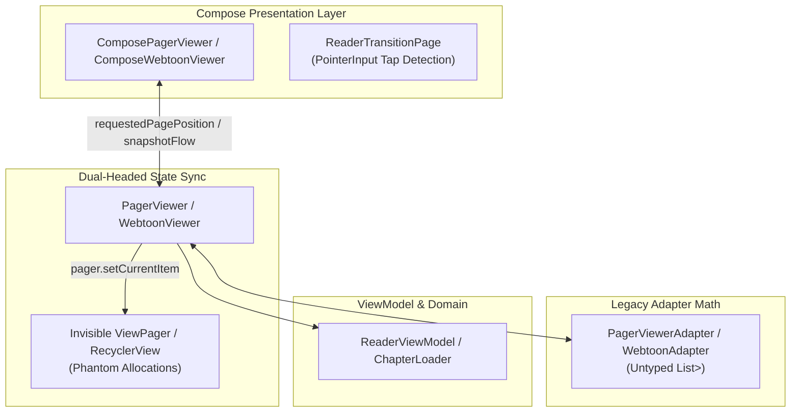
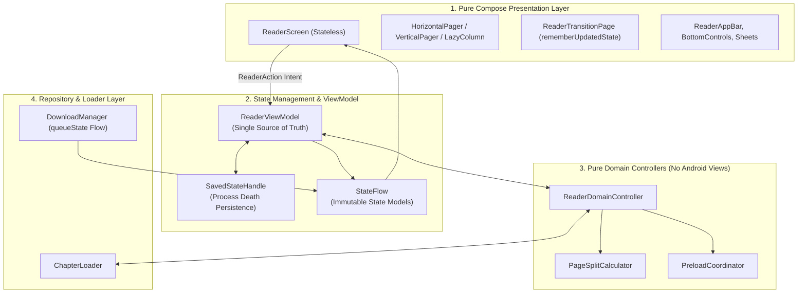
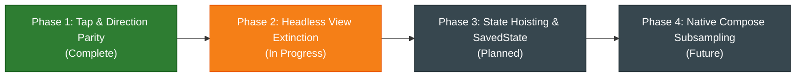

# Architectural Migration Plan: Reader Navigation & Domain Controller Decoupling

> **Document Type**: Architecture & Engineering Migration Specification  
> **Status**: Active / In Progress  
> **Target Path**: `docs/migrations/reader_domain_controller_migration_plan.md`  
> **Target Milestone**: Pure Compose Reader Architecture & Domain Controller Decoupling  

---

## 1. Executive Summary & Objective

Neko's reader subsystem has undergone a major modernization, moving from legacy XML-based `Activity`/`Fragment` layouts to a declarative **Jetpack Compose** presentation layer. 

While the presentation layer now renders using Compose [`HorizontalPager`](file:///run/media/nonproto/WD4T/programming/workspace-android/Neko/app/src/main/java/org/nekomanga/presentation/screens/reader/viewer/ComposePagerViewer.kt), [`VerticalPager`](file:///run/media/nonproto/WD4T/programming/workspace-android/Neko/app/src/main/java/org/nekomanga/presentation/screens/reader/viewer/ComposePagerViewer.kt), and [`LazyColumn`](file:///run/media/nonproto/WD4T/programming/workspace-android/Neko/app/src/main/java/org/nekomanga/presentation/screens/reader/viewer/ComposeWebtoonViewer.kt), remnants of the legacy Tachiyomi `ViewPager` and `RecyclerView` infrastructure remain beneath the surface. This creates a "dual-headed" pagination model where navigation state and chapter transitions are computed in legacy adapters (`PagerViewerAdapter`, `WebtoonAdapter`) while being observed and displayed in Compose.

### Core Objectives
1. **Extinguish Headless View Artifacts**: Eliminate phantom allocations of legacy Android `ViewPager` and `RecyclerView` instances that execute redundant layout and scroll passes behind invisible flags.
2. **Type-Safe Domain Modeling**: Replace untyped collections (`List<Pair<Any, Any?>>`) and runtime `is` / `as?` downcasting with explicit, immutable `sealed interface` hierarchies.
3. **Full Chapter Transition Tap & Gesture Parity**: Provide full interactive parity across all reading directions (LTR, RTL, Vertical, Webtoon) on chapter transition pages, allowing seamless single-tap chapter jumps and menu toggles.
4. **Decoupled Domain Controllers**: Extract page math, double-page splitting, and chapter preloading into pure Kotlin domain controllers isolated from Android framework dependencies (`Context`, `Activity`, `View`).
5. **State Hoisting & Single Source of Truth**: Centralize transient UI state in [`ReaderViewModel`](file:///run/media/nonproto/WD4T/programming/workspace-android/Neko/app/src/main/java/eu/kanade/tachiyomi/ui/reader/ReaderViewModel.kt) with `SavedStateHandle` persistence for full process death survivability.

---

## 2. Architecture: Current vs. Target State

### Current Architecture (Hybrid Dual-Headed Controller)



### Target Architecture (Pure Domain Controller Engine)



---

## 3. Data Model & Type-Safe Hierarchy Contract

To eliminate type-erasure bugs where `item is Pair<*, *>` is evaluated dynamically at runtime, all reader items and navigation actions are formalized into strict sealed hierarchies:

### 3.1 Type-Safe Pager Items

```kotlin
package org.nekomanga.domain.reader.model

import eu.kanade.tachiyomi.ui.reader.model.ChapterTransition
import eu.kanade.tachiyomi.ui.reader.model.ReaderPage
import eu.kanade.tachiyomi.ui.reader.model.ReaderPageSplit

sealed interface ReaderItem {
    val key: String

    data class SinglePage(
        val page: ReaderPage,
    ) : ReaderItem {
        override val key: String get() = "page_${page.chapter.chapter.id}_${page.index}_${page.firstHalf}"
    }

    data class DualPageSpread(
        val firstPage: ReaderPage,
        val secondPage: ReaderPage?,
    ) : ReaderItem {
        override val key: String get() = "spread_${firstPage.chapter.chapter.id}_${firstPage.index}_${secondPage?.index}"
    }

    data class SplitPage(
        val originalPage: ReaderPage,
        val split: ReaderPageSplit,
    ) : ReaderItem {
        override val key: String get() = "split_${split.page.chapter.chapter.id}_${split.page.index}_${split.part}"
    }

    data class Transition(
        val transition: ChapterTransition,
    ) : ReaderItem {
        override val key: String get() = when (transition) {
            is ChapterTransition.Prev -> "trans_prev_${transition.from.chapter.id}_${transition.to?.chapter?.id}"
            is ChapterTransition.Next -> "trans_next_${transition.from.chapter.id}_${transition.to?.chapter?.id}"
        }
    }
}
```

### 3.2 Reader Navigation Actions & Intention Contracts

```kotlin
package org.nekomanga.domain.reader.model

import eu.kanade.tachiyomi.data.database.models.Chapter

sealed interface ReaderNavigationAction {
    data object ToggleMenu : ReaderNavigationAction
    data object HideMenu : ReaderNavigationAction
    data object ShowMenu : ReaderNavigationAction
    data object NextPage : ReaderNavigationAction
    data object PreviousPage : ReaderNavigationAction
    data class LoadChapter(val chapter: Chapter) : ReaderNavigationAction
    data class RetryChapterLoad(val chapterId: Long) : ReaderNavigationAction
    data class JumpToPage(val pageIndex: Int, val animated: Boolean) : ReaderNavigationAction
}
```

---

## 4. Phased Migration Roadmap



### Phase 1: Tap Navigation & Directional Boundary Parity *(Completed)*
- [x] **Transition Page Tap Detection**: Converted [`ReaderTransitionPage`](file:///run/media/nonproto/WD4T/programming/workspace-android/Neko/app/src/main/java/org/nekomanga/presentation/screens/reader/viewer/ReaderTransitionPage.kt) to compute normalized `PointF` coordinates (`0.0f..1.0f`) via `Modifier.pointerInput` and `detectTapGestures`.
- [x] **Navigation Region Integration**: Connected transition page taps to [`ViewerNavigation.getAction()`](file:///run/media/nonproto/WD4T/programming/workspace-android/Neko/app/src/main/java/eu/kanade/tachiyomi/ui/reader/viewer/ViewerNavigation.kt) in both [`ComposePagerViewer`](file:///run/media/nonproto/WD4T/programming/workspace-android/Neko/app/src/main/java/org/nekomanga/presentation/screens/reader/viewer/ComposePagerViewer.kt) and [`ComposeWebtoonViewer`](file:///run/media/nonproto/WD4T/programming/workspace-android/Neko/app/src/main/java/org/nekomanga/presentation/screens/reader/viewer/ComposeWebtoonViewer.kt).
- [x] **Directional Movement Triggers**: Updated [`PagerViewer.moveRight()`](file:///run/media/nonproto/WD4T/programming/workspace-android/Neko/app/src/main/java/eu/kanade/tachiyomi/ui/reader/viewer/pager/PagerViewer.kt) and [`PagerViewer.moveLeft()`](file:///run/media/nonproto/WD4T/programming/workspace-android/Neko/app/src/main/java/eu/kanade/tachiyomi/ui/reader/viewer/pager/PagerViewer.kt) alongside [`R2LPagerViewer`](file:///run/media/nonproto/WD4T/programming/workspace-android/Neko/app/src/main/java/eu/kanade/tachiyomi/ui/reader/viewer/pager/PagerViewers.kt) to proactively trigger chapter loading when tapped at outer transition boundaries.

### Phase 2: Headless View Extinction & Domain Controller Extraction *(Current)*
- [ ] **Remove Phantom View Instantiation**: Delete `createPager()` allocations of `L2RViewPager`, `VerticalViewPager`, and `WebtoonRecyclerView` inside `PagerViewer` and `WebtoonViewer`.
- [ ] **Replace Legacy Adapter Data Structures**: Migrate [`PagerViewerAdapter.joinedItems`](file:///run/media/nonproto/WD4T/programming/workspace-android/Neko/app/src/main/java/eu/kanade/tachiyomi/ui/reader/viewer/pager/PagerViewerAdapter.kt) from `MutableList<Pair<Any, Any?>>` to `ImmutableList<ReaderItem>`.
- [ ] **Decouple Activity References**: Replace direct `viewer.activity.*` calls with functional callbacks and event channels emitted to [`ReaderViewModel`](file:///run/media/nonproto/WD4T/programming/workspace-android/Neko/app/src/main/java/eu/kanade/tachiyomi/ui/reader/ReaderViewModel.kt).
- [ ] **Gesture Lifecycle Stability**: Wrap `onTap` closures in `rememberUpdatedState` inside [`ReaderTransitionPage`](file:///run/media/nonproto/WD4T/programming/workspace-android/Neko/app/src/main/java/org/nekomanga/presentation/screens/reader/viewer/ReaderTransitionPage.kt) to prevent gesture cancellation during background recompositions.

### Phase 3: State Hoisting & Process Death Hardening *(Planned)*
- [ ] **Unified Reader UI State**: Hoist transient UI states (`overlayVisible`, `sheetType`, `currentPageIndex`, `activeChapterId`) into a single immutable `StateFlow<ReaderUiState>`.
- [ ] **SavedStateHandle Integration**: Persist current chapter ID, page number, and viewer configuration in `SavedStateHandle` to withstand OS background process termination.
- [ ] **Reactive Download Queue**: Connect download indicators on [`ReaderTransitionPage`](file:///run/media/nonproto/WD4T/programming/workspace-android/Neko/app/src/main/java/org/nekomanga/presentation/screens/reader/viewer/ReaderTransitionPage.kt) directly to `DownloadManager.queueState` flow collections.

### Phase 4: Native Compose Subsampling Image Engine *(Future Vision)*
- [ ] **Native Tiled Bitmap Decoder**: Implement a Compose `drawWithCache` canvas renderer backed by Kotlin coroutine tile workers.
- [ ] **100% Zero-Interop Tree**: Fully eliminate `AndroidView`, `SubsamplingScaleImageView`, and `PagerPageHolder`.

---

## 5. Critical Edge Cases & Concurrency Matrix

| Category | Edge Case Scenario | Risk / Failure Mode | Architectural Mitigation |
| :--- | :--- | :--- | :--- |
| **Touch Gestures** | Rapid double-tap or spam clicking Next on a Transition page | Duplicate chapter load calls and coroutine flooding | `triggerLoadChapter` enforces `isTransitioning` re-entrancy lock with `try/finally`. |
| **Reading Direction** | Reading in Right-to-Left (R2L) with Invert Tapping Mode enabled | Tap zones reversed or navigating backwards | `ViewerNavigation.getAction()` inverts geometry before evaluating; `R2LPagerViewer` delegates Left $\rightarrow$ Next and Right $\rightarrow$ Prev. |
| **Dual Page Mode** | First or last page of chapter is a wide double-page spread | Transition card appears attached to half-spread | `setJoinedItems` chunks spreads into isolated `ReaderItem.Transition` entries before emitting to UI. |
| **Recomposition** | Background download completes while user holds pointer on screen | `pointerInput(onTap)` cancels active touch gesture | Decouple gesture detector key from lambda identity via `rememberUpdatedState`. |
| **Network Failure** | Next chapter fails to load (offline or API 500 error) | Transition page stuck indefinitely on loading spinner | `ChapterPreloadStatusSection` observes `ReaderChapter.State.Error` and exposes interactive Retry button. |
| **Process Death** | OS terminates activity in background on a transition page | Reader restores to invalid negative or out-of-bounds index | `SavedStateHandle` saves `activeChapterId` and restores via `requestedPagePosition`. |

---

## 6. Verification & Quality Gate Checklist

- [x] **Lint & Repo Formatting**: Verify `./gradlew ktfmtFormat` produces zero diffs.
- [x] **Compile Safety**: Verify `./gradlew compileStandardDebugKotlin` completes cleanly.
- [x] **Unit Testing**: Run `./gradlew testStandardDebugUnitTest` across reader and domain test suites.
- [x] **Material 3 Tokens**: Ensure all UI padding and spacing strictly use `org.nekomanga.presentation.theme.Size` tokens.
- [x] **Stateless Composables**: Verify composable screens accept immutable data models and emit lambdas without coupling to `Activity` instances.
