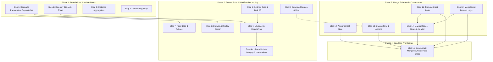

# Architecture & Technical Proposals

This directory houses technical proposals, architectural specifications, and migration blueprints for Neko.

Proposals are categorized by subsystem and scope to keep documentation organized and maintainable:

- [📖 Reader Architecture (`reader/`)](#reader-architecture-reader)
- [🧩 Subsystem & UI Decoupling (`decoupling/`)](#subsystem--ui-decoupling-decoupling)
- [✨ Features & Enhancements (`features/`)](#features--enhancements-features)
- [🔄 Migrations (`migrations/`)](#migrations-migrations)

---

## 📖 Reader Architecture (`reader/`)

Proposals focused on reader performance, Jetpack Compose viewers, navigation lifecycle orchestration, memory optimization, and UI controls decoupling.

### Reader Decoupling Execution Track

| Order | Proposal | Status | Description | Prerequisites | Target Milestone |
| :---: | :--- | :---: | :--- | :--- | :--- |
| **R1** | [**Decouple Reader Chapter Navigation, Concurrency Guards & Lifecycle Orchestration**](reader/decouple_reader_navigation_and_lifecycle_orchestration_proposal.md) | 🟢 Complete | Migrates chapter navigation into `viewModelScope`, introduces `ReaderNavCommand` and `ReaderChapterTransitionState`, and guards key events with a `Mutex`. | None | Neko 3.x Reader Decoupling |
| **R2** | [**Decouple ReaderTransitionPage**](reader/decouple_reader_transition_page_proposal.md) | 🟡 Ready | Decouples chapter transition pages from `DownloadManager`, legacy entity conversions, and chapter gap math into `ChapterTransitionUiModel`. | Step R1 (Complete) | Neko 3.x Reader Decoupling |
| **R3** | [**Decouple ComposePagerViewer & ComposeWebtoonViewer**](reader/decouple_reader_compose_viewers_proposal.md) | ⚪ Proposed | Removes legacy View references, `DownloadManager`, and `Injekt.get()` from Compose viewers, hoisting configurations into immutable UI models. | Steps R1, R2 | Neko 3.x Reader Decoupling |
| **R4** | [**Decouple ReaderControls and Bottom Action Bar**](reader/decouple_reader_controls_and_bottom_bar_proposal.md) | ⚪ Proposed | Refactors parameter-heavy reader control bars into grouped `ReaderBottomControlsUiState` and `ReaderBottomBarAction`. | Step R3 | Neko 3.x Reader Decoupling |
| **R5** | [**Decouple ReaderChaptersSheet**](reader/decouple_reader_chapters_sheet_proposal.md) | ⚪ Proposed | Decouples the chapter selection bottom sheet from direct preferences, context color resolvers, and inline repository calls. | Step R3 | Neko 3.x Reader Decoupling |
| **R6** | [**Decouple ReaderSettingsSheet**](reader/decouple_reader_settings_sheet_proposal.md) | ⚪ Proposed | Decouples reader settings sheet from service locators, preference mutations, and domain flags into `ReaderSettingsUiState`. | Step R3 | Neko 3.x Reader Decoupling |
| **R7** | [**Decouple GestureNavigationOverlay**](reader/decouple_gesture_navigation_overlay_proposal.md) | ⚪ Proposed | Decouples gesture navigation overlays from viewer navigation geometry inversion math into `NavigationRegionUiModel`. | None (Self-Contained) | Neko 3.x Reader Decoupling |

### Reader Feature Proposals

| Proposal | Status | Description | Target Milestone |
| :--- | :---: | :--- | :--- |
| [**Webtoon Preloading & Slice Cache Architecture**](reader/webtoon_preloading_and_slice_cache_architecture_proposal.md) | ⚪ Proposed | Eliminates black screen stutter, implements two-tier bounded preloading, disk-cached slice generation, and seamless scroll continuity for downloaded webtoons. | Neko Reader Phase 2 |
| [**Native Compose Subsampling Tile Renderer**](reader/native_compose_webtoon_subsampling_renderer_proposal.md) | ⚪ Proposed | Introduces high-performance tiled subsampling for long webtoon image strips in Compose. | Neko Performance |
| [**Unified Reader Preloader Engine & Two-Tier Pipeline**](reader/reader_preloader_engine_proposal.md) | 🟡 Partial | Extracts inline preloading logic from Compose viewers into a testable domain engine with two-tier disk/memory pipelining. | Neko Reader Phase 2 |
| [**Rock-Solid ComposeWebtoonViewer Architecture**](reader/rock_solid_webtoon_compose_viewer_proposal.md) | 🟢 Landed | Solves in-UI tall page splitting shifts, post-composition prepend races, and gesture bloat to reduce ComposeWebtoonViewer to ~220 lines. | Neko Reader Phase 2 |
| [**Rock-Solid ComposePagerViewer Architecture**](reader/rock_solid_paged_compose_viewer_proposal.md) | ⚪ Proposed | Solves destructive subtree key resets, post-composition page flashing, in-UI Coil preloading, and preference flooding to reduce ComposePagerViewer to ~180 lines. | Neko Reader Phase 2 |
| [**Zen Focus Reading Mode & Touch Shield**](reader/zen_focus_reading_mode_proposal.md) | ⚪ Proposed | Adds a distraction-free reading mode with accidental touch prevention. | Neko Feature |

---

## 🧩 Subsystem & UI Decoupling (`decoupling/`)

Proposals focused on breaking down God classes, separating domain business logic from Jetpack Compose components, eliminating layer inversion, and removing service locator lookups.

### Subsystem Decoupling Dependency & Execution Graph

### Phased Execution Roadmap

| Order | Proposal | Description | Prerequisites | Target Milestone |
| :---: | :--- | :--- | :--- | :--- |
| **Phase 1 Step 1** | [**Decouple Presentation Repositories & Eliminate Layer Inversion**](decoupling/decouple_presentation_repositories_proposal.md) | Relocates `BrowseRepository` and `FeedRepository` to `org.nekomanga.data.repository`, eliminates Compose imports in data layer, and introduces domain return models. | None (Root Data Layer Foundation) | Clean Architecture |
| **Phase 1 Step 2** | [**Decouple Category Management Dialogs & Sheets**](decoupling/decouple_category_management_dialog_and_sheet_proposal.md) | Extracts `ValidateCategoryNameUseCase` and `CalculateCategoryDiffUseCase`, decoupling category dialogs and sheets from validation and diff computation logic. | None | UI Decoupling |
| **Phase 1 Step 3** | [**Decouple Statistics Aggregation**](decoupling/decouple_statistics_aggregation_and_formatting_proposal.md) | Offloads heavy stats computation and $O(M \times C)$ dataset transformations from Jetpack Compose rendering to `AggregateDetailedStatsUseCase`. | None (Self-Contained) | UI Decoupling |
| **Phase 1 Step 4** | [**Decouple Onboarding Steps**](decoupling/decouple_onboarding_steps_proposal.md) | Decouples onboarding steps from service locators, direct preferences, and Activity recreation into `StorageStepUiState` and `ThemeStepUiState`. | None (Self-Contained) | UI Decoupling |
| **Phase 2 Step 5** | [**Decouple Settings Screens Jobs & I/O**](decoupling/decouple_settings_screens_jobs_and_io_proposal.md) | Decouples settings screens from `CoroutineScope`, background WorkManager workers (`LibraryUpdateJob`), and disk I/O. | None (Establishes Job Pattern) | UI Decoupling |
| **Phase 2 Step 6** | [**Decouple LibraryScreen Job Dispatching**](decoupling/decouple_library_screen_job_dispatching_proposal.md) | Decouples library screen from background jobs (`UpdateLibraryUseCase`), database entity mapping, and share intent logic. | Steps 2, 5 | UI Decoupling |
| **Phase 2 Step 6b** | [**Decouple Library Update Logging, Safe URI Generation & Notification Dispatch**](decoupling/decouple_library_update_logging_and_notifications_proposal.md) | Resolves crash hazards, encapsulates `FileProvider` URI resolution inside a safe try-catch boundary, and deduplicates notification builders into a unified component. | None (PR #3404 / PR #3397) | UI Decoupling |
| **Phase 2 Step 7** | [**Decouple FeedScreen Jobs & Actions**](decoupling/decouple_feed_screen_jobs_and_actions_proposal.md) | Isolates feed screen from background job orchestration, duplicate filtering rules, and `StateFlow` prop-drilling via `ValidateChapterDownloadUseCase`. | Step 1 | UI Decoupling |
| **Phase 2 Step 8** | [**Decouple DownloadScreen and DownloadChapterRow**](decoupling/decouple_download_screen_and_chapter_row_proposal.md) | Decouples download management screens from in-composable scanlator grouping and legacy `Download.State` enums. | None | UI Decoupling |
| **Phase 2 Step 9** | [**Decouple Browse & Display Screens**](decoupling/decouple_browse_and_display_screen_navigation_proposal.md) | Decouples Browse and Display screens from Room database entities (`BrowseFilterImpl`) and in-UI navigation routing. | Step 1 | UI Decoupling |
| **Phase 3 Step 10** | [**Decouple ArtworkSheet State & Domain Entities**](decoupling/decouple_artwork_sheet_state_proposal.md) | Hoists internal selection state, Coil image builders, and database models from `ArtworkSheet` into `ArtworkSheetUiModel` and `ArtworkSheetAction`. | None | UI Decoupling |
| **Phase 3 Step 11** | [**Decouple TrackingSheet Domain Logic**](decoupling/decouple_tracking_sheet_domain_logic_proposal.md) | Decouples tracking sheet from domain models, functional lambda providers, and 6 mutable dialog states into `TrackingSheetUiState`. | None | UI Decoupling |
| **Phase 3 Step 12** | [**Decouple MergeSheet Domain Logic**](decoupling/decouple_merge_sheet_domain_logic_proposal.md) | Decouples merge sheet from domain source resolvers and business merge rules via `GetAvailableMergeSourcesUseCase`. | None | UI Decoupling |
| **Phase 3 Step 13** | [**Decouple ChapterRow & Chapter Actions**](decoupling/decouple_chapter_row_and_actions_proposal.md) | Decouples chapter list items from domain logic, download status, and database entities via `OpenChapterUseCase` and `ChapterRowUiModel`. | Step 8 recommended | UI Decoupling |
| **Phase 3 Step 14** | [**Decouple Manga Details Screen**](decoupling/decouple_manga_details_share_and_header_proposal.md) | Decouples manga details screen from network request building and share intent assembly via `PrepareMangaSharePayloadUseCase`. | Steps 11, 12 | UI Decoupling |
| **Phase 4 Step 15** | [**Deconstructing MangaViewModel God Class**](decoupling/decouple_manga_viewmodel_god_class_proposal.md) | Breaks down the massive 2,387-line `MangaViewModel` God class into dedicated domain controllers (`MangaArtworkController`, `MangaTrackingController`, `MangaMergeController`, `MangaChapterController`). | Steps 10, 11, 12, 13, 14 | Neko Architecture |

---

## ✨ Features & Enhancements (`features/`)

Technical proposals outlining specifications for new features, social integrations, and user utilities.

| Proposal | Description | Target Milestone |
| :--- | :--- | :--- |
| [**Automated Smart-Merge Chapter Gap Engine**](features/automated_smart_merge_engine_proposal.md) | Intelligent chapter deduplication and gap filling across merged manga sources. | Neko 3.x Feature |
| [**Local Peer-to-Peer Sync (Neko Beam)**](features/local_peer_sync_neko_beam_proposal.md) | Local Wi-Fi / Hotspot peer-to-peer sync and direct chapter transfer between devices. | Neko 3.x Feature |
| [**Native MangaDex Discussion Threads & Comments**](features/native_mangadex_comments_proposal.md) | Direct integration with MangaDex forums and inline chapter comments. | Neko 3.x Feature |
| [**Neko Lens (On-Device Manga OCR & Dictionary)**](features/neko_lens_on_device_ocr_translation_proposal.md) | ML Kit / Tesseract on-device OCR and Japanese dictionary lookup assistant in reader. | Neko 3.x Feature |
| [**Neko Wrapped (Annual & Monthly Review)**](features/neko_wrapped_year_in_review_proposal.md) | Visual personalized reading statistics, milestones, and annual recap presentation. | Neko 3.x Feature |
| [**Manga Reading Activity Heatmap & Interactive Timeline**](features/reading_activity_heatmap_proposal.md) | GitHub-style reading streak heatmap and interactive reading history timeline. | Neko 3.x Feature |
| [**Chapter Release Radar & Cadence Predictor**](features/release_radar_predictive_schedule_proposal.md) | Predictive release schedule and cadence estimation for ongoing manga series. | Neko 3.x Feature |
| [**Scanlation Group Hub, Profiles & Follow Feeds**](features/scanlation_group_hub_proposal.md) | Dedicated scanlation group profiles, release hubs, and follow notifications. | Neko 3.x Feature |
| [**Smart Collections & Rule-Based Dynamic Categories**](features/smart_collections_dynamic_categories_proposal.md) | Dynamic smart categories defined by rule-based queries (status, genre, unread). | Neko 3.x Feature |

---

## 🔄 Migrations (`migrations/`)

Large-scale external API and infrastructure migrations.

| Proposal | Description | Target Milestone |
| :--- | :--- | :--- |
| [**Migrating Preference Flow Collections to Lifecycle-Aware `collectAsStateWithLifecycle()`**](migrations/migrate_preference_collect_as_state_with_lifecycle_proposal.md) | Migrates Composable preference observations from unconstrained `collectAsState()` to lifecycle-bounded `collectAsStateWithLifecycle()`. | Neko 3.x Lifecycle Modernization |
| [**Migrating Primary Metadata & Search to MangaBaka**](migrations/mangabaka_migration_proposal.md) | Architectural migration of Neko's primary metadata, search, and browse provider to MangaBaka. | Neko 4.0 Platform Migration |
