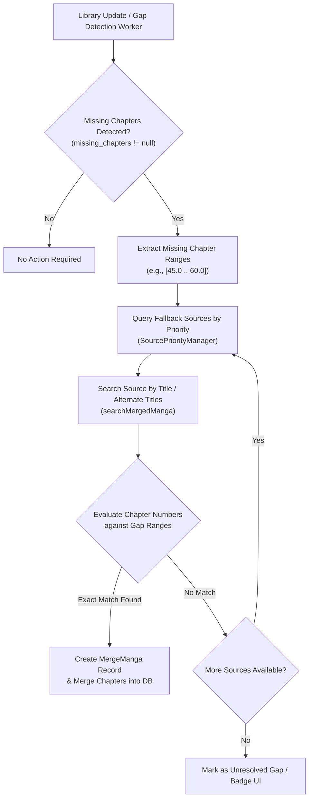

# Technical Proposal: Automated Smart-Merge Chapter Gap Engine

**Status:** Proposed / Under Review  
**Author:** Neko Development Team  
**Date:** August 2026  
**Target Milestone:** Neko 3.1 Content & Automation  
**Implementation State:** 🟡 Partially Present Baseline (Missing Gap Detection & Manual Merge exist; Autonomous Gap Resolver is New)  

---

## 📌 Codebase Audit & Baseline Notes

> [!NOTE]
> **Current Codebase Baseline:**
> Neko already calculates missing chapter gaps via [`List<ChapterItem>.getMissingChapters()`](file:///run/media/nonproto/WD4T/programming/workspace-android/Neko/app/src/main/java/eu/kanade/tachiyomi/util/chapter/ChapterExtensions.kt#L15), supports library-level missing chapter filtering ([`LibraryPreferences.filterMissingChapters()`](file:///run/media/nonproto/WD4T/programming/workspace-android/Neko/app/src/main/java/org/nekomanga/domain/library/LibraryPreferences.kt#L202)), warns readers during chapter transitions ([`MissingChapters.kt`](file:///run/media/nonproto/WD4T/programming/workspace-android/Neko/app/src/main/java/eu/kanade/tachiyomi/ui/reader/viewer/MissingChapters.kt#L9)), and supports manual source merging ([`MergeMangaRepository`](file:///run/media/nonproto/WD4T/programming/workspace-android/Neko/app/src/main/java/org/nekomanga/data/database/repository/MergeMangaRepository.kt)) across Komga, Suwayomi, WeebCentral, Atsumaru, Toonily, Comix, ProjectSuki, and MangaBall.
>
> **What This Proposal Adds:**
> Full automation. Currently, users must manually search each secondary source per title to fill missing chapters. This proposal introduces an autonomous resolver that queries fallback sources in priority order, verifies missing chapter number intervals, and allows 1-click batch merging or automated background gap filling during library updates.

---

## 1. Executive Summary & Vision

MangaDex often has missing chapters in popular series due to license takedowns, DMCA notices, or scanlation group removals. While Neko already has algorithms to detect missing chapter gaps and supports manual source merging, the process of filling gaps requires tedious manual searches across every third-party source for each title.

### The Objective
This proposal designs an **Autonomous Chapter Gap Resolution Engine (Smart-Merge Engine)** that automatically scans library titles with missing chapter gaps, queries configured fallback merge sources, matches missing chapter numbers, and allows 1-click or fully automated gap merging.

### Key Highlights:
1. **Automated Gap Resolver**: Evaluates missing chapter intervals (e.g. Ch. 45–60 missing) against configured fallback sources in user-defined priority order.
2. **Intelligent Source Hierarchy**: Users define a priority ladder (e.g. Komga $\rightarrow$ Suwayomi $\rightarrow$ WeebCentral $\rightarrow$ Atsumaru $\rightarrow$ Toonily $\rightarrow$ Comix $\rightarrow$ ProjectSuki $\rightarrow$ MangaBall).
3. **Fuzzy Chapter Matching & Deduplication**: Ensures chapter numbers align properly, skips already existing chapters, and prevents duplicate insertions.
4. **1-Click Batch Resolution & Background Auto-Merge**:
   - Interactive Mode: Highlights missing gaps in the library with a "Resolve Gaps" prompt offering side-by-side preview.
   - Background Automation: Automatically resolves gaps during scheduled library updates.

---

## 2. Architectural Design



---

## 3. Core Domain & Data Layer Changes

### 3.1 Domain Resolver Interface

```kotlin
package org.nekomanga.domain.merge

import androidx.compose.runtime.Immutable
import eu.kanade.tachiyomi.data.database.models.Manga
import eu.kanade.tachiyomi.data.database.models.MergeType

@Immutable
data class MissingChapterGap(
    val startChapter: Float,
    val endChapter: Float,
    val missingCount: Int,
)

@Immutable
data class SmartMergeCandidate(
    val mergeType: MergeType,
    val targetUrl: String,
    val title: String,
    val matchedGaps: List<MissingChapterGap>,
    val confidenceScore: Float, // 0.0 - 1.0 based on title & chapter match accuracy
)

interface SmartMergeResolver {
    suspend fun resolveGapsForManga(manga: Manga): List<SmartMergeCandidate>
    suspend fun autoApplySmartMerge(manga: Manga, candidate: SmartMergeCandidate): Boolean
}
```

### 3.2 Smart-Merge Preferences

Add to [`LibraryPreferences.kt`](file:///run/media/nonproto/WD4T/programming/workspace-android/Neko/app/src/main/java/org/nekomanga/domain/library/LibraryPreferences.kt) and [`MergeSettingsScreen.kt`](file:///run/media/nonproto/WD4T/programming/workspace-android/Neko/app/src/main/java/org/nekomanga/presentation/screens/settings/screens/MergeSettingsScreen.kt):

```kotlin
fun autoSmartMergeDuringUpdate() = preferenceStore.getBoolean("auto_smart_merge_key", false)
fun smartMergeSourcePriority() = preferenceStore.getString("smart_merge_priority_order", "1,5,3,11,2,10,9,7")
fun smartMergeMinConfidence() = preferenceStore.getFloat("smart_merge_min_confidence", 0.85f)
```

---

## 4. UI / UX Design Specifications

### 4.1 Manga Details Gap Resolution Banner ([MangaScreen.kt](file:///run/media/nonproto/WD4T/programming/workspace-android/Neko/app/src/main/java/org/nekomanga/presentation/screens/MangaScreen.kt))
- When a manga has missing chapters, an actionable banner appears above the chapter list:
  > **⚠️ Missing Chapters 45–60 Detected**  
  > *Found matching chapters on WeebCentral (Confidence: 98%)*  
  > `[Auto-Merge]` `[View Details]` `[Dismiss]`

### 4.2 Library-Wide Gap Resolution Hub
- In the Library Screen overflow menu, users can select **"Resolve Missing Gaps"**.
- Opens a dedicated sheet listing all library series with gaps, displaying suggested merge sources and previewing which chapters will be restored.
- Provides a **"Merge All High Confidence"** action button.

---

## 5. Technical Footprint & Integration

1. **Use Cases**:
   - Create `ResolveMissingChapterGaps.kt` inside `org.nekomanga.usecases.manga`.
   - Create `ApplySmartMerge.kt` inside `org.nekomanga.usecases.manga`.
2. **Library Update Worker**:
   - Hook `ResolveMissingChapterGaps` into `LibraryUpdateJob.kt` to optionally auto-resolve gaps when `autoSmartMergeDuringUpdate()` is enabled.
3. **Manga ViewModel**:
   - Expose `smartMergeCandidates` in `MangaDetailScreenState` inside [MangaViewModel.kt](file:///run/media/nonproto/WD4T/programming/workspace-android/Neko/app/src/main/java/eu/kanade/tachiyomi/ui/manga/MangaViewModel.kt).

---

## 6. Implementation Plan & Milestones

- [ ] **Step 1**: Implement `SmartMergeResolver` logic to match chapter intervals across secondary source DTOs.
- [ ] **Step 2**: Create priority order configuration UI in [MergeSettingsScreen.kt](file:///run/media/nonproto/WD4T/programming/workspace-android/Neko/app/src/main/java/org/nekomanga/presentation/screens/settings/screens/MergeSettingsScreen.kt).
- [ ] **Step 3**: Design and build the Gap Resolution banner and bottom sheet in Compose.
- [ ] **Step 4**: Integrate automated gap resolution into `LibraryUpdateJob.kt`.
