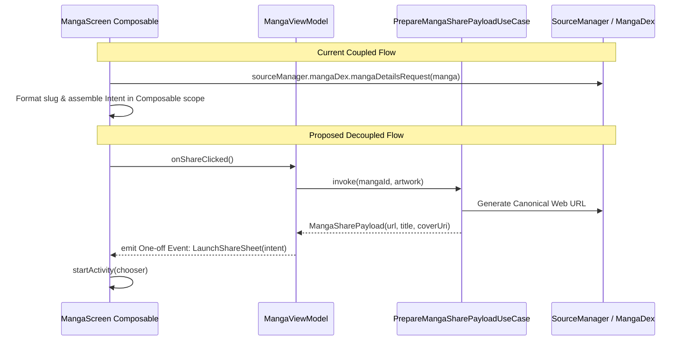

# Technical Proposal: Decoupling Manga Details Screen from Network Request Building & Share Intent Assembly

**Status:** Proposed / Under Review  
**Author:** Neko Development Team  
**Date:** September 2026  
**Target Milestone:** Neko 3.x Compose & Domain Decoupling  
**Implementation State:** 🟡 Coupled Baseline (Network URL builders, cache I/O, and Intent creation embedded in Composables)  

---

## 📌 Codebase Audit & Baseline Notes

> [!NOTE]
> **Current Codebase Baseline:**
> In [`MangaScreen.kt`](file:///run/media/nonproto/WD4T/programming/workspace-android/Neko/app/src/main/java/org/nekomanga/presentation/screens/MangaScreen.kt), several callbacks perform complex domain logic, network request construction, and Android framework file I/O inside Composable coroutine scopes:
> - **Lines 216–253 (`onShareClick`)**:
>   1. Fetches local cache directory via `context.sharedCacheDir()`.
>   2. Asynchronously saves cover image via `mangaViewModel.shareCover(...)`.
>   3. Calls MangaDex network request builder inside Compose:
>      `mangaViewModel.sourceManager.mangaDex.mangaDetailsRequest(manga).url.toString()`
>   4. Formats slug: `url = "$url/" + manga.getSlug()`.
>   5. Assembles `Intent.ACTION_SEND` and `ClipData` with custom flags, and triggers `Intent.createChooser`.
> - **Lines 256–282 (`coverActions.share`)**: Duplicates cache directory lookup, file generation, `ClipData` assembly, and intent launching.
> - **Line 215 (`onSimilarClick`)**: Directly queries the domain entity from ViewModel state:
>   `onNavigate(Screens.Similar(mangaViewModel.getManga().uuid()))`.
> - In [`ButtonBlock.kt`](file:///run/media/nonproto/WD4T/programming/workspace-android/Neko/app/src/main/java/org/nekomanga/presentation/screens/manga/ButtonBlock.kt#L140-L200), UI logic maps primitive counts (`trackServiceCount`, `mergedCount`) to numeric icon assets and string resources within `remember` blocks.
>
> **What This Proposal Solves:**
> Moves all URL generation, disk caching, and share payload preparation into domain UseCases and ViewModel event channels. Composables receive ready-to-render UI models and emit plain UI events without touching `SourceManager`, `sharedCacheDir`, or slug utilities.

---

## 1. Executive Summary & Vision

Jetpack Compose UI components should never assemble network request objects, query source managers, or manage file cache directories. Doing so couples the presentation layer to the network protocol (MangaDex API schemas) and filesystem internals, making UI unit tests impossible and leaking Android context references across coroutine boundaries.

### The Objective
Decouple [`MangaScreen.kt`](file:///run/media/nonproto/WD4T/programming/workspace-android/Neko/app/src/main/java/org/nekomanga/presentation/screens/MangaScreen.kt) and [`ButtonBlock.kt`](file:///run/media/nonproto/WD4T/programming/workspace-android/Neko/app/src/main/java/org/nekomanga/presentation/screens/manga/ButtonBlock.kt) by:
1. Extracting a `PrepareMangaSharePayloadUseCase` that builds share URLs and prepares cached cover URIs.
2. Emitting high-level one-off UI events (e.g., `MangaUiEvent.ShareIntent(intent)`) from `MangaViewModel`.
3. Hoisting the manga UUID directly into `MangaScreenMangaState` so Compose never calls `mangaViewModel.getManga().uuid()`.
4. Transforming [`ButtonBlock.kt`](file:///run/media/nonproto/WD4T/programming/workspace-android/Neko/app/src/main/java/org/nekomanga/presentation/screens/manga/ButtonBlock.kt) into a dumb renderer accepting pre-computed `List<HeaderActionButtonUiModel>`.

---

## 2. Architectural Design



---

## 3. Proposed Domain & UI Models

### 3.1 Share Payload Domain Model

```kotlin
data class MangaSharePayload(
    val title: String,
    val canonicalUrl: String,
    val coverUri: Uri?,
)
```

### 3.2 Extracted UseCase

```kotlin
class PrepareMangaSharePayloadUseCase(
    private val mangaRepository: MangaRepository,
    private val sourceManager: SourceManager,
    private val coverCache: CoverCache,
) {
    suspend operator fun invoke(mangaId: Long, artwork: Artwork?): Result<MangaSharePayload> = withContext(Dispatchers.IO) {
        val manga = mangaRepository.getManga(mangaId) ?: return@withContext Result.failure(IllegalArgumentException("Manga not found"))
        val baseUrl = sourceManager.mangaDex.mangaDetailsRequest(manga).url.toString()
        val canonicalUrl = "$baseUrl/${manga.getSlug()}"
        val coverUri = artwork?.let { coverCache.getShareableCoverUri(it) }
        
        Result.success(
            MangaSharePayload(
                title = manga.title,
                canonicalUrl = canonicalUrl,
                coverUri = coverUri,
            )
        )
    }
}
```

### 3.3 Header Action Button UI Model

```kotlin
@Immutable
data class HeaderActionButtonUiModel(
    val id: HeaderActionId,
    val icon: ImageVector,
    val label: UiText,
    val isChecked: Boolean = false,
    val isEnabled: Boolean = true,
)

enum class HeaderActionId {
    Favorite,
    Tracking,
    Artwork,
    Similar,
    Merge,
    Links,
    Share,
    Categories,
}
```

---

## 4. UI / Compose Layer Refactoring

### 4.1 Simplifying `MangaScreen.kt`

Eliminate all network and cache logic from `MangaScreenWrapper`:

```kotlin
// Before: 40+ lines of cacheDir, shareCover, network requests, and Intent builders
onShareClick = {
    scope.launch {
        val dir = context.sharedCacheDir() ?: ...
        val cover = mangaViewModel.shareCover(...)
        var url = mangaViewModel.sourceManager.mangaDex.mangaDetailsRequest(manga)...
    }
}

// After: Clean, single-line delegation
onShareClick = mangaViewModel::shareManga,
onSimilarClick = { onNavigate(Screens.Similar(screenState.manga.uuid)) }
```

The screen listens for a shared UI event via `ObserveAsEvents`:
```kotlin
ObserveAsEvents(flow = mangaViewModel.eventFlow) { event ->
    when (event) {
        is MangaUiEvent.LaunchShareSheet -> {
            context.startActivity(Intent.createChooser(event.intent, context.getString(R.string.share)))
        }
    }
}
```

### 4.2 Simplifying `ButtonBlock.kt`

[`ButtonBlock`](file:///run/media/nonproto/WD4T/programming/workspace-android/Neko/app/src/main/java/org/nekomanga/presentation/screens/manga/ButtonBlock.kt) drops all tracking count and merge count conditionals, receiving:
```kotlin
@Composable
fun ButtonBlock(
    actions: List<HeaderActionButtonUiModel>,
    themeColorState: ThemeColorState,
    hideButtonText: Boolean,
    onActionClick: (HeaderActionId) -> Unit,
)
```

---

## 5. Technical Footprint & Integration

1. **[`MangaScreen.kt`](file:///run/media/nonproto/WD4T/programming/workspace-android/Neko/app/src/main/java/org/nekomanga/presentation/screens/MangaScreen.kt)**: Remove lines 216–286; replace with ViewModel event triggers.
2. **[`ButtonBlock.kt`](file:///run/media/nonproto/WD4T/programming/workspace-android/Neko/app/src/main/java/org/nekomanga/presentation/screens/manga/ButtonBlock.kt)**: Decouple from tracking and merge counting; accept `List<HeaderActionButtonUiModel>`.
3. **[`MangaConstants.kt`](file:///run/media/nonproto/WD4T/programming/workspace-android/Neko/app/src/main/java/eu/kanade/tachiyomi/ui/manga/MangaConstants.kt)**: Add `uuid: String` to `MangaScreenMangaState` and `headerActions: List<HeaderActionButtonUiModel>`.
4. **[`MangaViewModel.kt`](file:///run/media/nonproto/WD4T/programming/workspace-android/Neko/app/src/main/java/eu/kanade/tachiyomi/ui/manga/MangaViewModel.kt)**: Inject `PrepareMangaSharePayloadUseCase` and expose `shareManga()` and `shareCover()`.

---

## 6. Implementation Plan & Milestones

- [ ] **Step 1**: Implement and unit-test `PrepareMangaSharePayloadUseCase`.
- [ ] **Step 2**: Add `uuid` and `headerActions` to `MangaConstants.MangaDetailScreenState`.
- [ ] **Step 3**: Update `MangaViewModel` to emit `LaunchShareSheet` UI events.
- [ ] **Step 4**: Refactor `ButtonBlock.kt` to be stateless and preview-friendly with `@Preview`.
- [ ] **Step 5**: Clean up `MangaScreen.kt` share and navigation lambdas.
- [ ] **Step 6**: Run `./gradlew ktfmtFormat` and `./gradlew testDebugUnitTest`.
