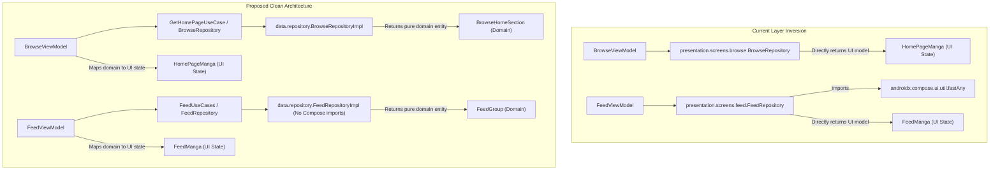

# Technical Proposal: Decoupling Presentation Repositories & Eliminating Layer Inversion

**Status:** Proposed / Under Review  
**Author:** Neko Development Team  
**Date:** September 2026  
**Target Milestone:** Neko 3.x Architectural Decoupling  
**Implementation State:** 🟡 Coupled Baseline (Repositories defined in `presentation` packages, importing Compose UI utilities, and directly returning UI state models)  

---

## 📌 Codebase Audit & Baseline Notes

> [!NOTE]
> **Current Codebase Baseline:**
> In the current architecture, data access and repository logic have leaked into the presentation layer:
> - In [`BrowseRepository.kt`](file:///run/media/nonproto/WD4T/programming/workspace-android/Neko/app/src/main/java/org/nekomanga/presentation/screens/browse/BrowseRepository.kt#L1-L32):
>   - Defined in package `org.nekomanga.presentation.screens.browse`.
>   - Injects data sources via Service Locator in default parameters: `private val mangaDex: MangaDex = Injekt.get<SourceManager>().mangaDex`, `mangaRepository: MangaRepository = Injekt.get()`, etc.
>   - In [`BrowseRepository.kt:L101-L110`](file:///run/media/nonproto/WD4T/programming/workspace-android/Neko/app/src/main/java/org/nekomanga/presentation/screens/browse/BrowseRepository.kt#L101-L110), directly maps network responses into `HomePageManga`, which is a presentation UI model defined in `BrowseScreenUiState.kt`.
>   - Implements complex multi-source batching and persistence logic (chunking blocked groups/uploaders by 900, querying repositories, fetching missing items from MangaDex, inserting into Room) directly inside a presentation package.
> - In [`FeedRepository.kt`](file:///run/media/nonproto/WD4T/programming/workspace-android/Neko/app/src/main/java/org/nekomanga/presentation/screens/feed/FeedRepository.kt#L1-L47):
>   - Defined in package `org.nekomanga.presentation.screens.feed`.
>   - **Line 3**: `import androidx.compose.ui.util.fastAny` — a data repository directly depending on Jetpack Compose UI utilities.
>   - Operates on and returns `FeedManga`, a presentation UI model.
>   - Holds mutable state and formatting objects across invocations: `private val bySeriesSet = mutableSetOf<Long>()`, `val dateFormat = SimpleDateFormat(...)`.
>   - Spans 641 lines of business and data aggregation logic that belongs in the domain/data layer.
>
> **What This Proposal Solves:**
> Resolves the Clean Architecture layer inversion by relocating data fetching to the data layer (`org.nekomanga.data.repository`), decoupling repositories from Compose dependencies, replacing presentation model return types with pure domain models, and moving UI mapping responsibilities into ViewModels.

---

## 1. Executive Summary & Vision

The presentation layer should strictly depend on the domain and data layers, never vice versa. Having classes named `*Repository` inside `presentation.screens.*` that import Jetpack Compose utilities (`androidx.compose.ui.util.fastAny`) breaks separation of concerns, complicates unit testing, and prevents data layer code reuse across other features (such as background workers or widgets).

### The Objective
Decouple [`BrowseRepository.kt`](file:///run/media/nonproto/WD4T/programming/workspace-android/Neko/app/src/main/java/org/nekomanga/presentation/screens/browse/BrowseRepository.kt) and [`FeedRepository.kt`](file:///run/media/nonproto/WD4T/programming/workspace-android/Neko/app/src/main/java/org/nekomanga/presentation/screens/feed/FeedRepository.kt) by:
1. Moving repository classes from `org.nekomanga.presentation.screens.*` to `org.nekomanga.data.database.repository.*` (or `org.nekomanga.data.repository.*`).
2. Purging all Jetpack Compose imports (`fastAny`) and UI formatting objects (`SimpleDateFormat`) from repository implementations.
3. Defining domain entities (`BrowseHomeSection`, `FeedUpdateGroup`) instead of returning presentation UI models (`HomePageManga`, `FeedManga`).
4. Making repositories stateless by moving mutable tracking sets (`bySeriesSet`) into ViewModel state.

---

## 2. Architectural Design



---

## 3. Proposed Domain & Data Contracts

### 3.1 Domain Models (Replacing UI Models in Data Layer)

```kotlin
// In org.nekomanga.domain.browse
data class BrowseHomeSection(
    val displayScreenType: DisplayScreenType,
    val mangaList: List<DisplayManga>,
)

// In org.nekomanga.domain.feed
data class FeedItem(
    val mangaId: Long,
    val mangaTitle: String,
    val chapterItems: List<ChapterItem>,
    val lastUpdated: Long,
)
```

### 3.2 Relocated Clean Repository Interface

```kotlin
package org.nekomanga.data.database.repository

import com.github.michaelbull.result.Result
import org.nekomanga.domain.browse.BrowseHomeSection
import org.nekomanga.domain.filter.DexFilters
import org.nekomanga.domain.manga.DisplayManga
import org.nekomanga.domain.network.ResultError

interface BrowseRepository {
    fun isLoggedIn(): Boolean
    suspend fun getRandomManga(): Result<DisplayManga, ResultError>
    suspend fun getSearchPage(page: Int, filters: DexFilters): Result<Pair<Boolean, List<DisplayManga>>, ResultError>
    suspend fun getHomePage(): Result<List<BrowseHomeSection>, ResultError>
    suspend fun getFollows(): Result<List<DisplayManga>, ResultError>
}
```

---

## 4. ViewModel & Presentation Layer Refactoring

### 4.1 UI Mapping in ViewModels

`BrowseViewModel` and `FeedViewModel` become responsible for mapping pure domain data into presentation UI models:

```kotlin
// In BrowseViewModel.kt
private fun List<BrowseHomeSection>.toUiState(): List<HomePageManga> {
    return map { section ->
        HomePageManga(
            displayScreenType = section.displayScreenType,
            displayManga = section.mangaList.distinctBy { it.url },
        )
    }
}
```

### 4.2 Removing Compose Dependency from Data Layer

In `FeedRepositoryImpl`, replace Compose's `fastAny` with Kotlin's standard library `any()`:
```kotlin
// BEFORE (app/src/main/java/org/nekomanga/presentation/screens/feed/FeedRepository.kt:3)
import androidx.compose.ui.util.fastAny
// ...
chapterList.fastAny { it.isUnread }

// AFTER (app/src/main/java/org/nekomanga/data/repository/FeedRepositoryImpl.kt)
// Pure Kotlin stdlib — zero Compose or UI framework dependencies
chapterList.any { it.isUnread }
```

---

## 5. Technical Footprint & Integration

1. **Move Files**:
   - `app/src/main/java/org/nekomanga/presentation/screens/browse/BrowseRepository.kt` $\to$ `app/src/main/java/org/nekomanga/data/repository/BrowseRepository.kt`.
   - `app/src/main/java/org/nekomanga/presentation/screens/feed/FeedRepository.kt` $\to$ `app/src/main/java/org/nekomanga/data/repository/FeedRepository.kt`.
2. **[`BrowseViewModel.kt`](file:///run/media/nonproto/WD4T/programming/workspace-android/Neko/app/src/main/java/org/nekomanga/presentation/screens/browse/BrowseViewModel.kt)**: Update imports to reference `org.nekomanga.data.repository.BrowseRepository` and map `BrowseHomeSection` to `HomePageManga`.
3. **[`FeedViewModel.kt`](file:///run/media/nonproto/WD4T/programming/workspace-android/Neko/app/src/main/java/org/nekomanga/presentation/screens/feed/FeedViewModel.kt)**: Update imports to reference `org.nekomanga.data.repository.FeedRepository`, move `bySeriesSet` state into the ViewModel, and map domain feed items to `FeedManga`.
4. **App DI Module**: Update Injekt bindings to register repositories under their clean data packages.

---

## 6. Implementation Plan & Milestones

- [ ] **Step 1**: Create `BrowseHomeSection` domain model and define `BrowseRepository` interface in `org.nekomanga.data.repository`.
- [ ] **Step 2**: Relocate `BrowseRepository` implementation, remove `HomePageManga` dependency, and add mapping in `BrowseViewModel`.
- [ ] **Step 3**: Relocate `FeedRepository`, remove `androidx.compose.ui.util.fastAny`, and extract `SimpleDateFormat` thread-local formatting.
- [ ] **Step 4**: Move mutable `bySeriesSet` state from `FeedRepository` into `FeedViewModel`.
- [ ] **Step 5**: Run `./gradlew ktfmtFormat` and `./gradlew testDebugUnitTest`.
