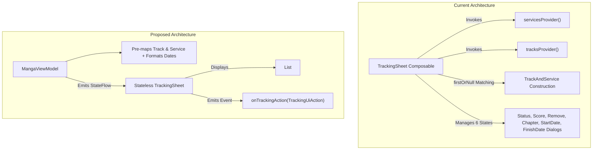

# Technical Proposal: Decoupling TrackingSheet from Domain Models, Functional Providers & Dialog State Multiplexing

**Status:** Proposed / Under Review  
**Author:** Neko Development Team  
**Date:** September 2026  
**Target Milestone:** Neko 3.x Compose & Domain Decoupling  
**Implementation State:** 🟡 Coupled Baseline (Functional lambda providers, domain object construction, and 6 mutable dialog states inside Composable)  

---

## 📌 Codebase Audit & Baseline Notes

> [!NOTE]
> **Current Codebase Baseline:**
> In [`TrackingSheet.kt`](file:///run/media/nonproto/WD4T/programming/workspace-android/Neko/app/src/main/java/org/nekomanga/presentation/components/sheets/TrackingSheet.kt), the sheet composable couples heavily with domain structures and multiplexes multiple dialog states internally:
> - **Lines 64–65**: Accepts functional lambda providers instead of stable evaluated data models:
>   `servicesProvider: () -> List<TrackServiceItem>`, `tracksProvider: () -> List<TrackItem>`.
> - **Lines 150–157**: Executes item matching and domain object instantiation inside the Composable rendering loop:
>   ```kotlin
>   servicesProvider().forEach { service ->
>       val track = tracksProvider().firstOrNull { it.trackServiceId == service.id }
>       val trackAndService = if (track != null) TrackAndService(track, service) else null
>   ```
> - **Lines 76–82**: Manages 6 independent mutable dialog states inside the sheet (`statusDialog`, `scoreDialog`, `removeTrackDialog`, `chapterTrackDialog`, `calendarStartTrackDialog`, `calendarFinishedTrackDialog`).
> - **Lines 124–144**: Instantiates domain objects (`TrackingDate`, `ReadingDate`) inside UI click handlers.
> - Directly depends on `java.text.DateFormat` and delegates date formatting to child composables.
>
> **What This Proposal Solves:**
> Decouples `TrackingSheet` by replacing lambda providers with an evaluated `List<TrackServiceCardUiModel>`, pre-formatting dates and score labels in the ViewModel, and consolidating dialog management into a single hoisted UI state model.

---

## 1. Executive Summary & Vision

Bottom sheets in Jetpack Compose should be simple presentation components that receive an immutable list of cards to display and emit user gestures upward. When a sheet manages multiple internal dialog sub-states, performs cross-list searching, and instantiates domain models (`TrackAndService`, `TrackingDate`), it becomes difficult to maintain, impossible to preview, and prone to recomposition glitches.

### The Objective
Decouple [`TrackingSheet.kt`](file:///run/media/nonproto/WD4T/programming/workspace-android/Neko/app/src/main/java/org/nekomanga/presentation/components/sheets/TrackingSheet.kt) by:
1. Eliminating functional providers (`servicesProvider`, `tracksProvider`) in favor of an evaluated UI model list.
2. Pre-calculating track statuses, scores, and formatted date strings in `MangaViewModel`.
3. Consolidating the six separate dialog states into a single hoisted `ActiveTrackingDialog` sealed model.
4. Making `TrackingSheet` purely stateless and previewable.

---

## 2. Architectural Design



---

## 3. Proposed Domain & UI Models

### 3.1 Immutable Tracking UI Models

```kotlin
@Immutable
data class TrackingSheetUiState(
    val services: List<TrackServiceCardUiModel> = emptyList(),
    val activeDialog: TrackingDialogUiState? = null,
)

@Immutable
data class TrackServiceCardUiModel(
    val serviceId: Int,
    val serviceName: String,
    val logoDrawableRes: Int,
    val isTracked: Boolean,
    val statusText: String?,
    val scoreText: String?,
    val chapterText: String?,
    val startDateText: String?,
    val finishDateText: String?,
    val trackingUrl: String?,
)

sealed interface TrackingDialogUiState {
    data class Status(val serviceId: Int, val currentStatus: Int) : TrackingDialogUiState
    data class Score(val serviceId: Int, val currentScore: Float) : TrackingDialogUiState
    data class Chapter(val serviceId: Int, val currentChapter: Int) : TrackingDialogUiState
    data class Remove(val serviceId: Int, val serviceName: String) : TrackingDialogUiState
    data class DatePicker(val serviceId: Int, val isStartDate: Boolean, val timestamp: Long) : TrackingDialogUiState
}
```

### 3.2 Unified UI Actions

```kotlin
sealed interface TrackingUiAction {
    data class OpenLink(val url: String) : TrackingUiAction
    data class SearchTracker(val serviceId: Int) : TrackingUiAction
    data class ShowDialog(val dialog: TrackingDialogUiState) : TrackingUiAction
    object DismissDialog : TrackingUiAction
    data class UpdateStatus(val serviceId: Int, val newStatus: Int) : TrackingUiAction
    data class UpdateScore(val serviceId: Int, val newScore: Float) : TrackingUiAction
    data class UpdateChapter(val serviceId: Int, val newChapter: Int) : TrackingUiAction
    data class UpdateDate(val serviceId: Int, val isStartDate: Boolean, val timestamp: Long) : TrackingUiAction
    data class RemoveTracking(val serviceId: Int, val alsoRemoveRemote: Boolean) : TrackingUiAction
}
```

---

## 4. UI / Compose Layer Refactoring

### 4.1 Stateless `TrackingSheet` Signature

```kotlin
@Composable
fun TrackingSheet(
    themeColor: ThemeColorState,
    uiState: TrackingSheetUiState,
    onAction: (TrackingUiAction) -> Unit,
    modifier: Modifier = Modifier,
) {
    BaseSheet(themeColor = themeColor) {
        // Render single active dialog if non-null
        uiState.activeDialog?.let { dialog ->
            TrackingDialogRenderer(dialog = dialog, themeColor = themeColor, onAction = onAction)
        }

        Column(
            modifier = Modifier.fillMaxWidth(),
            verticalArrangement = Arrangement.spacedBy(Size.small),
        ) {
            uiState.services.forEach { serviceModel ->
                TrackingServiceCard(
                    model = serviceModel,
                    themeColor = themeColor,
                    onAction = onAction,
                )
            }
        }
    }
}
```

---

## 5. Technical Footprint & Integration

1. **[`TrackingSheet.kt`](file:///run/media/nonproto/WD4T/programming/workspace-android/Neko/app/src/main/java/org/nekomanga/presentation/components/sheets/TrackingSheet.kt)**: Remove lines 60–194; replace with clean declarative renderer.
2. **[`MangaConstants.kt`](file:///run/media/nonproto/WD4T/programming/workspace-android/Neko/app/src/main/java/eu/kanade/tachiyomi/ui/manga/MangaConstants.kt)**: Integrate `TrackingSheetUiState` into `MangaScreenTrackState`.
3. **[`MangaViewModel.kt`](file:///run/media/nonproto/WD4T/programming/workspace-android/Neko/app/src/main/java/eu/kanade/tachiyomi/ui/manga/MangaViewModel.kt)**: Map `TrackItem` and `TrackServiceItem` to `TrackServiceCardUiModel`.

---

## 6. Implementation Plan & Milestones

- [ ] **Step 1**: Define `TrackingSheetUiState`, `TrackServiceCardUiModel`, and `TrackingUiAction`.
- [ ] **Step 2**: Move tracking status formatting and date formatting to `MangaViewModel`.
- [ ] **Step 3**: Consolidate dialog visibility into `TrackingDialogUiState` hoisted in `MangaViewModel`.
- [ ] **Step 4**: Refactor `TrackingSheet.kt` into a stateless component and add `@Preview`.
- [ ] **Step 5**: Run `./gradlew ktfmtFormat` and `./gradlew testDebugUnitTest`.
