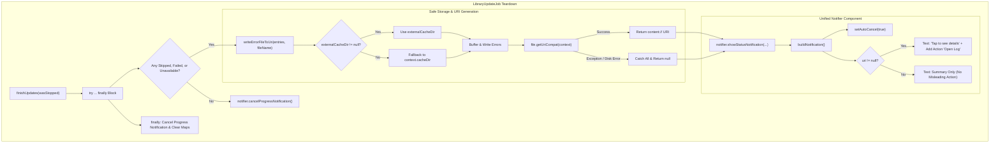
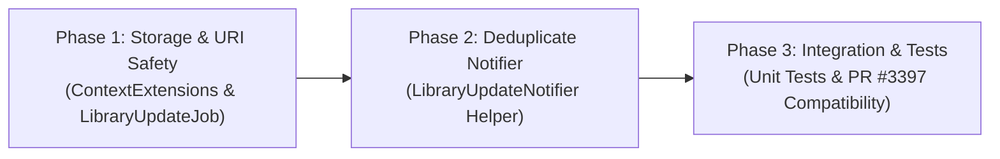

# Technical Proposal: Robust Library Update Logging, Safe URI Generation & Notification Deduplication

**Status:** Proposed / Under Review  
**Author:** Neko Development Team  
**Date:** September 2026  
**Target Milestone:** Neko 3.x Architecture & Stability  
**Related PRs & Issues:** [PR #3404](https://github.com/nekomangaorg/Neko/pull/3404), [PR #3397](https://github.com/nekomangaorg/Neko/pull/3397), [Issue #306](https://github.com/nekomangaorg/Neko/issues/306)  
**Execution Order:** Subsystem Decoupling — Library Background Processing & Notifications  
**Prerequisites:** None (Self-Contained Foundation)  
**Downstream Dependents:** PR #3397 ("Unavailable Chapters Notification"), Library Screen Decoupling  
**Implementation State:** 🟡 Fragile Baseline (PR #3404 bandaids crash symptom, leaving root cause, leaky URI generation, duplicate notification routines, and zombie notification states unaddressed)

---

## 📌 Codebase Audit & Background

### 1. The Incident: PR #3404 Crash Origin
During library background updates in [`LibraryUpdateJob.kt`](file:///run/media/nonproto/WD4T/programming/workspace-android/Neko/app/src/main/java/eu/kanade/tachiyomi/data/library/LibraryUpdateJob.kt#L763-L784), failure to write the error log file to disk (due to disk full, null external cache, or filesystem permissions) caught an `Exception` and returned `File("")`:
```kotlin
private fun writeErrorFile(errors: Map<String, String?>, fileName: String = "errors"): File {
    try {
        if (errors.isNotEmpty()) {
            val file = context.createFileInCacheDir("neko_update_$fileName.txt")
            ...
            return file
        }
    } catch (e: Exception) {
        TimberKt.e(e) { "Error writing error file" }
    }
    return File("") // <--- Root Trigger
}
```
The caller in [`LibraryUpdateJob.kt`](file:///run/media/nonproto/WD4T/programming/workspace-android/Neko/app/src/main/java/eu/kanade/tachiyomi/data/library/LibraryUpdateJob.kt#L734) then immediately invoked:
```kotlin
val errorFile = writeErrorFile(...)
notifier.showUpdateErrorNotification(
    failedUpdates.map { it.key.title },
    errorFile.getUriCompat(context), // <--- Crash Point
)
```
Because `File("")` resolves to a relative path without a valid root mapping in [`provider_paths.xml`](file:///run/media/nonproto/WD4T/programming/workspace-android/Neko/app/src/main/res/xml/provider_paths.xml), [`FileExtensions.getUriCompat()`](file:///run/media/nonproto/WD4T/programming/workspace-android/Neko/app/src/main/java/eu/kanade/tachiyomi/util/storage/FileExtensions.kt#L14) internally called `FileProvider.getUriForFile()`, which threw:
```
java.lang.IllegalArgumentException: Failed to find configured root that contains /
```
This unhandled exception crashed `finishUpdates()`. Consequently:
1. `notifier.showUpdateErrorNotification()` and `notifier.showUpdateSkippedNotification()` were never shown.
2. `failedUpdates.clear()` and `skippedUpdates.clear()` were aborted.
3. Crucially, [`notifier.cancelProgressNotification()`](file:///run/media/nonproto/WD4T/programming/workspace-android/Neko/app/src/main/java/eu/kanade/tachiyomi/data/library/LibraryUpdateJob.kt#L753) was never reached, permanently trapping the indeterminate "Updating library..." spinner notification in Android's status bar.

---

### 2. The Flaws in PR #3404's Band-Aid Fix
PR #3404 changed `writeErrorFile` to return `null` on failure, made the URI nullable in [`LibraryUpdateNotifier.kt`](file:///run/media/nonproto/WD4T/programming/workspace-android/Neko/app/src/main/java/eu/kanade/tachiyomi/data/library/LibraryUpdateNotifier.kt), and omitted the "Open log" action when null. 

While this prevents the specific `File("")` crash, a Senior Staff code audit reveals five critical architectural flaws remaining in production:

1. **Unprotected `FileProvider` Boundary (Porous Crash Barrier)**:
   In `LibraryUpdateJob.kt`:
   ```kotlin
   val errorFile = writeErrorFile(...)
   notifier.showUpdateErrorNotification(
       failedUpdates.map { it.key.title },
       errorFile?.getUriCompat(context), // <--- Still outside try-catch!
   )
   ```
   `writeErrorFile` catches `Exception`, but `errorFile?.getUriCompat(context)` runs *outside* any exception handler. If `writeErrorFile` succeeds in allocating a `File` object whose path cannot be resolved by `FileProvider` (e.g. secondary storage or custom ROM path discrepancies), `getUriCompat` throws `IllegalArgumentException`, crashing `finishUpdates()` anyway.
2. **Unaddressed Root Cause (`externalCacheDir` Nullability)**:
   In [`ContextExtensions.kt#L411-L418`](file:///run/media/nonproto/WD4T/programming/workspace-android/Neko/app/src/main/java/eu/kanade/tachiyomi/util/system/ContextExtensions.kt#L411-L418):
   ```kotlin
   fun Context.createFileInCacheDir(name: String): File {
       val file = File(externalCacheDir, name) // externalCacheDir can be NULL!
       if (file.exists()) file.delete()
       file.createNewFile()
       return file
   }
   ```
   On Android devices with work profiles, private spaces (Android 15+), unmounted SD cards, or multi-user profiles, `context.externalCacheDir` returns `null`. `File(null, name)` resolves to `/name` in the read-only root filesystem, causing `createNewFile()` to immediately fail with `IOException: Permission denied`. Internal cache (`context.cacheDir`) is always accessible and already mapped in `provider_paths.xml`, but Neko never fell back to it.
3. **Zombie Notifications (`setAutoCancel(true)` Omitted)**:
   Neither `showUpdateErrorNotification` nor `showUpdateSkippedNotification` sets `setAutoCancel(true)`. When `uri == null` and the user taps the notification, the app opens, but the notification remains stuck in the notification shade until manually swiped away.
4. **Deceptive UI Contract & Dead-End Intent**:
   The notification body hardcodes `context.getString(R.string.tap_to_see_details)`. When `uri == null`, tapping the notification fires `getNotificationIntent()`, which specifies:
   ```kotlin
   intent.action = DeepLinks.Actions.RecentlyUpdated
   ```
   In [`MainActivity.kt#L307-L411`](file:///run/media/nonproto/WD4T/programming/workspace-android/Neko/app/src/main/java/eu/kanade/tachiyomi/ui/main/MainActivity.kt#L307-L411), `DeepLinks.Actions.RecentlyUpdated` is completely unhandled. The intent drops into a void, dumping the user onto the home screen with zero details displayed.
5. **Copy-Paste Code Duplication Multiplier**:
   `showUpdateErrorNotification` and `showUpdateSkippedNotification` are 100% duplicate 28-line methods. PR #3397 copies this exact block a *third time* for "Unavailable chapters".

---

## 1. Executive Summary & Vision

This proposal re-engineers library update error logging, URI resolution, and notification dispatch into a unified, crash-resilient, zero-duplication architecture.

### Core Objectives
1. **Fix Root Storage Cause**: Update `Context.createFileInCacheDir()` to reliably fall back to internal `context.cacheDir` when `externalCacheDir` is null.
2. **Encapsulate Safe URI Generation**: Replace leaky `File?` returns with `writeErrorFileToUri()`, ensuring all file I/O and `FileProvider.getUriForFile()` operations are strictly contained within a single `try-catch` boundary.
3. **Eliminate Collection Allocations**: Stop mapping `failedUpdates` into throwaway intermediate `List<Pair>` and `Map` collections; format directly from entity entries.
4. **Deduplicate `LibraryUpdateNotifier`**: Merge `showUpdateErrorNotification`, `showUpdateSkippedNotification`, and the incoming unavailable chapters notification into a single, cohesive `showStatusNotification()` helper.
5. **Restore UI Integrity**: Add `setAutoCancel(true)`, make notification content text context-aware (avoiding "Tap to see details" when no details exist), and handle progress cancellation in a guaranteed `try-finally` block.

---

## 2. Architectural Design



---

## 3. Detailed Component Implementation

### 3.1 Robust Storage Directory Resolution (`ContextExtensions.kt`)

Update [`Context.createFileInCacheDir`](file:///run/media/nonproto/WD4T/programming/workspace-android/Neko/app/src/main/java/eu/kanade/tachiyomi/util/system/ContextExtensions.kt#L411-L418) to gracefully handle multi-user and restricted storage profiles:

```kotlin
/**
 * Creates a file in the cache directory, preferring external cache but safely falling
 * back to internal cache if external storage is unmounted or restricted.
 */
fun Context.createFileInCacheDir(name: String): File {
    val dir = externalCacheDir ?: cacheDir
    if (!dir.exists()) {
        dir.mkdirs()
    }
    val file = File(dir, name)
    if (file.exists()) {
        file.delete()
    }
    file.createNewFile()
    return file
}
```

Both `cacheDir` (`<cache-path name="cache_files" path="."/>`) and `externalCacheDir` (`<external-cache-path name="ext_cache_files" path="."/>`) are already registered in [`provider_paths.xml`](file:///run/media/nonproto/WD4T/programming/workspace-android/Neko/app/src/main/res/xml/provider_paths.xml), ensuring `FileProvider` succeeds under both paths.

---

### 3.2 Safe Error Logging & URI Generation (`LibraryUpdateJob.kt`)

Encapsulate file creation, writing, and `FileProvider` conversion within a single atomic boundary. Eliminate 4 layers of intermediate collection copies:

```kotlin
/**
 * Writes update error details to a cache log file and returns its shareable Content URI.
 * Returns null if the errors map is empty or if any file I/O or FileProvider error occurs.
 */
private fun writeErrorFileToUri(
    errors: Map<out Any, String?>,
    fileName: String = "errors",
    titleSelector: (Any) -> String,
): Uri? {
    if (errors.isEmpty()) return null

    return try {
        val file = context.createFileInCacheDir("neko_update_$fileName.txt")
        file.bufferedWriter().use { out ->
            // Format:
            // ! Error Reason
            //     - Manga Title
            errors.entries
                .groupBy({ it.value }, { titleSelector(it.key) })
                .forEach { (error, titles) ->
                    out.write("! ${error ?: "Unknown error"}\n")
                    titles.forEach { out.write("    - $it\n") }
                }
        }
        file.getUriCompat(context)
    } catch (e: Exception) {
        TimberKt.e(e) { "Failed to write update log or resolve URI for $fileName" }
        null
    }
}
```

In `finishUpdates()`:
```kotlin
private suspend fun finishUpdates(wasStopped: Boolean = false) {
    try {
        if (!wasStopped && !isStopped) {
            extraDeferredJobs.awaitAll()
        }
        if (newUpdates.isNotEmpty()) {
            notifier.showResultNotification(newUpdates)
            if (downloadNew && hasDownloads) {
                DownloadJob.start(applicationContext)
            }
        }
        newUpdates.clear()

        if (skippedUpdates.isNotEmpty() && Notifications.isNotificationChannelEnabled(context, Notifications.Channel.Library.Skipped)) {
            val skippedUri = writeErrorFileToUri(skippedUpdates, "skipped") { (it as LibraryManga).title }
            notifier.showUpdateSkippedNotification(skippedUpdates.keys.map { it.title }, skippedUri)
        }

        if (failedUpdates.isNotEmpty() && Notifications.isNotificationChannelEnabled(context, Notifications.Channel.Library.Error)) {
            val errorUri = writeErrorFileToUri(failedUpdates, "errors") { (it as Manga).title }
            notifier.showUpdateErrorNotification(failedUpdates.keys.map { it.title }, errorUri)
        }
    } finally {
        failedUpdates.clear()
        skippedUpdates.clear()
        notifier.cancelProgressNotification()
    }
}
```

---

### 3.3 Deduplicated Status Notification Dispatcher (`LibraryUpdateNotifier.kt`)

Consolidate redundant builders into a single, robust dispatch method:

```kotlin
class LibraryUpdateNotifier(private val context: Context) {

    fun showUpdateErrorNotification(errors: List<String>, uri: Uri?) {
        showStatusNotification(
            notificationId = Notifications.Id.Library.Error,
            channelId = Notifications.Channel.Library.Error,
            titleRes = R.string.notification_update_error,
            items = errors,
            uri = uri,
        )
    }

    fun showUpdateSkippedNotification(skips: List<String>, uri: Uri?) {
        showStatusNotification(
            notificationId = Notifications.Id.Library.Skipped,
            channelId = Notifications.Channel.Library.Skipped,
            titleRes = R.string.notification_update_skipped,
            items = skips,
            uri = uri,
        )
    }

    /**
     * Unified notification builder for batch status results (errors, skips, unavailable).
     */
    private fun showStatusNotification(
        notificationId: Int,
        channelId: String,
        titleRes: Int,
        items: List<String>,
        uri: Uri?,
    ) {
        if (items.isEmpty()) return

        val pendingIntent = uri?.let {
            NotificationReceiver.openErrorOrSkippedLogPendingActivity(context, it)
        } ?: getNotificationIntent()

        context.notificationManager.notify(
            notificationId,
            context.notificationBuilder(channelId) {
                setContentTitle(context.getString(titleRes, items.size))
                
                // Only prompt the user to tap for details if the log file is actually available
                if (uri != null) {
                    setContentText(context.getString(R.string.tap_to_see_details))
                }
                
                setStyle(
                    NotificationCompat.BigTextStyle()
                        .bigText(items.joinToString("\n") { it.chop(TITLE_MAX_LEN) })
                )
                setContentIntent(pendingIntent)
                setSmallIcon(R.drawable.ic_neko_notification)
                setAutoCancel(true) // Ensure notification dismisses when tapped

                if (uri != null) {
                    addAction(
                        R.drawable.ic_help_24dp,
                        context.getString(R.string.open_log),
                        pendingIntent,
                    )
                }
            }.build(),
        )
    }
```

---

## 4. Edge Cases & Failure Recovery Matrix

| Scenario / Trigger Condition | Current Production Behavior | Proposed Resilient Architecture Behavior |
| :--- | :--- | :--- |
| **`externalCacheDir` returns null** (Work profile, private space, unmounted storage) | `File(null, name)` throws `IOException: Permission denied`. Log file cannot be written. | Falls back to internal `context.cacheDir`. Log file writes successfully and user receives actionable log. |
| **`FileProvider` cannot map file** (Adopted storage / unusual mount point) | `File.getUriCompat` throws unhandled `IllegalArgumentException`, crashing `finishUpdates()`. | Captured within `writeErrorFileToUri`'s `try-catch`. Returns `null` cleanly; notification shows without crashing. |
| **Disk is 100% full** | `writeErrorFile` throws `IOException: No space left on device`. | Handled gracefully. Notification displays error titles in `BigTextStyle` without crashing or freezing. |
| **Notification clicked with `uri == null`** | App opens to arbitrary screen; notification remains permanently stuck in drawer (`setAutoCancel(false)`). | App opens safely; notification immediately dismisses from drawer (`setAutoCancel(true)`). |
| **Exception during update teardown** | `notifier.cancelProgressNotification()` is skipped. Indeterminate progress spinner hangs forever. | `finally` block guarantees `cancelProgressNotification()` is invoked under all circumstances. |
| **Incoming PR #3397 (Unavailable Chapters)** | Copies 30 lines of boilerplate a third time. | Simply calls `showStatusNotification()` with its own channel ID and title resource (zero duplicate code). |

---

## 5. Phased Implementation Roadmap



### Phase 1: Storage Fallback & Safe URI Generation
1. Update `Context.createFileInCacheDir` in [`ContextExtensions.kt`](file:///run/media/nonproto/WD4T/programming/workspace-android/Neko/app/src/main/java/eu/kanade/tachiyomi/util/system/ContextExtensions.kt) to fall back to `cacheDir` when `externalCacheDir` is null.
2. Replace `writeErrorFile` in [`LibraryUpdateJob.kt`](file:///run/media/nonproto/WD4T/programming/workspace-android/Neko/app/src/main/java/eu/kanade/tachiyomi/data/library/LibraryUpdateJob.kt) with `writeErrorFileToUri`, enclosing all file writing and `getUriCompat()` operations inside a protected `try-catch`.
3. Wrap update finalization in a `finally` block to guarantee progress cancellation and collection clearing.

### Phase 2: Deduplicate `LibraryUpdateNotifier`
1. Extract `showStatusNotification()` private helper in [`LibraryUpdateNotifier.kt`](file:///run/media/nonproto/WD4T/programming/workspace-android/Neko/app/src/main/java/eu/kanade/tachiyomi/data/library/LibraryUpdateNotifier.kt).
2. Configure `setAutoCancel(true)` on notification builders.
3. Condition `R.string.tap_to_see_details` on `uri != null`.

### Phase 3: Unit Testing & Upstream Handoff
1. Write unit tests for `LibraryUpdateNotifier` verifying notification construction with both `uri != null` and `uri == null`.
2. Provide handoff notes for PR #3397 so the author can utilize `showStatusNotification()` rather than introducing duplicate notification code.
