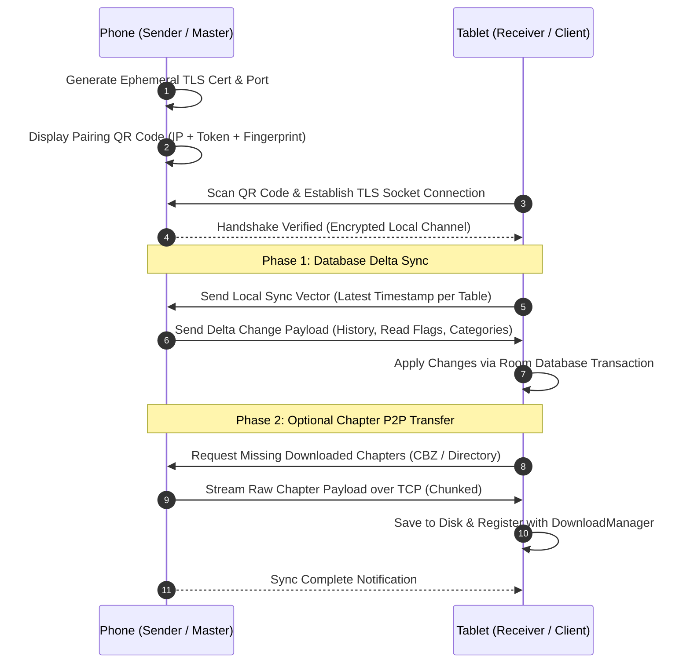

# Technical Proposal: Local Peer-to-Peer Sync & Direct Chapter Transfer (Neko Beam)

**Status:** Proposed / Under Review  
**Author:** Neko Development Team  
**Date:** August 2026  
**Target Milestone:** Neko 3.5 Multi-Device & Data  
**Implementation State:** 🔴 Completely New Feature (Not Present in Codebase)  

---

## 📌 Codebase Audit & Baseline Notes

> [!NOTE]
> **Current Codebase Baseline:**
> Cross-device synchronization in Neko currently relies on either:
> 1. Exporting a full backup file ([`BackupCreator.kt`](file:///run/media/nonproto/WD4T/programming/workspace-android/Neko/app/src/main/java/eu/kanade/tachiyomi/data/backup/BackupCreator.kt)) to local storage or Google Drive, moving it, and manually restoring it on a second device ([`BackupRestorer.kt`](file:///run/media/nonproto/WD4T/programming/workspace-android/Neko/app/src/main/java/eu/kanade/tachiyomi/data/backup/BackupRestorer.kt)).
> 2. MangaDex account library sync ([`StatusSyncJob.kt`](file:///run/media/nonproto/WD4T/programming/workspace-android/Neko/app/src/main/java/eu/kanade/tachiyomi/jobs/follows/StatusSyncJob.kt)), which only syncs MangaDex follow status, omitting custom categories, detailed read history timestamps, non-MangaDex merged sources, and downloaded chapter files.
>
> **What This Proposal Adds:**
> A zero-cloud, direct peer-to-peer sync engine ("Neko Beam") over local Wi-Fi or Wi-Fi Direct. Users with multiple Android devices (e.g., Phone + Tablet or E-Reader) can pair via QR code / Network Service Discovery (NSD) to instantly sync read positions, history, custom categories, and stream/transfer downloaded chapter archives directly at gigabit local speeds.

---

## 1. Executive Summary & Vision

Many manga enthusiasts read on multiple devices: a smartphone during commutes and a tablet or E-Ink device at home. Keeping both devices in sync today requires manual backup export/import cycles or partial MangaDex account syncing. Furthermore, downloaded chapters must be re-downloaded independently from slow content servers on each device.

### The Objective
This proposal introduces **Neko Beam**, an encrypted local Wi-Fi peer synchronization and direct chapter transfer protocol. Devices on the same local network automatically discover each other or pair via a QR code, allowing 1-tap delta state syncing and direct P2P chapter file transfers.

### Key Highlights:
1. **Zero-Configuration Discovery (NSD / mDNS)**: Automatically detects other active Neko instances on the local Wi-Fi network using Android's Network Service Discovery.
2. **Secure QR-Code Handshake**: Generates a one-time TLS pairing session using a displayed QR code, preventing unauthorized access on public Wi-Fi networks.
3. **Bi-Directional Delta Sync**: Intelligently resolves timestamps using Last-Write-Wins (LWW) conflict resolution across:
   - Chapter read flags and last-read page offsets.
   - History logs and reading duration timestamps.
   - Custom categories and library memberships.
   - Merged source mappings and tracker authorizations.
4. **Direct Chapter File Siphon**: Select downloaded manga titles on your phone and beam them directly to your tablet at 30–80 MB/s over local Wi-Fi without consuming internet bandwidth or hitting MangaDex CDN rate limits.

---

## 2. Architectural Design



---

## 3. Core Domain & Data Layer Changes

### 3.1 Domain Models

```kotlin
package org.nekomanga.domain.sync

import androidx.compose.runtime.Immutable

@Immutable
data class PeerDevice(
    val deviceName: String,
    val ipAddress: String,
    val port: Int,
    val fingerprint: String,
    val isPaired: Boolean,
)

@Immutable
data class SyncDeltaPayload(
    val syncTimestamp: Long,
    val historyUpdates: List<HistorySyncDto>,
    val chapterProgressUpdates: List<ChapterProgressSyncDto>,
    val categoryUpdates: List<CategorySyncDto>,
    val mergeRecords: List<MergeSyncDto>,
)

@Immutable
data class NekoBeamState(
    val isHosting: Boolean = false,
    val isConnecting: Boolean = false,
    val connectedPeer: PeerDevice? = null,
    val currentStep: SyncStep = SyncStep.Idle,
    val transferProgress: Float = 0.0f, // 0.0 to 1.0
    val error: String? = null,
)

enum class SyncStep { Idle, Discovering, Pairing, SyncingDatabase, TransferringChapters, Completed }
```

### 3.2 P2P Server & Client Engine

```kotlin
package org.nekomanga.data.sync

import io.ktor.server.engine.embeddedServer
import io.ktor.server.netty.Netty

class NekoBeamServer(private val appDatabase: AppDatabase) {
    fun startHosting(onQrReady: (String) -> Unit) {
        // Spin up lightweight embedded Ktor/Netty HTTP/2 TLS server
        // Broadcast mDNS service: _neko_sync._tcp
    }
}
```

---

## 4. UI / UX Design Specifications

### 4.1 Neko Beam Center ([DataStorageSettingsScreen.kt](file:///run/media/nonproto/WD4T/programming/workspace-android/Neko/app/src/main/java/org/nekomanga/presentation/screens/settings/screens/DataStorageSettingsScreen.kt))
- Accessible from **Settings $\rightarrow$ Data and Storage $\rightarrow$ Neko Beam (Local Sync)**.
- Large interactive buttons: **"Send to Nearby Device"** (displays QR code) and **"Receive from Nearby Device"** (opens camera scanner).

### 4.2 Sync Progress & Chapter Siphon Sheet
- Visual radar pulse animation during discovery.
- During sync, shows progress breakdown:
  - 🔄 Updating 45 chapter read markers...
  - 📁 Transferring *Chainsaw Man (Ch. 120–140)* [120 MB / 450 MB] @ 42 MB/s.
- Haptic confirmation chime upon successful sync completion.

---

## 5. Technical Footprint & Integration

1. **Networking Layer**:
   - Add `io.ktor:ktor-server-netty` and `io.ktor:ktor-client-cio` for high-throughput local binary streaming.
   - Implement Android `NsdManager` for local network service discovery.
2. **Camera & QR Scanner**:
   - Use Google ML Kit Barcode Scanning for fast pairing QR code extraction.
3. **Database Transactions**:
   - Build `SyncConflictResolver.kt` executing Room batch transactions with SQLite `INSERT OR REPLACE` rules.

---

## 6. Implementation Plan & Milestones

- [ ] **Step 1**: Implement TLS socket handshake and QR code payload encoder/decoder.
- [ ] **Step 2**: Implement delta database extraction query and conflict resolution algorithms.
- [ ] **Step 3**: Build local chapter streaming pipeline with chunked checksum verification.
- [ ] **Step 4**: Design and build Compose `NekoBeamScreen` and `QrScannerView`.
