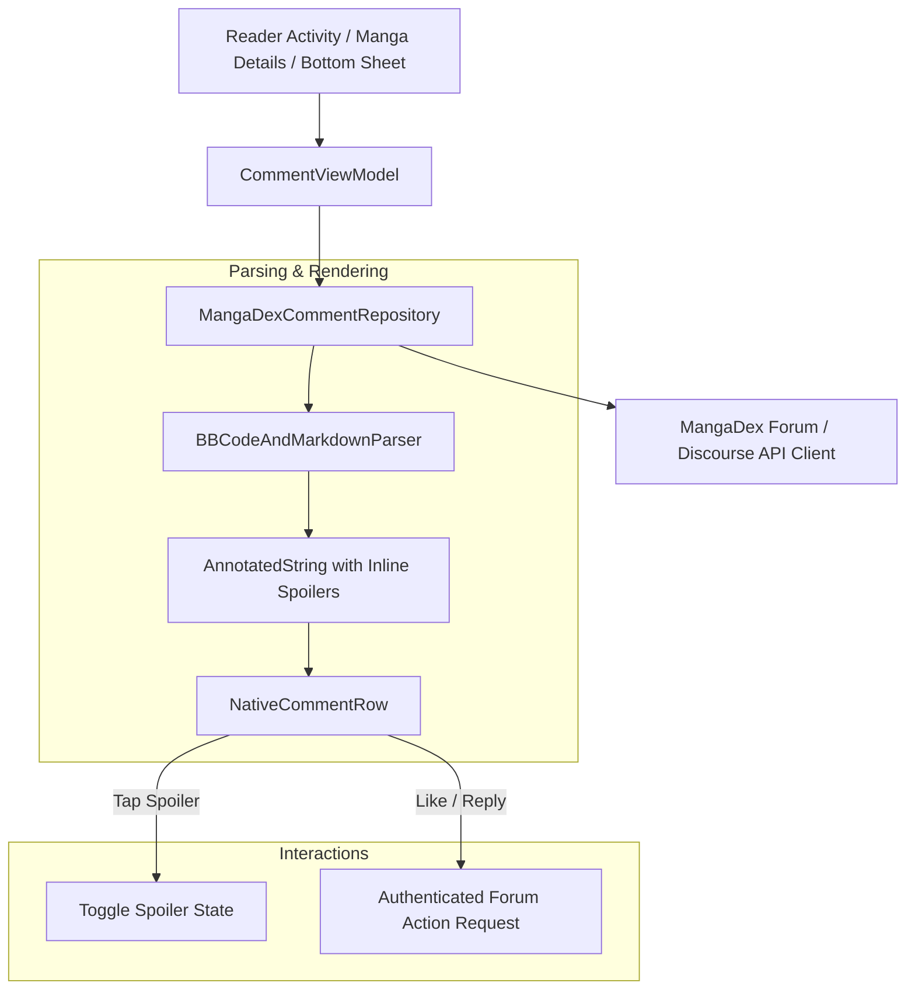

# Technical Proposal: Native MangaDex Discussion Threads & Inline Chapter Comments

**Status:** Proposed / Under Review  
**Author:** Neko Development Team  
**Date:** August 2026  
**Target Milestone:** Neko 3.2 Community & Engagement  
**Implementation State:** 🟡 Partially Present Baseline (WebView Forum Wrapper exists; Native Compose Discussion Engine is New)  

---

## 📌 Codebase Audit & Baseline Notes

> [!NOTE]
> **Current Codebase Baseline:**
> Neko currently fetches MangaDex forum thread IDs using [`fetchChapterCommentId()`](file:///run/media/nonproto/WD4T/programming/workspace-android/Neko/app/src/main/java/eu/kanade/tachiyomi/source/online/handlers/MangaHandler.kt#L235) and provides buttons in chapter rows, details headers, and the reader toolbar. However, clicking them opens the external forum thread in an in-app WebView browser wrapper ([`context.openInWebView`](file:///run/media/nonproto/WD4T/programming/workspace-android/Neko/app/src/main/java/eu/kanade/tachiyomi/ui/manga/MangaViewModel.kt#L1960)).
>
> **What This Proposal Adds:**
> A native Jetpack Compose comment feed. Replaces the WebView wrapper with direct consumption of MangaDex Discourse REST endpoints, native markdown/BBCode parsing, animated tap-to-reveal spoiler tags, inline end-of-chapter discussion sheets, and authenticated in-app reply/upvote actions.

---

## 1. Executive Summary & Vision

The community discussions on MangaDex are one of the platform's defining features, where readers discuss plot twists, review scanlation releases, share theories, and react to chapters.

In Neko's current implementation, viewing comments relies on opening the desktop MangaDex forum thread in an in-app WebView wrapper. This provides a subpar, slow user experience with web UI layout scaling issues and separate web sessions.

### The Objective
This proposal designs a **Native MangaDex Discussion & Comments Engine** built completely in Jetpack Compose, directly consuming MangaDex's Discourse/Forum REST API to render seamless, fast, and rich comment feeds inside the reader and manga details screens.

### Key Highlights:
1. **Native Compose Discussion Feed**: Smooth 120fps scrolling list with nested replies, avatar caching via Coil, and author badges.
2. **BBCode & Markdown Parsing with Tap-to-Reveal Spoilers**: Seamlessly parses MangaDex forum BBCode/Markdown formatting, including clickable links, user mentions, quotes, emojis, and `[spoiler]` tags with tap-to-reveal animations.
3. **End-of-Chapter Discussion Sheet**: Displays top reaction comments directly at the end of a chapter in the reader without leaving the reading flow.
4. **Authenticated Actions**: Users logged into MangaDex can upvote/like posts, reply to existing comments, and post new top-level chapter thoughts directly from Neko.

---

## 2. Architectural Design



---

## 3. Core Domain & Data Layer Changes

### 3.1 Domain Models

```kotlin
package org.nekomanga.domain.comment

import androidx.compose.runtime.Immutable
import java.time.Instant

@Immutable
data class DexCommentItem(
    val id: Long,
    val threadId: Long,
    val authorUsername: String,
    val authorAvatarUrl: String?,
    val rawContent: String,
    val parsedContent: List<CommentContentBlock>, // Text, Quote, Spoiler, Image
    val createdAt: Instant,
    val replyToCommentId: Long?,
    val voteCount: Int,
    val userVoted: Boolean,
    val isOp: Boolean,
)

sealed interface CommentContentBlock {
    data class Text(val content: String) : CommentContentBlock
    data class Spoiler(val hiddenContent: String, val isRevealed: Boolean = false) : CommentContentBlock
    data class Quote(val author: String?, val content: String) : CommentContentBlock
    data class Image(val url: String) : CommentContentBlock
}

@Immutable
data class CommentThreadState(
    val isLoading: Boolean = true,
    val threadId: Long? = null,
    val comments: List<DexCommentItem> = emptyList(),
    val totalCount: Int = 0,
    val error: String? = null,
    val isPosting: Boolean = false,
)
```

### 3.2 MangaDex Forum Client

```kotlin
package org.nekomanga.data.network.mangadex

interface MangaDexForumService {
    suspend fun getThreadComments(threadId: Long, page: Int = 1): Result<List<DexCommentDto>, NetworkError>
    suspend fun postComment(threadId: Long, message: String): Result<DexCommentDto, NetworkError>
    suspend fun voteComment(commentId: Long, isUpvote: Boolean): Result<Unit, NetworkError>
}
```

---

## 4. UI / UX Design Specifications

### 4.1 Reader End-of-Chapter Comments Sheet ([ReaderActivity.kt](file:///run/media/nonproto/WD4T/programming/workspace-android/Neko/app/src/main/java/eu/kanade/tachiyomi/ui/reader/ReaderActivity.kt))
- When scrolling past the final page of a chapter in Webtoon mode or paging past the end in Pager mode, a "Chapter Discussion" preview card displays the top 3 comments.
- Tapping opens an expandable modal bottom sheet containing the full discussion thread.
- Quick floating input bar to type a reply without obscuring the chapter viewer.

### 4.2 Rich Spoiler Tag Interaction
- Spoilers appear as blurred or shaded pills with a warning lock icon 🔒.
- Tapping a spoiler tag instantly reveals the underlying text with an animated alpha fade, preventing accidental plot revelations.

---

## 5. Technical Footprint & Integration

1. **Network Layer**:
   - Create `MangaDexForumService.kt` and `MangaDexForumServiceImpl.kt` utilizing Neko's OkHttp client.
2. **Parser Module**:
   - Create `MangaDexBBCodeParser.kt` converting forum markup to Compose `AnnotatedString` and `CommentContentBlock` elements.
3. **Presentation Layer**:
   - Create `org.nekomanga.presentation.screens.comment`:
     - `CommentBottomSheet.kt`
     - `CommentThreadItem.kt`
     - `CommentInputField.kt`
   - Wire comments sheet into [MangaScreen.kt](file:///run/media/nonproto/WD4T/programming/workspace-android/Neko/app/src/main/java/org/nekomanga/presentation/screens/MangaScreen.kt) and [ReaderActivity.kt](file:///run/media/nonproto/WD4T/programming/workspace-android/Neko/app/src/main/java/eu/kanade/tachiyomi/ui/reader/ReaderActivity.kt).

---

## 6. Implementation Plan & Milestones

- [ ] **Step 1**: Implement `MangaDexForumService` network client and pagination parser.
- [ ] **Step 2**: Implement BBCode and Markdown AST parser with spoiler block extraction.
- [ ] **Step 3**: Design and build native Compose `CommentBottomSheet` and `CommentThreadItem`.
- [ ] **Step 4**: Implement authenticated comment submission and like/upvote actions.
