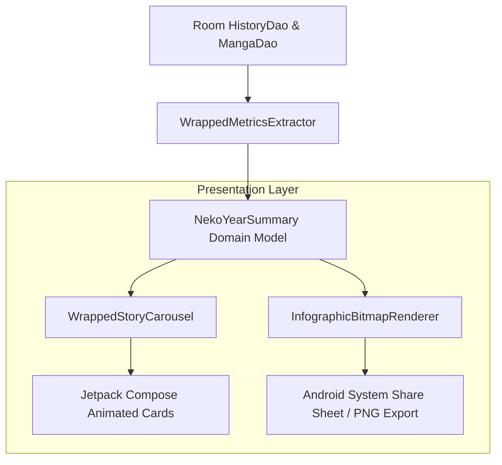

# Technical Proposal: Neko Wrapped & Annual/Monthly Reading Review

**Status:** Proposed / Under Review  
**Author:** Neko Development Team  
**Date:** August 2026  
**Target Milestone:** Neko 3.2 Social & Engagement  
**Implementation State:** 🔴 Completely New Feature (Not Present in Codebase)  

---

## 📌 Codebase Audit & Baseline Notes

> [!NOTE]
> **Current Codebase Baseline:**
> Neko offers all-time aggregate metrics in [`StatsScreen.kt`](file:///run/media/nonproto/WD4T/programming/workspace-android/Neko/app/src/main/java/org/nekomanga/presentation/screens/StatsScreen.kt) and [`DetailedStats.kt`](file:///run/media/nonproto/WD4T/programming/workspace-android/Neko/app/src/main/java/org/nekomanga/presentation/screens/stats/DetailedStats.kt), but does not segment reading activity by calendar year or month.
>
> **What This Proposal Adds:**
> A time-bounded retrospective recap engine. This proposal adds on-device generation of interactive story carousels (Spotify Wrapped style), annual milestone calculations (top genres, longest streak, peak day, most read series of the year), and high-resolution exportable infographic cards (PNG) for social sharing, computed 100% locally from Room database history.

---

## 1. Executive Summary & Vision

Readers love celebrating their accomplishments, discovering insights about their reading habits, and sharing yearly summaries on social media and Discord communities (analogous to Spotify Wrapped, GitHub Skyline, or Goodreads Year in Books). 

Currently, Neko offers aggregate metrics in [StatsScreen.kt](file:///run/media/nonproto/WD4T/programming/workspace-android/Neko/app/src/main/java/org/nekomanga/presentation/screens/StatsScreen.kt), but does not compile temporal milestones or generate shareable visual recaps.

### The Objective
This proposal introduces **Neko Wrapped / Year-in-Review**, an on-device, privacy-preserving interactive story presentation and exportable infographic generator summarizing a user's reading milestones over a specified calendar year or month.

### Key Highlights:
1. **Interactive Story Carousel**: A dynamic multi-card story experience (using Compose animations and transitions) revealing key milestones:
   - Total chapters and volumes completed.
   - Cumulative time spent reading (converted into hours and days).
   - Top 5 genres and most read scanlation groups/authors.
   - Longest daily reading streak and biggest reading marathon day.
   - Favorite manga of the year (by reading time and rating).
2. **Exportable High-Resolution Infographic Card**: One-tap generation of a beautifully styled PNG/Vector card formatted for social media stories (9:16 aspect ratio) or wide embeds (16:9).
3. **100% On-Device & Privacy Safe**: Computes all metrics strictly locally using Room database history without transmitting any user data to external servers.
4. **Historical Archives**: Access past years' recaps (e.g. 2024, 2025, 2026) directly from the Statistics tab.

---

## 2. Architectural Design



---

## 3. Core Domain & Data Layer Changes

### 3.1 Domain Models

```kotlin
package org.nekomanga.domain.stats

import androidx.compose.runtime.Immutable
import java.time.LocalDate

@Immutable
data class NekoYearSummary(
    val year: Int,
    val totalChaptersRead: Int,
    val totalTimeReadMs: Long,
    val totalMangaRead: Int,
    val completedSeriesCount: Int,
    val topGenres: List<Pair<String, Int>>,
    val topAuthors: List<Pair<String, Int>>,
    val longestStreakDays: Int,
    val biggestReadingDay: Pair<LocalDate, Int>?, // Date and chapter count
    val mostReadMangaTitle: String?,
    val mostReadMangaCoverUrl: String?,
    val mostReadMangaDurationMs: Long,
    val favoriteHourOfDay: Int, // 0 - 23
)
```

### 3.2 Metrics Extraction Engine

```kotlin
package org.nekomanga.domain.stats

class WrappedMetricsExtractor(
    private val historyRepository: HistoryRepository,
    private val mangaRepository: MangaRepository,
) {
    suspend fun generateSummary(year: Int): NekoYearSummary {
        // Query history between Jan 1 00:00:00 and Dec 31 23:59:59 of the target year
        // Aggregate genres, read durations, peak days, and top series
    }
}
```

---

## 4. UI / UX Design Specifications

### 4.1 Interactive Story Flow
- **Slide 1: The Intro**: Energetic animation introducing the user's reading year.
- **Slide 2: Volume & Time**: "You spent X hours reading across Y chapters this year."
- **Slide 3: Genre Universe**: Dynamic bubble chart displaying the user's top genres and tags.
- **Slide 4: The Marathon**: Highlights the user's longest streak and single most active reading day.
- **Slide 5: Series of the Year**: Showcases the manga title the user spent the most time reading with dynamic cover backdrop theming.
- **Slide 6: Summary & Share**: Complete recap poster with a **"Share My Year"** button.

### 4.2 On-Device Infographic Rendering
- Built with Jetpack Compose `rememberGraphicsLayer()` / `drawWithContent()` or Android `Canvas` to generate crisp bitmap cards at native resolution (1080x1920).
- Applies Material You dynamic accent colors or the user's favorite manga's cover art palette.

---

## 5. Technical Footprint & Integration

1. **Stats Navigation**:
   - Add a "Neko Wrapped" action card in [StatsScreen.kt](file:///run/media/nonproto/WD4T/programming/workspace-android/Neko/app/src/main/java/org/nekomanga/presentation/screens/StatsScreen.kt) with year picker.
2. **Presentation Package**:
   - Create `org.nekomanga.presentation.screens.stats.wrapped`:
     - `WrappedActivity.kt` / `WrappedScreen.kt`
     - `WrappedStoryCard.kt`
     - `WrappedInfographicExporter.kt`
3. **Sharing System**:
   - Use `FileProvider` to share generated images cleanly via Android `Intent.ACTION_SEND`.

---

## 6. Implementation Plan & Milestones

- [ ] **Step 1**: Implement `WrappedMetricsExtractor` with unit tests for historical edge cases.
- [ ] **Step 2**: Build Compose animated story cards with swipe gesture and auto-advance timers.
- [ ] **Step 3**: Implement canvas/graphics layer image capture for high-resolution PNG export.
- [ ] **Step 4**: Add Neko Wrapped banner and yearly archive selector in [StatsScreen.kt](file:///run/media/nonproto/WD4T/programming/workspace-android/Neko/app/src/main/java/org/nekomanga/presentation/screens/StatsScreen.kt).
