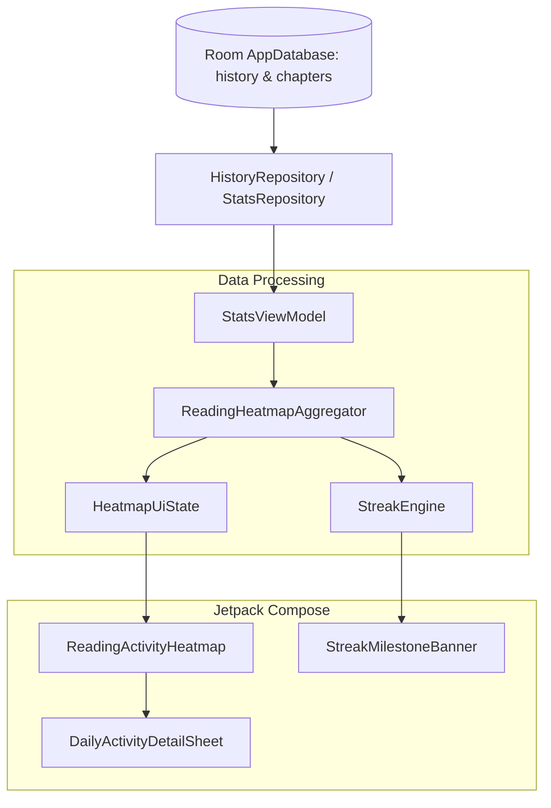

# Technical Proposal: Manga Reading Activity Heatmap & Interactive Timeline

**Status:** Proposed / Under Review  
**Author:** Neko Development Team  
**Date:** August 2026  
**Target Milestone:** Neko 3.1 Analytics & Personalization  
**Implementation State:** 🔴 Completely New Feature (Not Present in Codebase)  

---

## 📌 Codebase Audit & Baseline Notes

> [!NOTE]
> **Current Codebase Baseline:**
> Neko's current statistics subsystem ([`StatsScreen.kt`](file:///run/media/nonproto/WD4T/programming/workspace-android/Neko/app/src/main/java/org/nekomanga/presentation/screens/StatsScreen.kt), [`DetailedStats.kt`](file:///run/media/nonproto/WD4T/programming/workspace-android/Neko/app/src/main/java/org/nekomanga/presentation/screens/stats/DetailedStats.kt), [`StatsViewModel.kt`](file:///run/media/nonproto/WD4T/programming/workspace-android/Neko/app/src/main/java/org/nekomanga/presentation/screens/stats/StatsViewModel.kt)) tracks aggregate lifetime metrics: total manga count, chapter count, total reading duration, and tag/status distributions.
>
> **What This Proposal Adds:**
> Temporal granularity. Neko currently does not record or render daily activity timelines, historical reading heatmaps, daily streaks, or day-by-day drill-down history. This proposal introduces daily time-series aggregation on top of the existing `history` table.

---

## 1. Executive Summary & Vision

While Neko provides aggregate library statistics, it lacks temporal granularity. Users cannot see their daily consistency, reading velocity over time, or habit patterns (e.g., peak reading times of day or days of the week).

### The Objective
This proposal introduces a **GitHub-style Daily Reading Activity Heatmap** and **Interactive Reading Timeline** into Neko's Statistics module. This feature visualizes daily reading habits over a rolling 365-day window, tracks consecutive reading streaks, and highlights personal reading milestones.

### Key Highlights:
1. **Interactive Calendar Heatmap**: A responsive 52-week horizontal grid rendering daily reading intensity (chapters read / time spent) using theme-aware tonal palettes.
2. **Reading Streak Engine**: Computes current daily streak, longest all-time streak, and total active reading days.
3. **Hourly & Day-of-Week Distribution**: Radial or bar visualization detailing reading intensity by hour of day (e.g., night-time reader vs. morning reader).
4. **Historical Day Drill-Down**: Tapping any day cell on the heatmap displays a bottom sheet summarizing the specific manga titles and chapters read on that date.
5. **Zero Performance Overhead**: Aggregated asynchronously via a dedicated Room DAO query on `history` and `chapters` tables with in-memory caching.

---

## 2. Architectural Design



---

## 3. Database & Data Layer Specifications

### 3.1 Room History Aggregation Query

Neko already records chapter read events with timestamps in the `history` table. We introduce an optimized aggregation query in `HistoryDao.kt`:

```kotlin
@Query("""
    SELECT 
        date(datetime(history.last_read / 1000, 'unixepoch', 'localtime')) AS read_date,
        COUNT(history.id) AS chapters_read,
        SUM(history.time_read) AS total_duration_ms
    FROM history
    WHERE history.last_read >= :startTimestampMs
    GROUP BY read_date
    ORDER BY read_date ASC
""")
fun getDailyReadingActivity(startTimestampMs: Long): Flow<List<DailyReadingRecord>>
```

### 3.2 Domain Models

```kotlin
package org.nekomanga.domain.stats

import androidx.compose.runtime.Immutable
import java.time.LocalDate

@Immutable
data class DailyReadingRecord(
    val date: LocalDate,
    val chaptersRead: Int,
    val totalDurationMs: Long,
    val intensityLevel: Int, // 0 to 4 (for color shade mapping)
)

@Immutable
data class ReadingStreakInfo(
    val currentStreakDays: Int,
    val longestStreakDays: Int,
    val totalActiveDays: Int,
    val streakActiveToday: Boolean,
)

@Immutable
data class HeatmapUiState(
    val yearRecords: Map<LocalDate, DailyReadingRecord> = emptyMap(),
    val streakInfo: ReadingStreakInfo = ReadingStreakInfo(0, 0, 0, false),
    val selectedDayRecord: DailyReadingRecord? = null,
    val selectedDayChapters: List<HistoryChapterItem> = emptyList(),
    val maxDailyChapters: Int = 1,
)
```

---

## 4. UI / UX Design Specifications

### 4.1 Heatmap Component ([StatsScreen.kt](file:///run/media/nonproto/WD4T/programming/workspace-android/Neko/app/src/main/java/org/nekomanga/presentation/screens/StatsScreen.kt))
- **Layout**: 7 rows (representing days of the week: Mon–Sun) and 52 columns (weeks).
- **Styling**: Rendered using `MaterialTheme.colorScheme.primary` with 5 levels of alpha/tonal elevation:
  - Level 0 (0 chapters): `surfaceVariant.copy(alpha = 0.3f)`
  - Level 1 (1–2 chapters): `primary.copy(alpha = 0.35f)`
  - Level 2 (3–5 chapters): `primary.copy(alpha = 0.60f)`
  - Level 3 (6–10 chapters): `primary.copy(alpha = 0.85f)`
  - Level 4 (11+ chapters): `primary.copy(alpha = 1.0f)`
- **Interactions**:
  - Horizontal scrolling with initial scroll snapped to the current week.
  - Haptic feedback when tapping individual day cells.
  - Tooltip / Floating badge showing exact date, chapters read, and reading duration.

### 4.2 Streak Milestone Banner
- Displayed immediately above the heatmap.
- Shows flame icon 🔥 with `currentStreakDays`, trophy 🏆 with `longestStreakDays`, and total active days.
- Motivational indicator when the streak is at risk (e.g. "Read a chapter today to keep your 14-day streak alive!").

---

## 5. Technical Footprint & Integration

1. **Repository Layer**: Add `getDailyReadingStats(since: Long)` to `HistoryRepositoryImpl.kt`.
2. **ViewModel Layer**: Integrate `HeatmapUiState` generation in [StatsViewModel.kt](file:///run/media/nonproto/WD4T/programming/workspace-android/Neko/app/src/main/java/org/nekomanga/presentation/screens/stats/StatsViewModel.kt).
3. **Presentation Layer**:
   - Create `ReadingActivityHeatmap.kt` in `org.nekomanga.presentation.screens.stats.components`.
   - Embed heatmap composable inside [DetailedStats.kt](file:///run/media/nonproto/WD4T/programming/workspace-android/Neko/app/src/main/java/org/nekomanga/presentation/screens/stats/DetailedStats.kt).
   - Create `DailyHistoryDetailSheet.kt` for drill-down day inspection.

---

## 6. Implementation Plan & Milestones

- [ ] **Step 1**: Implement `HistoryDao` aggregation query and unit tests for `StreakEngine`.
- [ ] **Step 2**: Create custom Compose grid layout with Canvas or LazyRow for the 52-week heatmap.
- [ ] **Step 3**: Integrate day inspection bottom sheet with chapter history items.
- [ ] **Step 4**: Add user settings toggle in [AdvancedSettingsScreen.kt](file:///run/media/nonproto/WD4T/programming/workspace-android/Neko/app/src/main/java/org/nekomanga/presentation/screens/settings/screens/AdvancedSettingsScreen.kt) to reset or recalculate history metrics.
