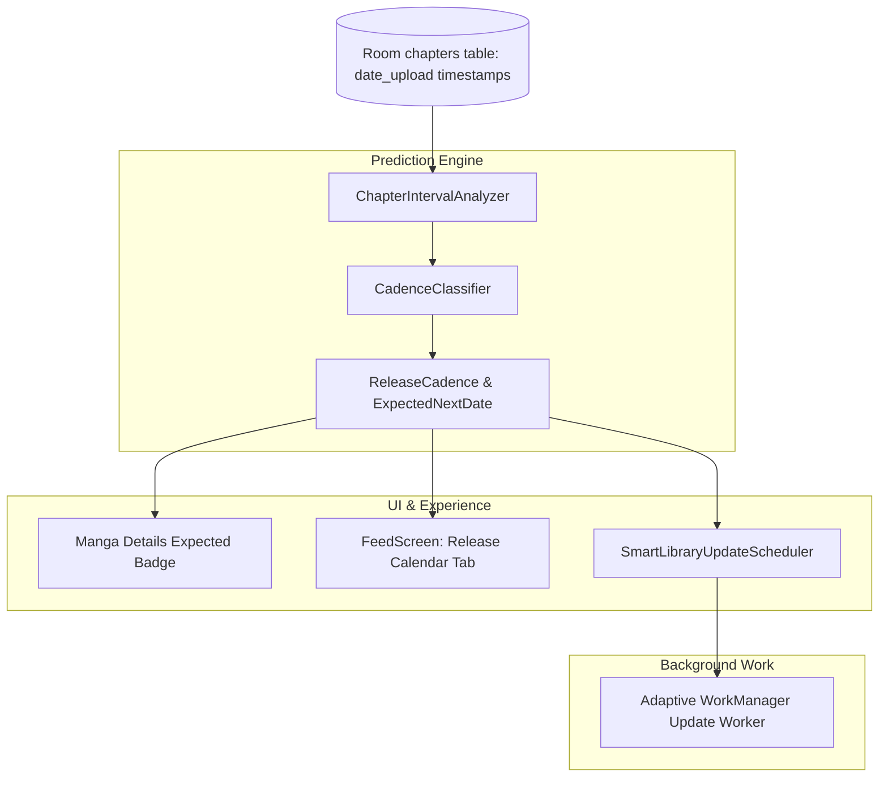

# Technical Proposal: Chapter Release Radar & Cadence Predictor

**Status:** Proposed / Under Review  
**Author:** Neko Development Team  
**Date:** August 2026  
**Target Milestone:** Neko 3.5 Content & Automation  
**Implementation State:** 🔴 Completely New Feature (Not Present in Codebase)  

---

## 📌 Codebase Audit & Baseline Notes

> [!NOTE]
> **Current Codebase Baseline:**
> Neko checks for new chapters during scheduled or manual background library updates ([`LibraryUpdateJob.kt`](file:///run/media/nonproto/WD4T/programming/workspace-android/Neko/app/src/main/java/eu/kanade/tachiyomi/jobs/library/LibraryUpdateJob.kt)). However, the app has no awareness of release cadences (e.g. weekly, bi-weekly, monthly) or expected upcoming release dates.
>
> **What This Proposal Adds:**
> A predictive release estimation and schedule tracking engine ("Release Radar"). By analyzing historical chapter upload timestamps and scanlation group patterns on MangaDex, Neko predicts when the next chapter is likely to drop, displays expected countdown timers, surfaces an upcoming release calendar in [`FeedScreen.kt`](file:///run/media/nonproto/WD4T/programming/workspace-android/Neko/app/src/main/java/org/nekomanga/presentation/screens/FeedScreen.kt), and prioritizes background checks for series expected to update today.

---

## 1. Executive Summary & Vision

Readers frequently check their library or feed to see if their favorite weekly or bi-weekly series have updated. Currently, Neko treats every manga equally during periodic library updates and provides no estimation for when the next chapter is expected.

### The Objective
This proposal designs the **Chapter Release Radar & Cadence Predictor**, an intelligent scheduling sub-system that models upload cadences, provides countdown indicators, and optimizes background network refresh cycles.

### Key Highlights:
1. **Cadence Estimation Algorithm**: Computes statistical inter-arrival time distributions between chapter uploads (e.g. Mean interval: 7.02 days $\rightarrow$ Weekly release on Wednesdays).
2. **Predictive Release Countdown**: Displays expected release badges on manga cards and details headers (e.g. `Next chapter in ~2 days` or `Expected today`).
3. **Hiatus & Serialization Alerts**: Detects sudden anomalies (e.g. 3x normal interval exceeded) and tags titles as `Likely on Hiatus` or alerts users when a long-dormant series unexpectedly drops a new chapter.
4. **Smart Battery-Saving Library Updates**: Prioritizes network checks for titles due for a release today/tomorrow while reducing polling frequency for monthly or dormant titles.
5. **Upcoming Release Calendar**: A visual week-by-week release schedule tab in [`FeedScreen.kt`](file:///run/media/nonproto/WD4T/programming/workspace-android/Neko/app/src/main/java/org/nekomanga/presentation/screens/FeedScreen.kt).

---

## 2. Architectural Design



---

## 3. Core Domain & Data Layer Changes

### 3.1 Domain Models

```kotlin
package org.nekomanga.domain.schedule

import androidx.compose.runtime.Immutable
import java.time.DayOfWeek
import java.time.Instant
import java.time.LocalDate

@Immutable
data class ReleaseCadence(
    val mangaId: Long,
    val cadenceType: CadenceType,
    val confidence: Float, // 0.0 to 1.0
    val expectedDayOfWeek: DayOfWeek?,
    val expectedIntervalDays: Double,
    val estimatedNextRelease: LocalDate?,
    val isHiatusSuspected: Boolean,
)

enum class CadenceType {
    DAILY,
    WEEKLY,
    BI_WEEKLY,
    MONTHLY,
    IRREGULAR,
    UNKNOWN,
}

@Immutable
data class UpcomingReleaseEntry(
    val mangaId: Long,
    val mangaTitle: String,
    val coverUrl: String?,
    val expectedDate: LocalDate,
    val expectedChapterNumber: Float?,
    val cadence: CadenceType,
)
```

### 3.2 Cadence Analyzer Engine

```kotlin
package org.nekomanga.domain.schedule

class ChapterIntervalAnalyzer {
    fun calculateCadence(chapterUploadTimestamps: List<Long>): ReleaseCadence {
        // Compute delta intervals between consecutive chapters
        // Calculate standard deviation and mode day-of-week
        // Determine whether interval matches Weekly (7d), Bi-weekly (14d), or Monthly (30d)
    }
}
```

---

## 4. UI / UX Design Specifications

### 4.1 Manga Details Expected Release Banner ([MangaScreen.kt](file:///run/media/nonproto/WD4T/programming/workspace-android/Neko/app/src/main/java/org/nekomanga/presentation/screens/MangaScreen.kt))
- A sleek info chip beside the publication status:
  - 🟢 **Weekly**: "New chapter expected Wednesday (~2 days)"
  - 🔵 **Monthly**: "Expected ~Sept 15"
  - 🟠 **Anomaly**: "3 weeks overdue (Likely on Hiatus)"

### 4.2 Upcoming Release Calendar in Feed ([FeedScreen.kt](file:///run/media/nonproto/WD4T/programming/workspace-android/Neko/app/src/main/java/org/nekomanga/presentation/screens/FeedScreen.kt))
- A new sub-tab in Feed called **"Schedule"**:
  - Groups library manga by day of the week (Monday through Sunday).
  - Displays covers of series expected to update on each specific day.

---

## 5. Technical Footprint & Integration

1. **Analysis Worker**:
   - Create `CadenceEvaluationWorker.kt` running during library sync to compute cadence metrics asynchronously.
2. **Database Caching**:
   - Add `@ColumnInfo(name = "estimated_next_release")` and `@ColumnInfo(name = "cadence_type")` to `MangaEntity.kt`.
3. **Adaptive Library Updater**:
   - Update `LibraryUpdateJob.kt` to allow users to select "Smart Adaptive Updates" (polling high-probability titles more frequently and dormant titles less frequently).

---

## 6. Implementation Plan & Milestones

- [ ] **Step 1**: Implement `ChapterIntervalAnalyzer` statistical math engine with comprehensive unit tests.
- [ ] **Step 2**: Add schema migration to cache estimated release dates on `MangaEntity`.
- [ ] **Step 3**: Design Compose "Schedule" calendar grid in [FeedScreen.kt](file:///run/media/nonproto/WD4T/programming/workspace-android/Neko/app/src/main/java/org/nekomanga/presentation/screens/FeedScreen.kt).
- [ ] **Step 4**: Integrate adaptive scheduling into background update worker.
