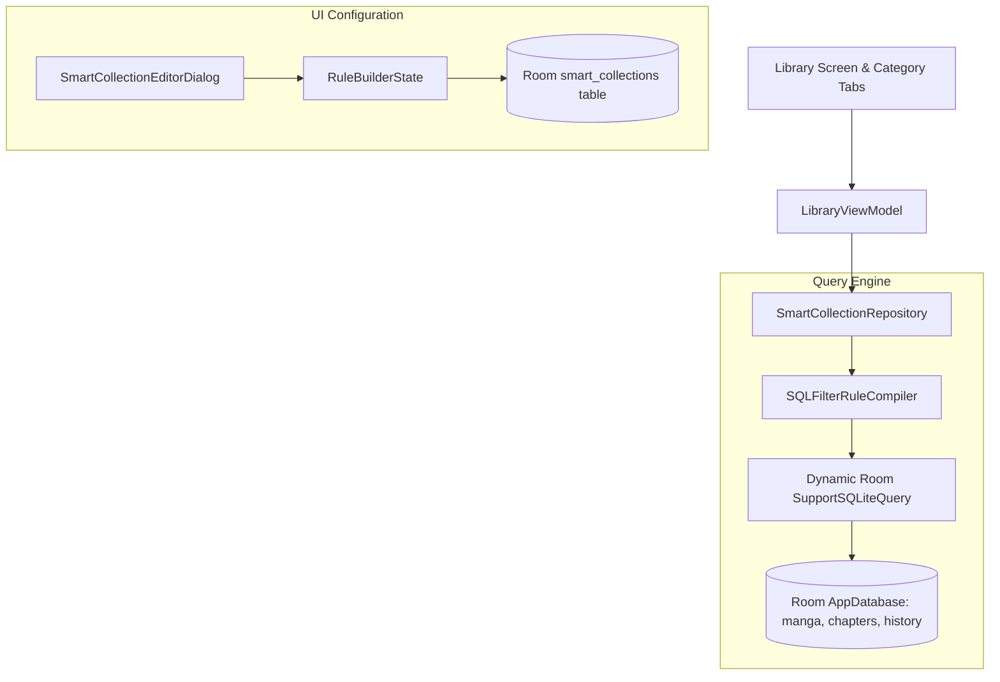

# Technical Proposal: Smart Collections & Rule-Based Dynamic Library Categories

**Status:** Proposed / Under Review  
**Author:** Neko Development Team  
**Date:** August 2026  
**Target Milestone:** Neko 3.4 Library Power-Tools  
**Implementation State:** 🟡 Partially Present Baseline (Static Manual Categories exist; Rule-Based Dynamic Categories are New)  

---

## 📌 Codebase Audit & Baseline Notes

> [!NOTE]
> **Current Codebase Baseline:**
> Neko currently allows creating manual categories ([`Category.kt`](file:///run/media/nonproto/WD4T/programming/workspace-android/Neko/app/src/main/java/eu/kanade/tachiyomi/data/database/models/Category.kt), [`AddEditCategoriesScreen.kt`](file:///run/media/nonproto/WD4T/programming/workspace-android/Neko/app/src/main/java/org/nekomanga/presentation/screens/settings/screens/AddEditCategoriesScreen.kt)), where users manually check/uncheck series to assign them to specific tabs in [`LibraryScreen.kt`](file:///run/media/nonproto/WD4T/programming/workspace-android/Neko/app/src/main/java/org/nekomanga/presentation/screens/LibraryScreen.kt).
>
> **What This Proposal Adds:**
> Dynamic rule-based "Smart Collections". Instead of manual tagging, users can define filter criteria (e.g., `Status == Ongoing AND Unread > 0`, `Downloaded == True`, `Tags contain 'Psychological'`, `Missing Chapters == True AND Rating >= 8.0`). These Smart Collections automatically compute their membership in real-time and display as dynamic tabs in the library.

---

## 1. Executive Summary & Vision

As users build large libraries with hundreds or thousands of manga, manually sorting titles into static categories becomes tedious and frequently falls out of date. Users constantly want focused views like "All Ongoing series with unread chapters", "Recent updates with missing chapters", or "Completed favorites that are fully downloaded".

### The Objective
This proposal designs a **Smart Collections Engine** enabling users to create declarative, live-updating dynamic library tabs powered by saved compound queries and Room database triggers.

### Key Highlights:
1. **Rule Builder UI**: An intuitive visual condition builder supporting `AND` / `OR` blocks matching:
   - Publication status (`Ongoing`, `Completed`, `Hiatus`, `Cancelled`).
   - Read status (`Unread > 0`, `Completed`, `Not Started`).
   - Download status (`Fully Downloaded`, `Partially Downloaded`, `Not Downloaded`).
   - Rating / Score thresholds (MangaDex Bayesian rating, User Tracker score).
   - Content ratings (`Safe`, `Suggestive`, `Erotica`, `Pornographic`).
   - Tags & Genres (Inclusive and Exclusive matching).
   - Missing chapter status (`Has Missing Gaps == true`).
   - Last updated / Last read date intervals (e.g. `Updated within 7 days`).
2. **First-Class Library Tabs**: Smart Collections sit seamlessly alongside manual category tabs in [`LibraryScreen.kt`](file:///run/media/nonproto/WD4T/programming/workspace-android/Neko/app/src/main/java/org/nekomanga/presentation/screens/LibraryScreen.kt) with a distinct sparkle icon ✨.
3. **Reactive Real-Time Updates**: Evaluated dynamically using Room reactive queries without data duplication.

---

## 2. Architectural Design



---

## 3. Core Domain & Data Layer Changes

### 3.1 Domain Models

```kotlin
package org.nekomanga.domain.category

import androidx.compose.runtime.Immutable
import org.nekomanga.domain.manga.MangaStatus

@Immutable
data class SmartCollection(
    val id: Long = 0,
    val name: String,
    val order: Int,
    val rules: List<CollectionRuleGroup>,
    val isDynamic: Boolean = true,
)

@Immutable
data class CollectionRuleGroup(
    val matchAll: Boolean = true, // true = AND, false = OR
    val conditions: List<RuleCondition>,
)

sealed interface RuleCondition {
    data class StatusMatch(val status: Set<MangaStatus>) : RuleCondition
    data class UnreadCount(val operator: ComparisonOp, val count: Int) : RuleCondition
    data class DownloadedStatus(val isDownloaded: Boolean) : RuleCondition
    data class TagMatch(val includedTags: Set<String>, val excludedTags: Set<String>) : RuleCondition
    data class MinRating(val minRating: Double) : RuleCondition
    data class HasMissingChapters(val hasMissing: Boolean) : RuleCondition
    data class UpdatedWithinDays(val days: Int) : RuleCondition
}

enum class ComparisonOp { GREATER_THAN, EQUALS, LESS_THAN }
```

### 3.2 Database Entity

```kotlin
@Entity(tableName = "smart_collections")
data class SmartCollectionEntity(
    @PrimaryKey(autoGenerate = true) val id: Long = 0,
    val name: String,
    @ColumnInfo(name = "sort_order") val order: Int,
    @ColumnInfo(name = "rule_json") val ruleJson: String,
)
```

---

## 4. UI / UX Design Specifications

### 4.1 Smart Collection Editor Sheet
- Accessible from **Library Settings $\rightarrow$ Edit Categories $\rightarrow$ "Add Smart Collection"**.
- Allows naming the collection and adding interactive rule chips (e.g. `[+ Status: Ongoing]` `[+ Unread > 0]` `[+ Tag: Action]`).
- Includes a **"Test Query"** badge showing live preview of matching manga count.

### 4.2 Library Tab Visual Differentiation
- Smart collections feature a discreet sparkle badge ✨ next to their name in the library tab row.
- Drag-and-drop ordering allows interleaving smart collections with traditional static categories.

---

## 5. Technical Footprint & Integration

1. **Persistence Layer**:
   - Add `SmartCollectionEntity` and `SmartCollectionDao.kt` to `AppDatabase.kt`.
2. **Compiler Module**:
   - Create `SmartCollectionSqlCompiler.kt` that parses `CollectionRuleGroup` into parameterized `SimpleSQLiteQuery` strings.
3. **Library View Model**:
   - Update [LibraryViewModel.kt](file:///run/media/nonproto/WD4T/programming/workspace-android/Neko/app/src/main/java/org/nekomanga/presentation/screens/library/LibraryViewModel.kt) to combine manual category flows with compiled dynamic collection flows.

---

## 6. Implementation Plan & Milestones

- [ ] **Step 1**: Implement `SmartCollectionEntity` and SQLite rule compiler.
- [ ] **Step 2**: Add Room DAO methods and repository interfaces.
- [ ] **Step 3**: Design Compose `SmartCollectionEditorSheet` with visual condition builder.
- [ ] **Step 4**: Integrate dynamic collection streams into `LibraryViewModel` and `LibraryScreen`.
