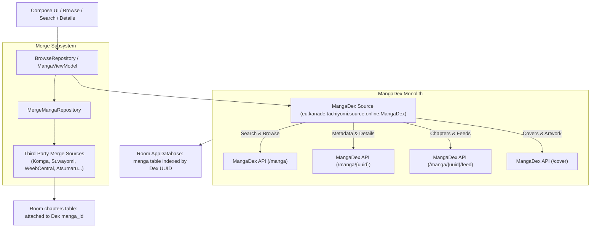
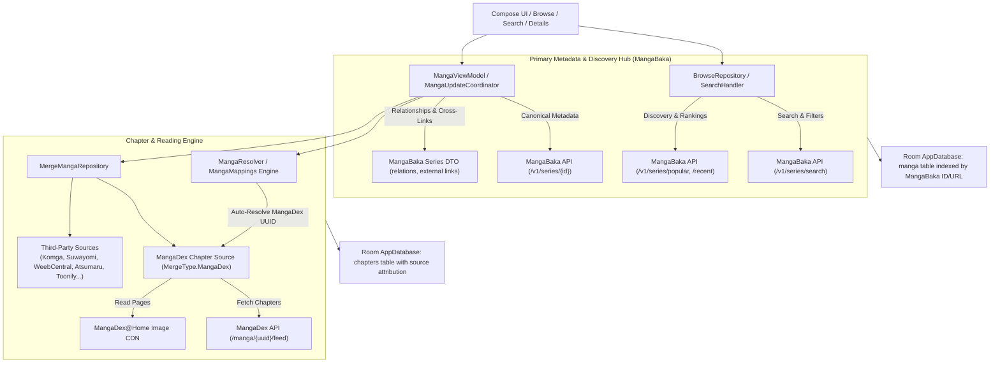
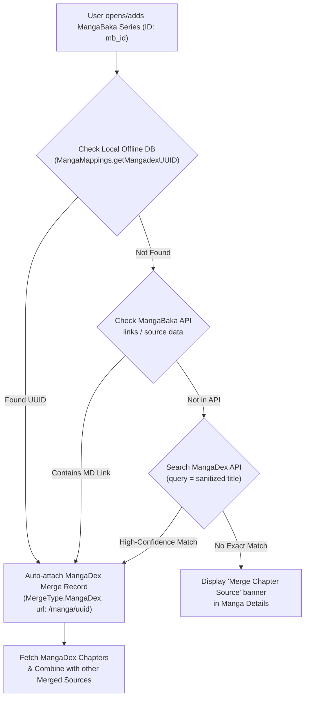
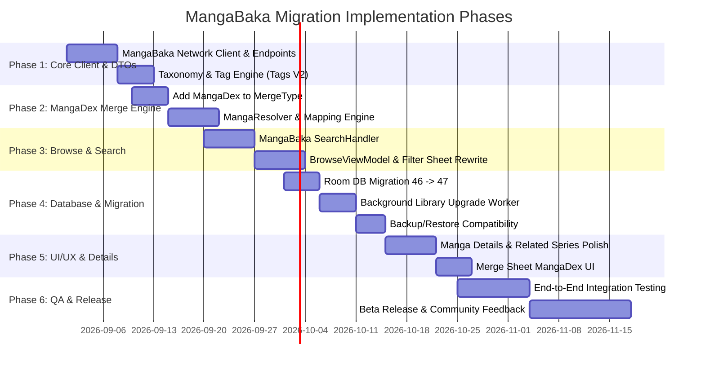

# Technical Proposal: Migrating Neko's Primary Metadata & Search Provider to MangaBaka

**Status:** Proposed / Under Review  
**Author:** Neko Development Team  
**Date:** August 2026  
**Target Milestone:** Neko 3.0 Architectural Modernization  

---

## 1. Executive Summary & Vision

Neko was originally architected as a dedicated, specialized client for [MangaDex](https://mangadex.org). In the current architecture, MangaDex acts simultaneously as the **exclusive metadata provider**, the **primary search engine**, the **catalogue discovery index**, and the **primary chapter host**. Secondary reading sources (such as [Komga](file:///run/media/nonproto/WD4T/programming/workspace-android/Neko/app/src/main/java/eu/kanade/tachiyomi/source/online/merged/komga/Komga.kt), [Suwayomi](file:///run/media/nonproto/WD4T/programming/workspace-android/Neko/app/src/main/java/eu/kanade/tachiyomi/source/online/merged/suwayomi/Suwayomi.kt), [WeebCentral](file:///run/media/nonproto/WD4T/programming/workspace-android/Neko/app/src/main/java/eu/kanade/tachiyomi/source/online/merged/weebcentral/WeebCentral.kt), [Atsumaru](file:///run/media/nonproto/WD4T/programming/workspace-android/Neko/app/src/main/java/eu/kanade/tachiyomi/source/online/merged/atsumaru/Atsumaru.kt), [Comix](file:///run/media/nonproto/WD4T/programming/workspace-android/Neko/app/src/main/java/eu/kanade/tachiyomi/source/online/merged/comix/Comix.kt), and [Toonily](file:///run/media/nonproto/WD4T/programming/workspace-android/Neko/app/src/main/java/eu/kanade/tachiyomi/source/online/merged/toonily/Toonily.kt)) exist solely as "merged sources" attached to a parent MangaDex manga record.

### The Objective
This proposal outlines the architectural migration to establish **[MangaBaka](https://mangabaka.org)** as Neko's **universal, canonical metadata and search provider**, while transitioning **MangaDex into a first-class chapter and merge provider**.

### Key Architectural Shifts:
1. **Canonical Series Identity**: The canonical identity of every series in Neko becomes its **MangaBaka Series ID** (`MangaBakaSeries.id`).
2. **Universal Search & Catalog Discovery**: In-app search, advanced tag filtering, genre exploration, and demographic filtering will query MangaBaka's REST API (`/v1/series/search`).
3. **MangaDex as Primary Merged Chapter Source**: MangaDex will be integrated into Neko's multi-source merge engine as a first-class chapter source, automatically linked via Neko's local mapping database ([`MangaMappings`](file:///run/media/nonproto/WD4T/programming/workspace-android/Neko/app/src/main/java/eu/kanade/tachiyomi/util/manga/MangaMappings.kt)) and external cross-references.
4. **Decoupled Architecture**: Metadata (titles, descriptions, localized alt-titles, authors, artists, publishers, demographic tags, content ratings, related series, and recommendations) is cleanly separated from chapter hosting and page delivery.
5. **Zero Data Loss Migration**: Existing user libraries, read markers, history, categories, bookmarks, and downloads will be automatically migrated via Room database migrations and offline mapping tables.

---

## 2. Architectural Comparison: Before vs. After

### Current Architecture (MangaDex-Centric)



### Proposed Architecture (MangaBaka Metadata Hub + Merged Chapter Providers)



---

## 3. Core Domain & Data Layer Changes

### 3.1 Manga Identity & Canonical URL Structure

In the current schema, [`MangaEntity.url`](file:///run/media/nonproto/WD4T/programming/workspace-android/Neko/app/src/main/java/org/nekomanga/data/database/entity/MangaEntity.kt#L13) and [`SManga.url`](file:///run/media/nonproto/WD4T/programming/workspace-android/Neko/app/src/main/java/eu/kanade/tachiyomi/source/model/SManga.kt) store MangaDex relative paths (e.g. `/manga/32d76d19-8a05-4db0-9fc2-e0b0648fe9d0`).

In the proposed schema:
- **Canonical URL**: Stored as `/series/{mangabaka_id}` (e.g. `/series/12345`).
- **Source Identifier**: [`MangaEntity.source`](file:///run/media/nonproto/WD4T/programming/workspace-android/Neko/app/src/main/java/org/nekomanga/data/database/entity/MangaEntity.kt#L12) stores `MangaBaka.ID` (e.g. `200L`).
- **External Identifiers Mapping**:
  - `MangaEntity.mangadex_id`: Dedicated column or mapped via `merge_manga` table.
  - `anilist_id`, `my_anime_list_id`, `kitsu_id`, `manga_updates_id`, `anime_planet_id`: Populated directly from [`MangaBakaSourceSpecificData`](file:///run/media/nonproto/WD4T/programming/workspace-android/Neko/app/src/main/java/org/nekomanga/data/network/mangabaka/dto/MangaBakaSeriesMetadata.kt#L48).

### 3.2 Metadata Mapping Model

The MangaBaka DTOs already defined in [`org.nekomanga.data.network.mangabaka.dto`](file:///run/media/nonproto/WD4T/programming/workspace-android/Neko/app/src/main/java/org/nekomanga/data/network/mangabaka/dto) provide rich, multi-lingual metadata:

| Manga Domain Field | MangaBaka DTO Field | Transformation / Parsing Logic |
|---|---|---|
| `title` | [`MangaBakaSeries.titles`](file:///run/media/nonproto/WD4T/programming/workspace-android/Neko/app/src/main/java/org/nekomanga/data/network/mangabaka/dto/MangaBakaSeries.kt#L41) | Evaluated using user language preference: Official EN title $\rightarrow$ Romanized Native $\rightarrow$ Native $\rightarrow$ Secondary. |
| `altTitles` | `titles`, `secondaryTitles` | Flattened list joined with `Constants.ALT_TITLES_SEPARATOR`. |
| `author` | [`MangaBakaSeries.authors`](file:///run/media/nonproto/WD4T/programming/workspace-android/Neko/app/src/main/java/org/nekomanga/data/network/mangabaka/dto/MangaBakaSeries.kt#L25) | Joined as comma-separated string `authors.joinToString(", ")`. |
| `artist` | [`MangaBakaSeries.artists`](file:///run/media/nonproto/WD4T/programming/workspace-android/Neko/app/src/main/java/org/nekomanga/data/network/mangabaka/dto/MangaBakaSeries.kt#L26) | Joined as comma-separated string `artists.joinToString(", ")`. |
| `description` | [`MangaBakaSeries.description`](file:///run/media/nonproto/WD4T/programming/workspace-android/Neko/app/src/main/java/org/nekomanga/data/network/mangabaka/dto/MangaBakaSeries.kt#L27) | Direct string. |
| `status` | [`MangaBakaSeries.status`](file:///run/media/nonproto/WD4T/programming/workspace-android/Neko/app/src/main/java/org/nekomanga/data/network/mangabaka/dto/MangaBakaSeries.kt#L30) | `RELEASING` $\rightarrow$ `ONGOING`, `COMPLETED` $\rightarrow$ `COMPLETED`, `HIATUS` $\rightarrow$ `ON_HIATUS`, `CANCELLED` $\rightarrow$ `CANCELLED`. |
| `genre` | [`MangaBakaSeries.genresV2`](file:///run/media/nonproto/WD4T/programming/workspace-android/Neko/app/src/main/java/org/nekomanga/data/network/mangabaka/dto/MangaBakaSeries.kt#L42) & `tagsV2` | Tags and genres flattened with content rating tags. |
| `thumbnail_url` | [`MangaBakaCover`](file:///run/media/nonproto/WD4T/programming/workspace-android/Neko/app/src/main/java/org/nekomanga/data/network/mangabaka/dto/MangaBakaCommonModels.kt#L19) | High resolution image selection based on quality preference (`x350.x1`, `x250.x1`, or `raw.url`). |
| `rating` | [`MangaBakaSeries.rating`](file:///run/media/nonproto/WD4T/programming/workspace-android/Neko/app/src/main/java/org/nekomanga/data/network/mangabaka/dto/MangaBakaSeries.kt#L36) | Bayesian rating formatted to 2 decimal places. |
| `seriesType` | [`MangaBakaSeries.type`](file:///run/media/nonproto/WD4T/programming/workspace-android/Neko/app/src/main/java/org/nekomanga/data/network/mangabaka/dto/MangaBakaSeries.kt#L35) | `MANGA`, `MANHWA`, `MANHUA`, `NOVEL`, `OEL`, `OTHER`. |

---

## 4. Universal Search & Catalog Discovery

### 4.1 Search Pipeline Overhaul

The search engine in [`SearchHandler`](file:///run/media/nonproto/WD4T/programming/workspace-android/Neko/app/src/main/java/eu/kanade/tachiyomi/source/online/handlers/SearchHandler.kt) and [`BrowseRepository`](file:///run/media/nonproto/WD4T/programming/workspace-android/Neko/app/src/main/java/eu/kanade/tachiyomi/ui/source/browse/BrowseRepository.kt) will be re-routed to MangaBaka's search endpoints.

#### Query Capabilities:
- **Keyword Search**: Matches titles, romanized titles, native titles, and synonyms (`/v1/series/search?q={query}`).
- **Taxonomy Filtering (Tags V2)**: Supports inclusive and exclusive tag filters using MangaBaka's Tag IDs (`included_tag_ids`, `excluded_tag_ids`).
- **Content Rating Filtering**: Multi-select filtering for `safe`, `suggestive`, `erotica`, and `pornographic` ([`MangaBakaContentRating`](file:///run/media/nonproto/WD4T/programming/workspace-android/Neko/app/src/main/java/org/nekomanga/data/network/mangabaka/dto/MangaBakaEnums.kt#L24)).
- **Media Type Filtering**: Filter by Manga, Manhwa, Manhua, OEL, or Novels ([`MangaBakaMediaType`](file:///run/media/nonproto/WD4T/programming/workspace-android/Neko/app/src/main/java/org/nekomanga/data/network/mangabaka/dto/MangaBakaEnums.kt#L32)).
- **Publication Status**: Filter by `releasing`, `completed`, `hiatus`, `cancelled`, or `upcoming`.
- **Publication Year Range**: Filter by starting and ending year.
- **Sorting Options**:
  - Rating (Highest to Lowest)
  - Popularity / Follower count
  - Last Updated timestamp
  - Alphabetical (A-Z, Z-A)
  - Relevance score

### 4.2 Explore / Browse Feeds

The Home tab in [`BrowseViewModel`](file:///run/media/nonproto/WD4T/programming/workspace-android/Neko/app/src/main/java/eu/kanade/tachiyomi/ui/source/browse/BrowseViewModel.kt) will display a dynamic composite feed:
1. **Trending / Popular Series** (from MangaBaka API)
2. **Top Rated Series** (from MangaBaka API)
3. **Recently Added Titles** (from MangaBaka API)
4. **Latest Chapters / Follows Feed** (streamed directly from authenticated MangaDex feeds, mapped to MangaBaka series)

---

## 5. MangaDex as Primary Chapter & Merge Provider

### 5.1 The New Role of MangaDex

MangaDex transitions from being the database master to the **lead chapter source**. Neko retains its deep, tailored integration with MangaDex for reading:
- High-speed MangaDex@Home chapter page downloads.
- Chapter language filtering (`filtered_language`) and scanlator group filtering (`filtered_scanlators`).
- Blocked scanlator groups and blocked uploader filters.
- MangaDex forum comment thread integration ([`thread_id`](file:///run/media/nonproto/WD4T/programming/workspace-android/Neko/app/src/main/java/org/nekomanga/data/database/entity/MangaEntity.kt#L40)).
- MangaDex user library sync (syncing follows and read chapters to MangaDex accounts).

### 5.2 Auto-Mapping Engine: Linking MangaBaka to MangaDex

To ensure zero friction for users, whenever a MangaBaka series is opened or added to the library, Neko executes a multi-tier automatic resolution process to link the corresponding MangaDex chapter repository:



#### Mapping Tiers:
1. **Tier 1: High-Performance Offline Database ([`MangaMappings`](file:///run/media/nonproto/WD4T/programming/workspace-android/Neko/app/src/main/java/eu/kanade/tachiyomi/util/manga/MangaMappings.kt))**:
   Neko bundles a precompiled SQLite mapping database (`neko_mapping.db`) containing hundreds of thousands of pre-computed relationships between MangaBaka IDs (`mb`), MangaDex UUIDs (`mdex`), AniList (`al`), MyAnimeList (`mal`), and MangaUpdates (`mu`). Resolution takes **< 1ms**.
2. **Tier 2: MangaBaka Series Metadata**:
   MangaBaka returns canonical external links and source mappings in [`MangaBakaSeries.links`](file:///run/media/nonproto/WD4T/programming/workspace-android/Neko/app/src/main/java/org/nekomanga/data/network/mangabaka/dto/MangaBakaSeries.kt#L39) and [`MangaBakaSeries.source`](file:///run/media/nonproto/WD4T/programming/workspace-android/Neko/app/src/main/java/org/nekomanga/data/network/mangabaka/dto/MangaBakaSeries.kt#L48).
3. **Tier 3: Fuzzy Title Resolution via MangaDex API**:
   If an entry is newly created on MangaBaka and not yet in the offline mapping database, Neko queries MangaDex's `/manga?title={title}` endpoint to automatically discover the corresponding UUID.
4. **Tier 4: Manual Merge Search UI**:
   If automatic resolution fails (e.g. heavily distinct localized title), the user can tap "Link MangaDex" in the Merge Sheet to search and pair the series manually.

### 5.3 Extension of `MergeType`

The [`MergeType`](file:///run/media/nonproto/WD4T/programming/workspace-android/Neko/app/src/main/java/eu/kanade/tachiyomi/data/database/models/MergeMangaImpl.kt#L34) enum is expanded to include MangaDex as an official merge source:

```kotlin
enum class MergeType(
    val id: Int,
    val scanlatorName: String,
    val baseUrl: String = "",
    val multiMerge: Boolean = false,
) {
    Invalid(id = -1, scanlatorName = "Invalid Merge source"),
    MangaDex(
        id = 0,
        scanlatorName = "MangaDex",
        baseUrl = "https://mangadex.org",
        multiMerge = false,
    ),
    Komga(id = 1, scanlatorName = Komga.name, multiMerge = true),
    Toonily(id = 2, scanlatorName = Toonily.name, baseUrl = Toonily.baseUrl),
    WeebCentral(id = 3, scanlatorName = WeebCentral.name, baseUrl = WeebCentral.baseUrl),
    Suwayomi(id = 5, scanlatorName = Suwayomi.name, multiMerge = true),
    MangaBall(id = 7, scanlatorName = MangaBall.name, baseUrl = MangaBall.baseUrl),
    ProjectSuki(id = 9, scanlatorName = ProjectSuki.name, baseUrl = ProjectSuki.baseUrl),
    Comix(id = 10, scanlatorName = Comix.name, baseUrl = Comix.baseUrl),
    Atsumaru(id = 11, scanlatorName = Atsumaru.name, baseUrl = Atsumaru.baseUrl);
}
```

---

## 6. Multi-Source Merging & Chapter Aggregation

In the unified model, a series can aggregate chapters from **MangaDex** alongside any number of secondary sources (e.g. personal Komga servers, Suwayomi instances, scanlator aggregator sites, or raw webtoon providers):

```
┌────────────────────────────────────────────────────────┐
│               Canonical Series (MangaBaka)             │
│               ID: 1042 | "Sousou no Frieren"          │
└───────────────────────────┬────────────────────────────┘
                            │
        ┌───────────────────┼────────────────────┐
        │                   │                    │
┌───────▼────────┐  ┌───────▼────────┐  ┌────────▼────────┐
│  MangaDex (0)  │  │   Komga (1)    │  │  Suwayomi (5)   │
│  (Ch. 1 - 130) │  │  (Vol. 1 - 11) │  │  (Ch. 131-135)  │
└───────┬────────┘  └───────┬────────┘  └────────┬────────┘
        │                   │                    │
        └───────────────────┼────────────────────┘
                            │
┌───────────────────────────▼────────────────────────────┐
│          Unified Chapter List (Smart Sorting)          │
│          - Deduplication by Chapter/Volume Number       │
│          - Source Badging (MangaDex, Komga, etc.)      │
│          - Unified Read State & History Tracking       │
└────────────────────────────────────────────────────────┘
```

[`MangaUpdateCoordinator`](file:///run/media/nonproto/WD4T/programming/workspace-android/Neko/app/src/main/java/eu/kanade/tachiyomi/ui/manga/MangaUpdateCoordinator.kt) coordinates metadata refresh from MangaBaka while asynchronously fetching and combining chapter feeds from MangaDex and all attached merge sources.

---

## 7. Database Migration & Backward Compatibility

### 7.1 Room Database Migration (Schema 46 $\rightarrow$ Schema 47)

A dedicated Room migration will execute the transition without requiring users to rebuild their libraries:

```kotlin
val MIGRATION_46_47 = object : Migration(46, 47) {
    override fun migrate(db: SupportSQLiteDatabase) {
        // 1. Add mangabaka_id column if needed or update url scheme
        db.execSQL("ALTER TABLE manga ADD COLUMN mangabaka_id INTEGER DEFAULT NULL")
        
        // 2. Ensure merge_manga table supports MangaDex merge records
        // 3. Populate MangaDex merge records for existing MangaDex library items
        db.execSQL("""
            INSERT INTO merge_manga (manga_id, cover_url, url, title, merge_type)
            SELECT id, thumbnail_url, url, title, 0
            FROM manga
            WHERE source = 24992809278782  -- Legacy MangaDex Source ID
              AND url LIKE '/manga/%'
        """)
    }
}
```

### 7.2 Post-Migration Library Resolution Worker

A background `OneTimeWorkRequest` will iterate through all existing library manga:
1. Extract the MangaDex UUID from `manga.url`.
2. Look up the corresponding MangaBaka ID via [`MangaMappings.getMbId(uuid)`](file:///run/media/nonproto/WD4T/programming/workspace-android/Neko/app/src/main/java/eu/kanade/tachiyomi/util/manga/MangaMappings.kt#L56).
3. If mapped:
   - Update `manga.url` to `/series/${mbId}`.
   - Update `manga.source` to `MangaBaka.ID`.
   - Update metadata (cover, alt titles, tags) on the next background library update.
4. If not immediately found in the offline mapping database:
   - Schedule a lightweight MangaBaka API lookup by title or MangaDex external link.

### 7.3 Backup & Restore Backward Compatibility

[`BackupRestorer`](file:///run/media/nonproto/WD4T/programming/workspace-android/Neko/app/src/main/java/eu/kanade/tachiyomi/data/backup/BackupRestorer.kt) and [`RestoreHelper`](file:///run/media/nonproto/WD4T/programming/workspace-android/Neko/app/src/main/java/eu/kanade/tachiyomi/data/backup/RestoreHelper.kt) will be updated to:
- Detect legacy backup files where manga items have `source == MangaDex.id` and URLs matching `/manga/{uuid}`.
- Automatically transform the legacy manga record into a MangaBaka manga entry paired with a MangaDex merge entry upon restoration.

---

## 8. Deep Linking & Tracker Integration

### 8.1 Unified Deep Link Routing

[`DeepLinkViewModel`](file:///run/media/nonproto/WD4T/programming/workspace-android/Neko/app/src/main/java/org/nekomanga/presentation/screens/deepLink/DeepLinkViewModel.kt) will natively route incoming URLs from all supported platforms:
- **MangaBaka Links**: `https://mangabaka.org/series/{id}` $\rightarrow$ Opens Manga Details directly using the MangaBaka ID.
- **MangaDex Links**: `https://mangadex.org/title/{uuid}` $\rightarrow$ Resolves to MangaBaka ID via `MangaMappings.getMbId(uuid)`, attaches MangaDex chapter source, and opens Manga Details.
- **Third-Party Tracker Links**: AniList, MyAnimeList, and MangaUpdates links resolve to the canonical MangaBaka series entry.

### 8.2 MangaBaka Tracker Unification

Because MangaBaka already implements OAuth 2.0 PKCE tracking in [`MangaBakaApi`](file:///run/media/nonproto/WD4T/programming/workspace-android/Neko/app/src/main/java/eu/kanade/tachiyomi/data/track/mangabaka/MangaBakaApi.kt), series metadata and user tracking are seamlessly unified. When a user adds a series to their Neko library, tracking status can be linked directly with 1:1 ID parity, eliminating the need for fuzzy tracker searches.

---

## 9. UI / UX Design Specifications

### 9.1 Browse & Search Screen
- **Filter Sheet**: Replaced with MangaBaka V2 taxonomy:
  - Hierarchical genre/tag tree (expanding categories with parent-child relationships).
  - Media Type selector chips (Manga, Manhwa, Manhua, Novel, OEL).
  - Content Rating filters with clear visual indicators (`Safe`, `Suggestive`, `Erotica`, `Pornographic`).
  - Publication Status and Year range sliders.
- **Search Header**: Supports real-time text query and filter badge counters.

### 9.2 Manga Details Screen
- **Rich Metadata Display**: Displays MangaBaka's unified ratings, publication start/end dates, localized alternative titles, anime adaptation badges, and publisher details.
- **Source & Chapter Provider Indicators**: Clear chip indicators showing the active chapter provider(s) (e.g. `MangaDex`, `Komga`) with one-tap access to merge management.
- **Related & Recommended Series**: Uses MangaBaka's rich relationship graph (prequels, sequels, spin-offs, adaptations) and community recommendations.

### 9.3 Merge Management Sheet
- MangaDex is featured at the top of the Merge Sheet as the primary chapter source.
- Users can view the current MangaDex pairing, toggle automatic vs manual mapping, search for alternative MangaDex entries, or attach additional merge sources.

---

## 10. Phased Implementation Roadmap



### Phase Details:
- **Phase 1: Foundation & Networking**
  - Implement full MangaBaka service layer (`/v1/series`, `/v1/series/search`, `/v1/tags`, `/v1/genres`).
  - Cache MangaBaka tag/genre taxonomy locally for instant filter rendering.
- **Phase 2: MangaDex Provider Decoupling**
  - Extract MangaDex chapter fetching into a standalone chapter provider.
  - Implement `MergeType.MangaDex` and auto-resolution pipeline using `MangaMappings`.
- **Phase 3: Search & Discovery Migration**
  - Migrate `BrowseRepository` and `SearchHandler` to MangaBaka.
  - Update `BrowseScreenState`, `DexFilters`, and `FilterBrowseSheet` to use MangaBaka filters.
- **Phase 4: Persistence & Data Migration**
  - Implement Room migration `MIGRATION_46_47`.
  - Build `LibraryMigrationJob` for seamless background conversion of existing user libraries.
  - Update `BackupCreator` and `BackupRestorer` for cross-version compatibility.
- **Phase 5: UI & Deep Linking Refactor**
  - Update `MangaDetails` UI to present MangaBaka metadata and relationships.
  - Update `DeepLinkViewModel` for universal URI routing.
- **Phase 6: Verification & Release**
  - Comprehensive unit and UI testing.
  - Beta testing release with fallback diagnostics.

---

## 11. Risk Analysis & Mitigation Strategies

| Risk / Challenge | Impact | Mitigation Strategy |
|---|---|---|
| **MangaBaka API Rate Limits** | High | Implement local HTTP caching with OkHttp cache, aggressive taxonomy caching in Room, and debounce search input queries by 400ms. |
| **Series Without MangaDex Mapping** | Medium | Provide instant title-based search fallback against MangaDex API, plus an intuitive manual "Link Chapter Source" action in the Manga Details UI. |
| **Offline Library Browsing** | Low | Room database persists all MangaBaka metadata locally; offline library browsing and downloaded chapter reading continue without network dependency. |
| **MangaDex Specific Features (Comments, MD@Home)** | Low | All MangaDex features are preserved by associating the MangaDex UUID in the `merge_manga` record and passing it to MangaDex service calls. |
| **MangaBaka Service Downtime** | Medium | Cached metadata remains fully accessible; chapter fetching and reading from MangaDex or other merge sources continue unaffected. |

---

## 12. Conclusion & Next Steps

Migrating to MangaBaka as Neko's primary metadata and search provider modernizes the application into a versatile, metadata-rich manga browser while preserving the best-in-class MangaDex reading experience. 

### Recommended Next Actions:
1. Solicit feedback on taxonomy filtering and filter UI preferences.
2. Finalize the MangaBaka REST API client implementation.
3. Review the proposed Room database migration script (`MIGRATION_46_47`).
