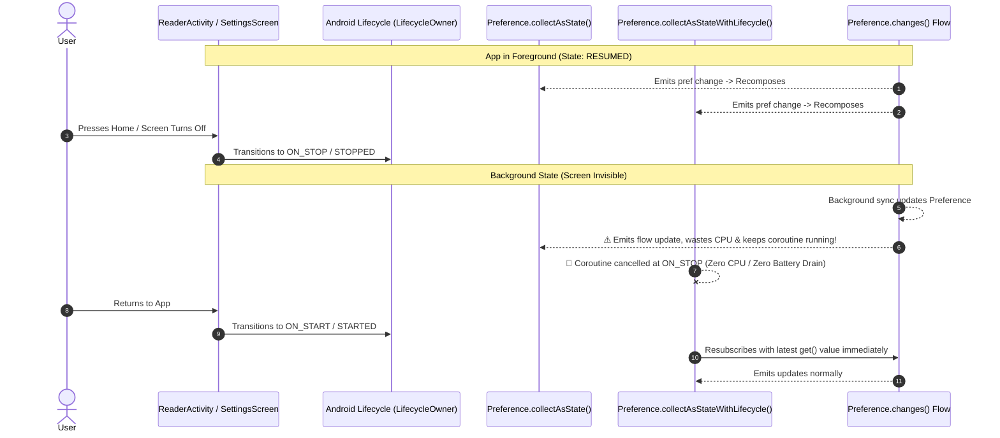
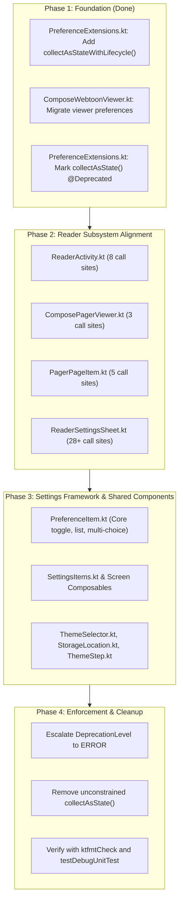

# Technical Proposal: Migrating Preference Flow Collections to Lifecycle-Aware `collectAsStateWithLifecycle()`

**Status:** Proposed / Under Review  
**Author:** Neko Development Team  
**Date:** September 2026  
**Target Milestone:** Neko 3.x UI Lifecycle Modernization & Battery Preservation  
**Execution Order:** Cross-Cutting Infrastructure / Compose Modernization  
**Prerequisites:** Addition of [`Preference<T>.collectAsStateWithLifecycle()`](file:///run/media/nonproto/WD4T/programming/workspace-android/Neko/app/src/main/java/org/nekomanga/presentation/extensions/PreferenceExtensions.kt) in `ref/rock-solid-webtoon-compose-viewer`  
**Related Proposals:** [`rock_solid_webtoon_compose_viewer_proposal.md`](../reader/rock_solid_webtoon_compose_viewer_proposal.md), [`decouple_reader_settings_sheet_proposal.md`](../reader/decouple_reader_settings_sheet_proposal.md), [`decouple_settings_screens_jobs_and_io_proposal.md`](../decoupling/decouple_settings_screens_jobs_and_io_proposal.md)  
**Implementation State:** 🟡 Partially Implemented (Core extension landed in `PreferenceExtensions.kt`; `ComposeWebtoonViewer.kt` migrated; 14 files / 50+ sites pending migration)  

---

## 📌 Executive Summary & Motivation

In modern Android Jetpack Compose development, collecting observable streams must respect the host `LifecycleOwner` state. Collecting data streams when an Activity or Composable is not visible wastes CPU cycles, drains battery power, and can trigger redundant layout calculations.

Neko maintains a strict architectural rule in `.agents/AGENTS.md`:
> **Always use `collectAsStateWithLifecycle()`**: When collecting `StateFlow` or `Flow` streams inside Jetpack Compose, always use `collectAsStateWithLifecycle()` from `androidx.lifecycle.compose` to ensure safe, lifecycle-bounded coroutine execution.

However, across Neko's presentation layer, preference observations historically relied on a legacy Compose extension in [`PreferenceExtensions.kt`](file:///run/media/nonproto/WD4T/programming/workspace-android/Neko/app/src/main/java/org/nekomanga/presentation/extensions/PreferenceExtensions.kt):

```kotlin
@Composable
fun <T> Preference<T>.collectAsState(): State<T> {
    val flow = remember(this) { changes() }
    return flow.collectAsState(initial = get())
}
```

Because this extension internally calls `androidx.compose.runtime.collectAsState()`, its coroutine scope is bound strictly to the **Composition** rather than the host **`Lifecycle`**. When the user puts the app in the background, locks the device, or switches tabs, the underlying flow collector coroutine remains active. Any concurrent write to SharedPreferences/DataStore (such as background library updates, chapter downloads, or backup jobs) triggers unnecessary flow emissions and queued Compose recompositions.

### The Objective
Migrate all appropriate Composable preference observations from `Preference<T>.collectAsState()` to `Preference<T>.collectAsStateWithLifecycle()`, deprecate the unconstrained extension, and establish automated guardrails to prevent regressions.

---

## 2. Architectural Comparison: Composition vs. Lifecycle Binding



### Key Differences

| Feature | `Preference<T>.collectAsState()` | `Preference<T>.collectAsStateWithLifecycle()` |
| :--- | :--- | :--- |
| **Collection Scope** | Composition lifecycle (stops only on unmount/dispose) | Android `LifecycleOwner` (stops on `ON_STOP`, resumes on `ON_START`) |
| **Background Behavior** | Active coroutine; consumes battery and processes broadcasts | Automatically paused; coroutine cancelled while invisible |
| **Initial Value Source** | Synchronous `Preference.get()` | Synchronous `Preference.get()` (zero flicker on resume) |
| **Lifecycle Safety** | Prone to background recomposition work | 100% lifecycle-safe (Official Google Android Architecture Standard) |
| **Repository Rule Adherence** | ❌ Violates `AGENTS.md` Compose rule | ✅ Fully compliant with `AGENTS.md` |

---

## 3. Codebase Audit: Comprehensive Usage Inventory

An exhaustive codebase audit identified **14 files** and **over 50 call sites** utilizing `Preference<T>.collectAsState()`. These call sites fall into three architectural categories:

### A. Reader Subsystem (High Impact)

The reader is Neko's most performance-critical subsystem. Collecting preferences in backgrounded reader activities or persistent bottom sheets causes significant overhead.

| File | Usages | Collected Preferences | Priority |
| :--- | :---: | :--- | :---: |
| [`ReaderActivity.kt`](file:///run/media/nonproto/WD4T/programming/workspace-android/Neko/app/src/main/java/eu/kanade/tachiyomi/ui/reader/ReaderActivity.kt) | 8 | `readerTheme`, `readerBottomButtons`, `cropBorders`, `grayscale`, `defaultOrientationType`, `pageLayout`, `sliderPosition` | **P0** |
| [`ComposePagerViewer.kt`](file:///run/media/nonproto/WD4T/programming/workspace-android/Neko/app/src/main/java/org/nekomanga/presentation/screens/reader/viewer/ComposePagerViewer.kt) | 3 | `animatedPageTransitions`, `readerTheme`, `preloadPageAmount` | **P0** |
| [`PagerPageItem.kt`](file:///run/media/nonproto/WD4T/programming/workspace-android/Neko/app/src/main/java/org/nekomanga/presentation/screens/reader/viewer/PagerPageItem.kt) | 5 | `imageScaleType`, `doublePageGap`, `invertDoublePages`, `readerThemePref`, `zoomStart` | **P0** |
| [`ReaderSettingsSheet.kt`](file:///run/media/nonproto/WD4T/programming/workspace-android/Neko/app/src/main/java/org/nekomanga/presentation/screens/reader/ReaderSettingsSheet.kt) | 28+ | `defaultReadingMode`, `readerTheme`, `showPageNumber`, `keepScreenOn`, `alwaysShowChapterTransition`, `cropBordersWebtoon`, `webtoonSidePadding`, `webtoonEnableZoomOut`, `webtoonNav`, `splitTallImages`, `imageScaleType`, `doublePageGap`, `navigateToPan`, `landscapeZoom`, `pagerCutoutBehavior`, etc. | **P1** |
| [`ComposeWebtoonViewer.kt`](file:///run/media/nonproto/WD4T/programming/workspace-android/Neko/app/src/main/java/org/nekomanga/presentation/screens/reader/viewer/ComposeWebtoonViewer.kt) | 6 | `readerTheme`, `webtoonSidePadding`, `animatedPageTransitionsWebtoon`, `webtoonDisableGaps`, `webtoonEnableZoomOut`, `preloadPageAmount` | **Completed** |

> [!NOTE]
> In [`ReaderActivity.kt`](file:///run/media/nonproto/WD4T/programming/workspace-android/Neko/app/src/main/java/eu/kanade/tachiyomi/ui/reader/ReaderActivity.kt), the import was previously aliased as `import org.nekomanga.presentation.extensions.collectAsState as preferenceCollectAsState` because `collectAsStateWithLifecycle` was already imported for ViewModel StateFlows.

### B. Settings Screens & Core Preference UI Framework (Broad Impact)

Neko's settings architecture renders items via [`PreferenceItem.kt`](file:///run/media/nonproto/WD4T/programming/workspace-android/Neko/app/src/main/java/org/nekomanga/presentation/screens/settings/PreferenceItem.kt). Migrating the core item components cascades lifecycle safety across all settings sub-screens.

| File | Usages | Scope & Description | Priority |
| :--- | :---: | :--- | :---: |
| [`PreferenceItem.kt`](file:///run/media/nonproto/WD4T/programming/workspace-android/Neko/app/src/main/java/org/nekomanga/presentation/screens/settings/PreferenceItem.kt) | 5 | `TogglePreference`, `ListPreference`, `MultiChoicePreference`, `BasicListPreference` item wrappers | **P0 (Cascading)** |
| [`SettingsItems.kt`](file:///run/media/nonproto/WD4T/programming/workspace-android/Neko/app/src/main/java/org/nekomanga/presentation/screens/settings/SettingsItems.kt) | 1 | Shared settings item preference collectors | **P1** |
| [`AppearanceSettingsScreen.kt`](file:///run/media/nonproto/WD4T/programming/workspace-android/Neko/app/src/main/java/org/nekomanga/presentation/screens/settings/screens/AppearanceSettingsScreen.kt) | 1 | `nightMode` | **P1** |
| [`DataStorageSettingsScreen.kt`](file:///run/media/nonproto/WD4T/programming/workspace-android/Neko/app/src/main/java/org/nekomanga/presentation/screens/settings/screens/DataStorageSettingsScreen.kt) | 1 | `lastAutoBackupTimestamp` | **P1** |
| [`DownloadSettingsScreen.kt`](file:///run/media/nonproto/WD4T/programming/workspace-android/Neko/app/src/main/java/org/nekomanga/presentation/screens/settings/screens/DownloadSettingsScreen.kt) | 3 | `downloadNewChaptersInCategories`, `excludeCategoriesInDownloadNew`, `downloadNewChapters` | **P1** |
| [`LibrarySettingsScreen.kt`](file:///run/media/nonproto/WD4T/programming/workspace-android/Neko/app/src/main/java/org/nekomanga/presentation/screens/settings/screens/LibrarySettingsScreen.kt) | 3 | `updateInterval`, `whichCategoriesToUpdate`, `whichCategoriesToExclude` | **P1** |
| [`ReaderSettingsScreen.kt`](file:///run/media/nonproto/WD4T/programming/workspace-android/Neko/app/src/main/java/org/nekomanga/presentation/screens/settings/screens/ReaderSettingsScreen.kt) | 5 | `colorEInk16bit`, `imageScaleType`, `pageLayout`, `doublePageRotate`, `readWithVolumeKeys` | **P1** |

### C. Shared Presentation Components & Onboarding

| File | Usages | Description | Priority |
| :--- | :---: | :--- | :---: |
| [`StorageLocation.kt`](file:///run/media/nonproto/WD4T/programming/workspace-android/Neko/app/src/main/java/org/nekomanga/presentation/components/storage/StorageLocation.kt) | 1 | `storageDirPref` directory picker | **P2** |
| [`ThemeSelector.kt`](file:///run/media/nonproto/WD4T/programming/workspace-android/Neko/app/src/main/java/org/nekomanga/presentation/components/theme/ThemeSelector.kt) | 3 | `nightMode`, `darkTheme`, `lightTheme` | **P2** |
| [`ThemeStep.kt`](file:///run/media/nonproto/WD4T/programming/workspace-android/Neko/app/src/main/java/org/nekomanga/presentation/screens/onboarding/ThemeStep.kt) | 1 | Onboarding `nightMode` selector | **P2** |

---

## 4. Where `collectAsStateWithLifecycle()` Is Appropriate vs. Inappropriate

To adhere strictly to the user requirement of migrating **where appropriate**, we define clear architectural boundaries:

### ✅ Where It IS Appropriate (Must Migrate)
1. **Screen-level Composables**: Any Composable directly hosted in an Activity, Fragment, or Navigation backstack entry (e.g. `ReaderActivity`, `AppearanceSettingsScreen`, `LibrarySettingsScreen`).
2. **Modal Sheets & Dialogs**: Composables hosted in bottom sheets or dialog windows attached to an active `LifecycleOwner` (e.g. `ReaderSettingsSheet`).
3. **Reusable UI Components**: Stateless or stateful UI items rendered within a lifecycle-backed composition (e.g. `ThemeSelector`, `PreferenceItem`).
4. **Reader Page & Viewer Overlays**: Composable views displaying pages and transitions in the reader (e.g. `ComposePagerViewer`, `PagerPageItem`).

### ❌ Where It Is NOT Appropriate (Must NOT Use / Exclude)
1. **Non-Composable / Domain / Data Layers**:
   - `UseCases`, `Repositories`, and `Background Jobs` must **never** call Composable extensions. They must continue using pure coroutine primitives: `preference.changes().collect { ... }`, `preference.get()`, or `preference.set()`.
2. **Custom Offscreen / Headless Compositions**:
   - If a composition is executed without a `LocalLifecycleOwner` (e.g., custom image generation, canvas snapshotting, or headless testing without a mocked `LifecycleOwner`), `collectAsStateWithLifecycle()` will throw an `IllegalStateException`. In those isolated contexts, synchronous `preference.get()` or a constant state must be used instead.
3. **Composables Requiring Instantaneous Resumption Without Lifecycle Restarts**:
   - For preferences that need a different minimum active lifecycle state (e.g., keeping collection active while paused in multi-window mode), `minActiveState = Lifecycle.State.STARTED` (the default) is already ideal. If a component must only observe while strictly focused, `Lifecycle.State.RESUMED` should be specified explicitly.

---

## 5. Implementation Specification

### 5.1 Extension Function Definition

The extension in [`PreferenceExtensions.kt`](file:///run/media/nonproto/WD4T/programming/workspace-android/Neko/app/src/main/java/org/nekomanga/presentation/extensions/PreferenceExtensions.kt) provides the lifecycle-bounded bridge:

```kotlin
package org.nekomanga.presentation.extensions

import androidx.compose.runtime.Composable
import androidx.compose.runtime.State
import androidx.compose.runtime.remember
import androidx.lifecycle.Lifecycle
import androidx.lifecycle.compose.collectAsStateWithLifecycle
import tachiyomi.core.preference.Preference

/**
 * Collects values from this [Preference] as Compose [State] bounded by the current [LifecycleOwner].
 *
 * Automatically stops collecting when the lifecycle drops below [minActiveState] (default [Lifecycle.State.STARTED])
 * to prevent background CPU and battery drain.
 */
@Composable
fun <T> Preference<T>.collectAsStateWithLifecycle(
    minActiveState: Lifecycle.State = Lifecycle.State.STARTED,
): State<T> {
    val flow = remember(this) { changes() }
    return flow.collectAsStateWithLifecycle(initialValue = get(), minActiveState = minActiveState)
}

/**
 * @deprecated Use [collectAsStateWithLifecycle] to ensure flow collection pauses when the screen is in the background.
 */
@Deprecated(
    message = "Use collectAsStateWithLifecycle() to ensure lifecycle-bounded collection and prevent background battery drain",
    replaceWith = ReplaceWith("collectAsStateWithLifecycle()"),
    level = DeprecationLevel.WARNING,
)
@Composable
fun <T> Preference<T>.collectAsState(): State<T> {
    val flow = remember(this) { changes() }
    return androidx.compose.runtime.collectAsState(initial = get())
}
```

### 5.2 Migration Pattern Examples

#### Case A: Direct Import Replacement (Standard Screen / Component)

```diff
- import org.nekomanga.presentation.extensions.collectAsState
+ import org.nekomanga.presentation.extensions.collectAsStateWithLifecycle

  @Composable
  fun ThemeSelector(preferences: UiPreferences) {
-     val nightMode by preferences.nightMode().collectAsState()
-     val darkAppTheme by preferences.darkTheme().collectAsState()
-     val lightAppTheme by preferences.lightTheme().collectAsState()
+     val nightMode by preferences.nightMode().collectAsStateWithLifecycle()
+     val darkAppTheme by preferences.darkTheme().collectAsStateWithLifecycle()
+     val lightAppTheme by preferences.lightTheme().collectAsStateWithLifecycle()
  }
```

#### Case B: De-aliasing in `ReaderActivity.kt`

```diff
- import org.nekomanga.presentation.extensions.collectAsState as preferenceCollectAsState
+ import org.nekomanga.presentation.extensions.collectAsStateWithLifecycle as preferenceCollectAsStateWithLifecycle

- val readerTheme by readerPreferences.readerTheme().preferenceCollectAsState()
+ val readerTheme by readerPreferences.readerTheme().preferenceCollectAsStateWithLifecycle()
```

#### Case C: Core Preference Item Framework (`PreferenceItem.kt`)

```diff
  @Composable
  fun TogglePreference(item: Preference.PreferenceItem.TogglePreference) {
-     val value by item.pref.collectAsState()
+     val value by item.pref.collectAsStateWithLifecycle()
      ...
  }
```

---

## 6. Phased Migration Plan



### Milestone Breakdown

1. **Phase 1: Foundation (Completed in `ref/rock-solid-webtoon-compose-viewer`)**
   - Added `Preference<T>.collectAsStateWithLifecycle()` to [`PreferenceExtensions.kt`](file:///run/media/nonproto/WD4T/programming/workspace-android/Neko/app/src/main/java/org/nekomanga/presentation/extensions/PreferenceExtensions.kt).
   - Migrated all preference observations in [`ComposeWebtoonViewer.kt`](file:///run/media/nonproto/WD4T/programming/workspace-android/Neko/app/src/main/java/org/nekomanga/presentation/screens/reader/viewer/ComposeWebtoonViewer.kt).
   - Verified that `./gradlew ktfmtCheck` and `./gradlew ktfmtFormat` pass cleanly.

2. **Phase 2: Reader Subsystem Migration (Target: Next Reader Stabilization PR)**
   - Migrate [`ReaderActivity.kt`](file:///run/media/nonproto/WD4T/programming/workspace-android/Neko/app/src/main/java/eu/kanade/tachiyomi/ui/reader/ReaderActivity.kt).
   - Migrate [`ComposePagerViewer.kt`](file:///run/media/nonproto/WD4T/programming/workspace-android/Neko/app/src/main/java/org/nekomanga/presentation/screens/reader/viewer/ComposePagerViewer.kt) and [`PagerPageItem.kt`](file:///run/media/nonproto/WD4T/programming/workspace-android/Neko/app/src/main/java/org/nekomanga/presentation/screens/reader/viewer/PagerPageItem.kt).
   - Migrate [`ReaderSettingsSheet.kt`](file:///run/media/nonproto/WD4T/programming/workspace-android/Neko/app/src/main/java/org/nekomanga/presentation/screens/reader/ReaderSettingsSheet.kt) (can be batched with Step R6 of the reader track).

3. **Phase 3: Settings Framework & Shared Components (Target: Settings Modernization PR)**
   - Migrate [`PreferenceItem.kt`](file:///run/media/nonproto/WD4T/programming/workspace-android/Neko/app/src/main/java/org/nekomanga/presentation/screens/settings/PreferenceItem.kt) and [`SettingsItems.kt`](file:///run/media/nonproto/WD4T/programming/workspace-android/Neko/app/src/main/java/org/nekomanga/presentation/screens/settings/SettingsItems.kt).
   - Migrate Settings sub-screens ([`AppearanceSettingsScreen.kt`](file:///run/media/nonproto/WD4T/programming/workspace-android/Neko/app/src/main/java/org/nekomanga/presentation/screens/settings/screens/AppearanceSettingsScreen.kt), [`DataStorageSettingsScreen.kt`](file:///run/media/nonproto/WD4T/programming/workspace-android/Neko/app/src/main/java/org/nekomanga/presentation/screens/settings/screens/DataStorageSettingsScreen.kt), [`DownloadSettingsScreen.kt`](file:///run/media/nonproto/WD4T/programming/workspace-android/Neko/app/src/main/java/org/nekomanga/presentation/screens/settings/screens/DownloadSettingsScreen.kt), [`LibrarySettingsScreen.kt`](file:///run/media/nonproto/WD4T/programming/workspace-android/Neko/app/src/main/java/org/nekomanga/presentation/screens/settings/screens/LibrarySettingsScreen.kt), [`ReaderSettingsScreen.kt`](file:///run/media/nonproto/WD4T/programming/workspace-android/Neko/app/src/main/java/org/nekomanga/presentation/screens/settings/screens/ReaderSettingsScreen.kt)).
   - Migrate [`ThemeSelector.kt`](file:///run/media/nonproto/WD4T/programming/workspace-android/Neko/app/src/main/java/org/nekomanga/presentation/components/theme/ThemeSelector.kt), [`StorageLocation.kt`](file:///run/media/nonproto/WD4T/programming/workspace-android/Neko/app/src/main/java/org/nekomanga/presentation/components/storage/StorageLocation.kt), and [`ThemeStep.kt`](file:///run/media/nonproto/WD4T/programming/workspace-android/Neko/app/src/main/java/org/nekomanga/presentation/screens/onboarding/ThemeStep.kt).

4. **Phase 4: Deprecation Enforcement & Guardrails**
   - Add `@Deprecated(level = DeprecationLevel.WARNING)` to `Preference<T>.collectAsState()`.
   - After downstream PRs land, elevate to `DeprecationLevel.ERROR` and remove the unconstrained implementation.

---

## 7. Verification & Testing Strategy

1. **Unit Testing**:
   - Validate that `Preference<T>.collectAsStateWithLifecycle()` correctly emits the initial value returned by `get()`.
   - Verify with Compose UI test harnesses that state updates emitted by `preference.set(newValue)` propagate to the Composable.
2. **Lifecycle Pause Verification**:
   - Verify that pausing the host lifecycle stops flow collection and resuming restarts collection without missing intermediate updates.
3. **Static Analysis**:
   - Enforce via `./gradlew ktfmtCheck` and `./gradlew detekt` that no new calls to unconstrained `collectAsState()` are introduced.
