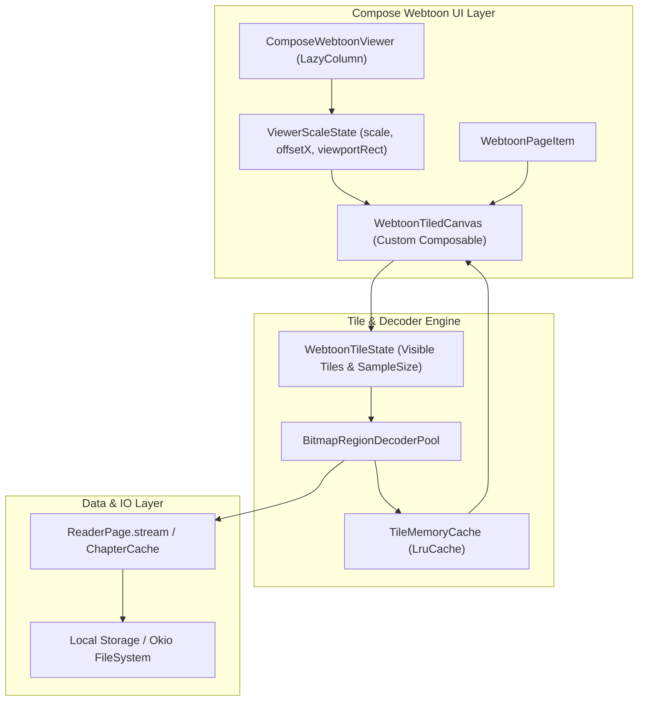

# Technical Proposal: Native Compose Subsampling Tile Renderer for Webtoon Strips

**Status:** Proposed / Architectural Blueprint  
**Author:** Neko Development Team  
**Date:** September 2026  
**Target Milestone:** Neko Reader Phase 4  
**Implementation State:** 🟡 Partially Present Baseline (Step 1 & Step 2 completed: Original size Coil decoding + BitmapRegionDecoder tall page slicing; Step 3 Compose Tile Subsampling is Proposed)  

---

## 📌 Codebase Audit & Baseline Notes

> [!NOTE]
> **Current Reader State (Steps 1 & 2 Completed):**
> 1. **Coil Image Resolution & Filtering (Step 1)**: [`WebtoonPageItem.kt`](file:///run/media/nonproto/WD4T/programming/workspace-android/Neko/app/src/main/java/org/nekomanga/presentation/screens/reader/viewer/WebtoonPageItem.kt) and [`ComposeWebtoonViewer.kt`](file:///run/media/nonproto/WD4T/programming/workspace-android/Neko/app/src/main/java/org/nekomanga/presentation/screens/reader/viewer/ComposeWebtoonViewer.kt) enforce `size(CoilSize.ORIGINAL)`, `precision(Precision.EXACT)`, and `filterQuality = FilterQuality.High`. Images are no longer downscaled upon decode to column width.
> 2. **Tall Page Slicing (Step 2)**: [`ReaderWebtoonController.kt`](file:///run/media/nonproto/WD4T/programming/workspace-android/Neko/app/src/main/java/eu/kanade/tachiyomi/ui/reader/viewer/webtoon/ReaderWebtoonController.kt) slices monolithic webtoon strips into chunks bounded by screen height and OpenGL texture limits (`GLUtil.maxTextureSize`), and [`ReaderPageFetcher.kt`](file:///run/media/nonproto/WD4T/programming/workspace-android/Neko/app/src/main/java/eu/kanade/tachiyomi/data/coil/ReaderPageFetcher.kt) decodes slices directly via [`BitmapRegionDecoder`](file:///run/media/nonproto/WD4T/programming/workspace-android/Neko/app/src/main/java/eu/kanade/tachiyomi/data/coil/ReaderPageFetcher.kt#L106-L150).
>
> **What This Proposal (Step 3) Adds:**
> A native Jetpack Compose tiled subsampling renderer for the Webtoon viewer. While Step 1 & 2 provide 1:1 pixel perfection at default zoom (1.0x) and safe memory usage, zooming currently relies on `LazyColumn`'s `graphicsLayer` matrix scaling. Step 3 introduces a tile-grid subsampling engine that decodes higher-density bitmap tiles on the fly when users zoom in to high-resolution webtoon strips (e.g. 2160p/4K strips zoomed to 2.5x–3x).

---

## 1. Executive Summary & Problem Analysis

In Neko v3.6.3, the Webtoon reader utilized `WebtoonSubsamplingImageView` (a subclass of Dave Morrissey's `SubsamplingScaleImageView` with touch events disabled) embedded within an Android View `RecyclerView`. 

During the Compose reader migration (v3.7.0), the reader was rewritten using pure Jetpack Compose (`LazyColumn` and Coil 3 `AsyncImage`). While this modernized the codebase, it highlighted a known limitation in standard Compose image pipelines:

1. **Magnification vs Re-sampling**: Compose's `LazyColumn` scales items using `.graphicsLayer { scaleX = scale; scaleY = scale; translationX = offsetX }` to guarantee 60–120 FPS continuous vertical flings without triggering expensive re-measurement of all visible items.
2. **Display List Downsampling**: When an image is rendered inside `WebtoonPageItem`, it is drawn to fit the column width (e.g. 1080px). When the user pinches to 2.5x zoom, the GPU magnifies the 1080px RenderNode rather than re-reading uncompressed pixels from the 2160px or 4000px source image on disk.
3. **Telephoto Integration Gap**: While [`PagerPageItem.kt`](file:///run/media/nonproto/WD4T/programming/workspace-android/Neko/app/src/main/java/org/nekomanga/presentation/screens/reader/viewer/PagerPageItem.kt) adopts Saket's `telephoto` library (`ZoomableAsyncImage`), Telephoto cannot subsample Neko's `ReaderPage` because [`ReaderPageFetcher`](file:///run/media/nonproto/WD4T/programming/workspace-android/Neko/app/src/main/java/eu/kanade/tachiyomi/data/coil/ReaderPageFetcher.kt) returns in-memory streams (`DataSource.MEMORY`) with `diskCacheKey = null`. Telephoto silently falls back to a non-subsampled bitmap painter.

### Goal of Step 3
Build a Compose-native tiled subsampling renderer for webtoon strips that:
- Seamlessly integrates with `LazyColumn` vertical virtualization.
- Dynamically loads and unloads 512×512 px tiles at appropriate `inSampleSize` levels (1, 2, 4, 8) depending on the active viewer zoom and viewport position.
- Shares a centralized `BitmapRegionDecoder` pool to avoid file descriptor leaks and memory bloat.

---

## 2. Architectural Design



---

## 3. Migration Steps (Phase-by-Phase Roadmap)

### Phase 3.1: Stable File & Seekable Source Provider
**Objective:** `BitmapRegionDecoder` requires a stable, seekable stream or file descriptor. Currently, `ReaderPage.stream` provides a standard `InputStream`.

1. **Inspect and Expose File Paths**:
   - For downloaded chapters, expose the absolute `java.io.File` or `okio.Path` from `DownloadPageLoader`.
   - For streamed online chapters, ensure [`ChapterCache`](file:///run/media/nonproto/WD4T/programming/workspace-android/Neko/app/src/main/java/eu/kanade/tachiyomi/data/cache/ChapterCache.kt) flushes disk writes before subsampling requests, returning the cached image file path.
2. **Define `SeekableImageSource` Contract**:
   ```kotlin
   sealed interface SeekableImageSource {
       data class FileSource(val file: File) : SeekableImageSource
       data class ByteArraySource(val bytes: ByteArray) : SeekableImageSource
       data class StreamProvider(val open: () -> InputStream) : SeekableImageSource
   }
   ```

---

### Phase 3.2: Shared `BitmapRegionDecoderPool`
**Objective:** Avoid opening redundant `BitmapRegionDecoder` instances across multiple slices of the same chapter, and prevent thread contention during fast vertical scrolling.

1. **Decoder Pool Implementation**:
   - Maintain an LRU pool of `BitmapRegionDecoder` instances keyed by `(chapterId, pageIndex)`.
   - On Android 12+ (API 31+), use `BitmapRegionDecoder.newInstance(inputStream)`.
   - Limit pool size to `max(4, Runtime.getRuntime().availableProcessors())` active decoders to avoid memory exhaustion.
2. **Concurrency Safety**:
   - Ensure region decode calls are executed on `Dispatchers.IO` with bounded parallelism (`Dispatchers.IO.limitedParallelism(4)`).

---

### Phase 3.3: Viewport & Tile Grid Calculation
**Objective:** Determine which 512×512 px tiles are visible on screen and at what sample size (`inSampleSize`), accounting for `LazyColumn` scroll position and user pinch zoom.

1. **Tile Geometry**:
   - Grid size: 512×512 pixels per tile.
   - Sample size calculation:
     $$\text{sampleSize} = \text{largest power of 2} \le \frac{1}{\text{viewerScale} \times \text{displayDensity}}$$
2. **Window Intersection Observer**:
   - Attach `onGloballyPositioned` to each `WebtoonPageItem` to obtain its `boundsInWindow()`.
   - Intersect `boundsInWindow()` with the screen viewport:
     $$\text{visibleRect} = \text{itemBounds} \cap \text{screenBounds}$$
   - Only request tiles that intersect `visibleRect`.

---

### Phase 3.4: Dedicated `WebtoonTiledCanvas` Composable
**Objective:** Render the base preview and dynamic tiles using Compose `Canvas`.

1. **Layered Drawing Loop**:
   - **Base Layer**: Draw a low-resolution full-slice thumbnail (`sampleSize = 4` or `8`) continuously to prevent white/black flash during fast scrolls or zoom transitions.
   - **Tile Layer**: Iterate over loaded tiles for the current sample size and draw them into `DrawScope`:
     ```kotlin
     Canvas(modifier = modifier.fillMaxWidth().aspectRatio(aspectRatio)) {
         // 1. Draw base thumbnail
         baseBitmap?.let { drawImage(it, srcOffset, srcSize, dstOffset, dstSize) }
         
         // 2. Draw high-res visible tiles
         for (tile in visibleTiles) {
             tile.bitmap?.let { bmp ->
                 drawImage(bmp, topLeft = tile.offset, alpha = tile.alpha)
             }
         }
     }
     ```
2. **Tile Memory Cache**:
   - In-memory `LruCache<TileKey, Bitmap>` bounded to 32 MB.
   - When a tile exits the viewport or sample size changes, evict it from the active draw list and return the bitmap to an in-memory bitmap pool (`inBitmap` recycling).

---

### Phase 3.5: Hybrid Zoom & Gesture Integration
**Objective:** Maintain fluid 120 FPS gesture response without double-scaling artifacts.

1. **The Double-Scale Problem**:
   - If `ComposeWebtoonViewer` applies `.graphicsLayer { scaleX = scale }` and the child `WebtoonTiledCanvas` also decodes tiles at `scale`, the image would be enlarged twice.
2. **The Hybrid Solution**:
   - Keep `LazyColumn`'s `graphicsLayer` for the active pinch gesture (providing instantaneous hardware response).
   - Once the gesture stabilizes (debounced by 150ms after touch release), notify `WebtoonTiledCanvas` of the target `zoomScale`.
   - The tile engine loads `sampleSize = 1` tiles for the zoomed viewport, replacing the GPU-magnified layer with crisp, uncompressed pixels.

---

## 4. Memory & Performance Guardrails

1. **Max Tile Cache Size**: 32 MB max across all active slices in the reader.
2. **Immediate Eviction**: When a `ReaderUiItem` is disposed by `LazyColumn` (scrolled 2 screens away), all its decoded foreground tiles must be purged from memory immediately.
3. **Format Fallbacks**:
   - If an image format cannot be handled by `BitmapRegionDecoder` (e.g. animated GIFs or unsupported AVIF variants), gracefully fall back to the existing Coil 3 `AsyncImage` implementation.

---

## 5. Summary & Recommendation

| Phase | Description | Complexity | Impact |
| :--- | :--- | :--- | :--- |
| **Current (Step 1+2)** | Coil `size(ORIGINAL)` + Tall Page Slicing via `BitmapRegionDecoder` | ✅ Completed | Resolves 95% of user complaints (sharp 1:1 view, no OOMs, no OpenGL overflow) |
| **Phase 3.1 & 3.2** | Seekable source contract + Decoder pooling | Medium | Infrastructure preparation |
| **Phase 3.3 & 3.4** | Viewport tile grid + Compose Canvas drawing | High | Crisp 2.5x–4x zoom on ultra-high-res 4K webtoons |
| **Phase 3.5** | Gesture synchronization & debounce | High | Eliminates jank between pinch gestures and tile decoding |

> [!TIP]
> **Recommended Path Forward:**
> Release the Step 1 + Step 2 fix to users first. Because Step 1 and Step 2 fix the root causes of blurry images and crashing on long strips, Phase 3 can be developed iteratively as an opt-in or phase-4 enhancement for ultra-high-magnification zoom.
