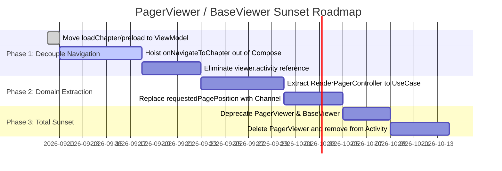

# Technical Proposal: Decoupling Reader Chapter Navigation, Concurrency Guards & Lifecycle Orchestration

**Status:** Proposed / Under Review  
**Author:** Neko Development Team  
**Date:** September 2026  
**Target Milestone:** Neko 3.x Reader Decoupling  
**Implementation State:** 🟡 Phase 1 Stabilization Complete (Hoisted `onNavigateToChapter` and `onRequestPreloadChapter`, memoized `defaultPageIndex`, stabilized `nestedScrollConnection`, and aligned concurrency checks; transition execution remains in Activity `lifecycleScope` awaiting Phase 2 ViewModel engine)  

---

## 📌 Codebase Audit & Baseline Notes

> [!NOTE]
> **Current Architectural Baseline:**
> Following the Compose reader migration in Neko 3.7.1 and subsequent hardening for brand-new chapter page jumps:
> - **Activity-Bound Coroutine Lifecycle ([`ReaderActivity.kt#L1161-L1185`](file:///run/media/nonproto/WD4T/programming/workspace-android/Neko/app/src/main/java/eu/kanade/tachiyomi/ui/reader/ReaderActivity.kt#L1161-L1185))**:
>   `loadAdjacentChapter(next: Boolean)` launches inside `lifecycleScope.launch`. When the user rotates the device, unfolds a foldable device (e.g. Pixel Fold / Galaxy Fold), or switches apps during a chapter transition, the activity is destroyed/recreated and `lifecycleScope` is cancelled mid-flight. This risks interrupted downloads, incomplete progress commits, or stuck loading states.
> - **Compose Navigation Hoisting & Timer Lock Gap ([`ComposePagerViewer.kt#L370-L384`](file:///run/media/nonproto/WD4T/programming/workspace-android/Neko/app/src/main/java/org/nekomanga/presentation/screens/reader/viewer/ComposePagerViewer.kt#L370-L384))**:
>   `onNavigateToChapter` and `onRequestPreloadChapter` have been hoisted out of `ComposePagerViewer`. However, until `ReaderChapterTransitionState.Loading` is wired into `ReaderViewModel`, overscroll transitions still rely on an internal `isTransitioning` guard with `delay(500L)`. On high-latency loads (>500ms), the guard releases prematurely; on instantaneous cache hits (<50ms), gestures are blocked unnecessarily.
> - **Compose Recomposition & Touch Slop Stabilization**:
>   `defaultPageIndex` calculation originally performed up to three unmemoized O(N) list scans on every Compose recomposition pass. Additionally, `nestedScrollConnection` previously held `items` in its `remember` keys, resetting `accumulatedOverscroll` to `0f` mid-gesture when background download statuses updated. These are stabilized via `remember(items, ...)` and `rememberUpdatedState(items)`.
> - **Fragile Imperative Event Bus via Mutable State ([`PagerViewer.kt#L35`](file:///run/media/nonproto/WD4T/programming/workspace-android/Neko/app/src/main/java/eu/kanade/tachiyomi/ui/reader/viewer/pager/PagerViewer.kt#L35))**:
>   Programmatic page navigation (slider scrub, TOC selection, bookmark jumps) sets `viewer.requestedPagePosition = Pair<Int, Boolean>?`. Compose catches this via `LaunchedEffect(viewer.requestedPagePosition)` ([`ComposePagerViewer.kt#L176-L197`](file:///run/media/nonproto/WD4T/programming/workspace-android/Neko/app/src/main/java/org/nekomanga/presentation/screens/reader/viewer/ComposePagerViewer.kt#L176-L197)) and clears it in a `finally` block. This mutable side-channel is vulnerable to race conditions, missed frames, and timing-dependent bugs.
> - **Split Concurrency Locks & Dispatch Gaps**:
>   Navigation locks are split between Activity-level state (`isScrollingThroughPagesOrChapters` in [`ReaderActivity.kt`](file:///run/media/nonproto/WD4T/programming/workspace-android/Neko/app/src/main/java/eu/kanade/tachiyomi/ui/reader/ReaderActivity.kt#L1165)) and ViewModel-level state (`isLoadingAdjacentChapter` in [`ReaderViewModel.kt`](file:///run/media/nonproto/WD4T/programming/workspace-android/Neko/app/src/main/java/eu/kanade/tachiyomi/ui/reader/ReaderViewModel.kt#L530)), creating dual sources of truth and potential deadlocks under rapid hardware key events (`KEYCODE_N`, `KEYCODE_P`, `KEYCODE_R`, `KEYCODE_L`, volume keys) and gesture flings.
> - **Double Navigation Dispatch on Chapter Load ([`ReaderActivity.kt#L1200`](file:///run/media/nonproto/WD4T/programming/workspace-android/Neko/app/src/main/java/eu/kanade/tachiyomi/ui/reader/ReaderActivity.kt#L1200) vs [`PagerViewer.kt#L129`](file:///run/media/nonproto/WD4T/programming/workspace-android/Neko/app/src/main/java/eu/kanade/tachiyomi/ui/reader/viewer/pager/PagerViewer.kt#L129))**:
>   When a chapter finishes loading, `viewModel.loadChapter` updates `state.viewerChapters` which triggers `setChapters(viewerChapters)` -> `PagerViewer.moveToPage(pages[requestedIndex], false)`. Concurrently, `ReaderActivity.loadChapter` resumes from its suspension point and calls `moveToPageIndex(targetPage, false, chapterChange = true)` -> `viewer.moveToPage(...)`. Having two separate, uncoordinated pathways setting page positions creates duplicate state writes, unnecessary recompositions, and timing races.
> - **Legacy Hybrid `PagerViewer` / `BaseViewer` Controller**:
>   [`PagerViewer`](file:///run/media/nonproto/WD4T/programming/workspace-android/Neko/app/src/main/java/eu/kanade/tachiyomi/ui/reader/viewer/pager/PagerViewer.kt) still holds a direct reference to `ReaderActivity` (`val activity: ReaderActivity`) and injects `DownloadManager` via Injekt, functioning as an obsolete bridge from the pre-Compose View system.

---

## 1. Executive Summary & Vision

The reader is the core surface of Neko. While the Compose migration in 3.7.1 moved rendering to Jetpack Compose (`HorizontalPager`, `VerticalPager`, `LazyColumn`), navigation and lifecycle orchestration remained split across legacy View controllers (`PagerViewer`), Activity `lifecycleScope`, and Compose `LaunchedEffect` hooks.

### The Problem
1. **Configuration-Vulnerable Transitions:** Launching chapter transitions in Activity `lifecycleScope` causes transitions to cancel or corrupt state upon device rotation, multi-window resize, or foldable fold/unfold events.
2. **Tight Coupling to Android Activity:** Compose viewers cannot be previewed, unit-tested, or modularized because they require concrete `activity` and `viewer` instances to navigate.
3. **Fragile Mutable State Synchronization:** Using `requestedPagePosition: Pair<Int, Boolean>?` as an imperative synchronization channel between non-Compose callers and Compose's `PagerState` is brittle and error-prone.
4. **Divided Concurrency Control & Dispatch Gaps:** Concurrency checks (`isScrollingThroughPagesOrChapters` vs `isLoadingAdjacentChapter`) are separated and lack an atomic Mutex, allowing edge-case races during fast hardware key or fling navigation.
5. **Double Navigation Dispatch:** Both `ReaderActivity.loadChapter` (`moveToPageIndex`) and `PagerViewer.setChapters` (`moveToPage`) attempt to synchronize page positioning independently on chapter load.

### The Objective
Elevate reader navigation to a pure **Unidirectional Data Flow (UDF) / MVI architecture**:
1. **Move all chapter navigation and preloading orchestration into [`ReaderViewModel.kt`](file:///run/media/nonproto/WD4T/programming/workspace-android/Neko/app/src/main/java/eu/kanade/tachiyomi/ui/reader/ReaderViewModel.kt)** running in `viewModelScope`, ensuring transitions survive configuration changes.
2. **Establish a robust concurrency state machine (`ReaderChapterTransitionState`)** protected by a coroutine `Mutex` in `ReaderViewModel`.
3. **Make `ComposePagerViewer` completely stateless** by replacing `viewer.activity.*` calls with hoisted event lambdas (`onNavigateToChapter`, `onRequestPreload`).
4. **Replace `requestedPagePosition` with a buffered unidirectional navigation command channel (`ReaderNavCommand`)**, unifying page positioning into a single source of truth and eliminating double dispatch.
5. **Establish a clear deprecation and sunset roadmap for [`PagerViewer.kt`](file:///run/media/nonproto/WD4T/programming/workspace-android/Neko/app/src/main/java/eu/kanade/tachiyomi/ui/reader/viewer/pager/PagerViewer.kt) and [`BaseViewer.kt`](file:///run/media/nonproto/WD4T/programming/workspace-android/Neko/app/src/main/java/eu/kanade/tachiyomi/ui/reader/viewer/BaseViewer.kt)**.

---

## 2. Architectural Design

```mermaid
flowchart TD
    subgraph Current Coupled Architecture
        RA["ReaderActivity\n(lifecycleScope.launch)"] -->|isScrollingThroughPagesOrChapters| RA
        PV["PagerViewer\n(activity reference)"] -->|requestedPagePosition Pair?| CPV1["ComposePagerViewer"]
        CPV1 -->|viewer.activity.loadChapter()| RA
        CPV1 -->|viewer.activity.requestPreloadChapter()| RA
        RA -->|viewModel.loadChapter()| RVM1["ReaderViewModel\n(isLoadingAdjacentChapter)"]
    end

    subgraph Proposed Decoupled UDF Architecture
        Input["Hardware Keys / Overlays / Gestures"] -->|ReaderUiEvent| RVM2["ReaderViewModel\n(viewModelScope + Mutex)"]
        RVM2 -->|Emits State| UIState["ReaderUiState\n(transitionState, items, activeChapter)"]
        RVM2 -->|Emits One-Time Commands| NavChannel["Channel<ReaderNavCommand>\n(ScrollToPage, SnapToPage)"]
        
        UIState --> CPV2["Stateless ComposePagerViewer"]
        NavChannel --> CPV2
        
        CPV2 -->|onNavigateToChapter(chapter, target)| RVM2
        CPV2 -->|onRequestPreload(chapter)| RVM2
        CPV2 -->|onPageSelected(page)| RVM2
        
        RVM2 -->|One-Time UI Side Effects| SideEffectChannel["Channel<ReaderUiSideEffect>\n(ShowToast, CloseReader)"]
        SideEffectChannel --> RA2["ReaderActivity\n(Presents Toasts / System UI)"]
    end
```

---

## 3. Proposed Domain Models & State Definitions

### 3.1 Reader Navigation Commands (`ReaderNavCommand`)
Replaces the mutable `viewer.requestedPagePosition` with an explicit, one-time command stream consumed deterministically by Compose:

```kotlin
package eu.kanade.tachiyomi.ui.reader.model

/** One-time programmatic navigation command dispatched from ViewModel to Compose Pager/Webtoon. */
sealed interface ReaderNavCommand {
    /** Scroll to a target page index, optionally animated (slider scrub, TOC jump). */
    data class ScrollToPage(
        val pageIndex: Int,
        val animated: Boolean,
    ) : ReaderNavCommand

    /** Instantly snap to a target page index without animation (initial load, chapter swap). */
    data class SnapToPage(
        val pageIndex: Int,
    ) : ReaderNavCommand

    /** Scroll to a specific adjacent direction. */
    data class StepPage(
        val forward: Boolean,
    ) : ReaderNavCommand
}
```

### 3.2 Reader Transition State Machine (`ReaderChapterTransitionState`)
Replaces disjoint boolean flags (`isLoading`, `isScrollingThroughPagesOrChapters`, `isLoadingAdjacentChapter`) with an exhaustive, mutually exclusive state model:

```kotlin
package eu.kanade.tachiyomi.ui.reader.model

/** Represents the current lifecycle and execution state of chapter transitions in the reader. */
sealed interface ReaderChapterTransitionState {
    /** Viewer is idle and ready to process navigation. */
    data object Idle : ReaderChapterTransitionState

    /** Currently resolving and switching to a target chapter. */
    data class Loading(
        val targetChapterId: Long,
        val navTarget: ChapterNavTarget,
    ) : ReaderChapterTransitionState

    /** Target chapter successfully loaded; waiting for initial page composition/settling. */
    data class Settling(
        val targetChapterId: Long,
        val targetPage: Int,
    ) : ReaderChapterTransitionState

    /** Chapter transition failed (e.g. Network error, missing pages). */
    data class Error(
        val targetChapterId: Long,
        val throwable: Throwable,
    ) : ReaderChapterTransitionState
}
```

### 3.3 Navigation Intent Actions (`ReaderNavigationAction`)
Encapsulates all sources of chapter navigation (hardware keys, tap gestures, transition overscroll, slider):

```kotlin
package eu.kanade.tachiyomi.ui.reader.model

sealed interface ReaderNavigationAction {
    data class LoadAdjacent(val forward: Boolean) : ReaderNavigationAction
    data class JumpToChapter(val chapter: Chapter, val navTarget: ChapterNavTarget) : ReaderNavigationAction
    data class PreloadChapter(val chapter: Chapter) : ReaderNavigationAction
    data class SeekPage(val pageIndex: Int, val animated: Boolean) : ReaderNavigationAction
}
```

---

## 4. ViewModel-Centric Navigation & Concurrency Engine

### 4.1 Orchestration in `ReaderViewModel.kt`
All transition logic is migrated from `ReaderActivity.loadAdjacentChapter` into `ReaderViewModel`. Transitions are guarded with a `Mutex` to eliminate race conditions from rapid input events:

```kotlin
class ReaderViewModel(...) : ViewModel() {

    private val navigationMutex = Mutex()

    private val _navigationCommands = Channel<ReaderNavCommand>(capacity = Channel.BUFFERED)
    val navigationCommands: Flow<ReaderNavCommand> = _navigationCommands.receiveAsFlow()

    private val _transitionState = MutableStateFlow<ReaderChapterTransitionState>(ReaderChapterTransitionState.Idle)
    val transitionState: StateFlow<ReaderChapterTransitionState> = _transitionState.asStateFlow()

    /**
     * Navigates to an adjacent chapter in reading order.
     * Guaranteed to survive configuration changes via viewModelScope and protected against concurrent invocations.
     */
    fun navigateAdjacentChapter(forward: Boolean) {
        viewModelScope.launch {
            if (!navigationMutex.tryLock()) {
                TimberKt.d { "Navigation already in progress; ignoring duplicate adjacent request" }
                return@launch
            }
            try {
                val adjChapter = adjacentChapter(forward)
                if (adjChapter != null) {
                    val target = if (forward) ChapterNavTarget.Start else ChapterNavTarget.End
                    executeChapterTransition(adjChapter, target)
                } else {
                    _sideEffects.send(
                        ReaderUiSideEffect.Notify(
                            if (forward) R.string.theres_no_next_chapter else R.string.theres_no_previous_chapter
                        )
                    )
                }
            } finally {
                navigationMutex.unlock()
            }
        }
    }

    /**
     * Executes chapter loading, saves reading progress for current chapter, and emits navigation command.
     */
    fun navigateToChapter(chapter: Chapter, navTarget: ChapterNavTarget) {
        viewModelScope.launch {
            navigationMutex.withLock {
                val readerChapter = getChapterList().find { it.chapter.id == chapter.id } ?: ReaderChapter(chapter)
                executeChapterTransition(readerChapter, navTarget)
            }
        }
    }

    private suspend fun executeChapterTransition(chapter: ReaderChapter, navTarget: ChapterNavTarget) {
        _transitionState.value = ReaderChapterTransitionState.Loading(chapter.chapter.id, navTarget)
        try {
            val targetPage = loadChapter(chapter, navTarget)
            if (targetPage != null && targetPage >= 0) {
                _transitionState.value = ReaderChapterTransitionState.Settling(chapter.chapter.id, targetPage)
                _navigationCommands.send(ReaderNavCommand.SnapToPage(targetPage))
            }
        } catch (e: Throwable) {
            if (e is CancellationException) throw e
            TimberKt.e(e) { "Failed to transition to chapter ${chapter.chapter.url}" }
            _transitionState.value = ReaderChapterTransitionState.Error(chapter.chapter.id, e)
        } finally {
            _transitionState.value = ReaderChapterTransitionState.Idle
        }
    }

    fun requestPreloadChapter(chapter: Chapter) {
        viewModelScope.launch {
            val readerChapter = getChapterList().find { it.chapter.id == chapter.id } ?: ReaderChapter(chapter)
            preload(readerChapter)
        }
    }
}
```

---

## 5. UI Layer Refactoring: Stateless `ComposePagerViewer`

### 5.1 Removing `viewer.activity` Dependencies
[`ComposePagerViewer.kt`](file:///run/media/nonproto/WD4T/programming/workspace-android/Neko/app/src/main/java/org/nekomanga/presentation/screens/reader/viewer/ComposePagerViewer.kt) is refactored into a stateless composable accepting navigation streams and emitting callbacks:

```kotlin
@Composable
fun ComposePagerViewer(
    items: List<ReaderUiItem>,
    isRtl: Boolean,
    isVertical: Boolean,
    config: PagerViewerConfigUiModel,
    navCommands: Flow<ReaderNavCommand>,
    onPageSelected: (ReaderPage, Boolean) -> Unit,
    onTransitionSelected: (ChapterTransition) -> Unit,
    onNavigateToChapter: (Chapter, ChapterNavTarget) -> Unit,
    onRequestPreload: (Chapter) -> Unit,
    onRetryTransition: (ReaderChapter) -> Unit,
    modifier: Modifier = Modifier,
) {
    val pagerState = rememberPagerState(
        initialPage = config.initialPageIndex,
        pageCount = { items.size },
    )

    // Unidirectional command collector
    LaunchedEffect(navCommands) {
        navCommands.collect { command ->
            when (command) {
                is ReaderNavCommand.ScrollToPage -> {
                    if (command.pageIndex in items.indices) {
                        if (command.animated && config.animatedTransitions) {
                            pagerState.animateScrollToPage(
                                page = command.pageIndex,
                                animationSpec = tween(durationMillis = 250, easing = FastOutSlowInEasing),
                            )
                        } else {
                            pagerState.scrollToPage(command.pageIndex)
                        }
                    }
                }
                is ReaderNavCommand.SnapToPage -> {
                    if (command.pageIndex in items.indices) {
                        pagerState.scrollToPage(command.pageIndex)
                    }
                }
                is ReaderNavCommand.StepPage -> {
                    val target = if (command.forward) pagerState.currentPage + 1 else pagerState.currentPage - 1
                    if (target in items.indices) {
                        pagerState.animateScrollToPage(target)
                    }
                }
            }
        }
    }

    // Overscroll transition triggering purely via event emission
    // (nestedScrollConnection overscroll threshold triggers onNavigateToChapter instead of viewer.activity.loadChapter)
}
```

### 5.2 Transition State Observation vs. Timer Debounce
In the interim Phase 1 implementation, Compose prevents rapid overscroll re-triggers via a local `isTransitioning` boolean and a fallback `delay(500L)` timer. In Phase 2, this timer hack is completely superseded by observing `ReaderChapterTransitionState` directly from `ReaderViewModel`:

```kotlin
val transitionState by viewModel.transitionState.collectAsStateWithLifecycle()
val isNavigating = transitionState is ReaderChapterTransitionState.Loading

// nestedScrollConnection gates overscroll gestures on live state:
if (isTrigger && !isNavigating) {
    onNavigateToChapter(toChapter.chapter, navTarget)
}
```
This guarantees that overscroll locks match the actual network/disk loading lifecycle without arbitrary timeouts.

---

## 6. Deprecation & Sunset Roadmap for Legacy `PagerViewer` / `BaseViewer`



### Phase 1: Decouple Navigation & Preloading (Milestone 3.8.0)
- Move `loadAdjacentChapter` execution completely into `ReaderViewModel.viewModelScope`.
- Hoist `onNavigateToChapter` and `onRequestPreload` out of `ComposePagerViewer` and `ComposeWebtoonViewer`.
- Remove `val activity: ReaderActivity` parameter from `PagerViewer` and `WebtoonViewer`.

### Phase 2: Domain Extraction & Command Stream (Milestone 3.8.1)
- Extract page-pairing and split-page calculations from `ReaderPagerController` into pure Kotlin domain Use Cases (`PairPagesUseCase`, `ResolveViewerItemsUseCase`).
- Replace `requestedPagePosition: Pair<Int, Boolean>?` with `Channel<ReaderNavCommand>` emitted by `ReaderViewModel`.
- Convert `ReaderPreferences` collection into `ReaderViewerConfigUiModel` in `ReaderViewModel`.

### Phase 3: Sunset Legacy Viewers (Milestone 3.9.0)
- Mark `BaseViewer`, `PagerViewer`, and `WebtoonViewer` as `@Deprecated(level = DeprecationLevel.ERROR)`.
- Delete `BaseViewer` interface and its implementations.
- Let `ReaderViewModel` expose `items: StateFlow<List<ReaderUiItem>>` directly to the Compose screens.

---

## 7. Technical Footprint & Integration Checklist

| File | Proposed Modifications |
| :--- | :--- |
| [`ChapterNavTarget.kt`](file:///run/media/nonproto/WD4T/programming/workspace-android/Neko/app/src/main/java/eu/kanade/tachiyomi/ui/reader/model/ChapterNavTarget.kt) | Baseline in place. Add `ReaderNavCommand` and `ReaderChapterTransitionState`. |
| [`ReaderViewModel.kt`](file:///run/media/nonproto/WD4T/programming/workspace-android/Neko/app/src/main/java/eu/kanade/tachiyomi/ui/reader/ReaderViewModel.kt) | Add `navigationMutex`, `navigateAdjacentChapter(forward: Boolean)`, and `_navigationCommands` Channel. Guard against overlapping transitions. |
| [`ReaderActivity.kt`](file:///run/media/nonproto/WD4T/programming/workspace-android/Neko/app/src/main/java/eu/kanade/tachiyomi/ui/reader/ReaderActivity.kt) | Delegate key events (`KEYCODE_N`, `KEYCODE_P`, `KEYCODE_R`, `KEYCODE_L`) directly to `viewModel.navigateAdjacentChapter(...)`. Remove `lifecycleScope.launch` navigation blocks. |
| [`ComposePagerViewer.kt`](file:///run/media/nonproto/WD4T/programming/workspace-android/Neko/app/src/main/java/org/nekomanga/presentation/screens/reader/viewer/ComposePagerViewer.kt) | Replace `viewer.activity.loadChapter(...)` and `viewer.activity.requestPreloadChapter(...)` with hoisted lambdas. Consume `ReaderNavCommand` flow for page scrolling. |
| [`PagerViewer.kt`](file:///run/media/nonproto/WD4T/programming/workspace-android/Neko/app/src/main/java/eu/kanade/tachiyomi/ui/reader/viewer/pager/PagerViewer.kt) | Remove `val activity: ReaderActivity`. Mark class as `@Deprecated`. |

---

## 8. Verification & Test Strategy

1. **Orientation & Foldable Tests:**
   - Initiate chapter transition on a foldable device and unfold/fold during page load. Verify transition continues uninterrupted in `viewModelScope` and renders on target page.
2. **Concurrency & Rapid Key Press Tests:**
   - Simulate rapid alternating presses of `KEYCODE_N`, `KEYCODE_P`, and overscroll gestures. Verify `navigationMutex` suppresses duplicate parallel transitions and prevents race conditions.
3. **Navigation Target Unit Tests:**
   - Verify `ReaderNavCommand` accurately emits `SnapToPage(0)` for `ChapterNavTarget.Start`, `SnapToPage(lastIndex)` for `ChapterNavTarget.End`, and correctly restores progress for `ChapterNavTarget.Resume`.
4. **Tooling Verification:**
   - Execute `./gradlew testDebugUnitTest` to verify unit test suite.
   - Execute `./gradlew ktfmtFormat` to enforce coding style standards.
