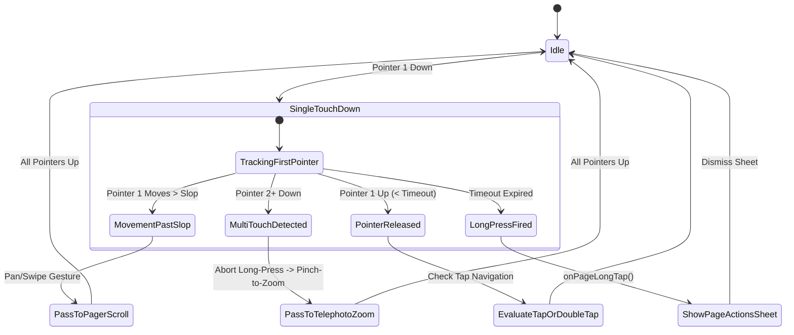

# Technical Proposal: Multi-Touch Gesture Disambiguation & Pinch-Zoom Long-Press Guard

**Status:** Proposed / Under Review  
**Author:** Neko Development Team  
**Date:** September 2026  
**Target Milestone:** Neko 3.x Reader Decoupling & Gesture Stabilization  
**Execution Order:** Reader Track — Phase R4 (Gesture Engine & Pointer Interaction), Step R13 (Priority: High / Touch Gesture Fix)  
**Resolves Issue:** [GitHub Issue #3434](https://github.com/nekomangaorg/Neko/issues/3434) ("Gesture issue: zooming in too slowly (1 finger stationary, 2nd moving) triggers long-press menu popup")  
**Prerequisites:** Step R5 ([`rock_solid_paged_compose_viewer_proposal.md`](rock_solid_paged_compose_viewer_proposal.md))  
**Downstream Dependents:** None  
**Implementation Targets:** [`PagerPageItem.kt`](file:///run/media/nonproto/WD4T/programming/workspace-android/Neko/app/src/main/java/org/nekomanga/presentation/screens/reader/viewer/PagerPageItem.kt)  

---

## 📌 Baseline Audit & Problem Statement

### 1.1 Context & Reproduction
In Jetpack Compose, gestures for [`PagerPageItem.kt`](file:///run/media/nonproto/WD4T/programming/workspace-android/Neko/app/src/main/java/org/nekomanga/presentation/screens/reader/viewer/PagerPageItem.kt) are managed via a custom `pointerInput` block utilizing `awaitEachGesture`. This block detects:
- Single tap (navigation or menu toggle)
- Double tap (zoom toggle)
- Long press (page actions sheet: Share, Save, Set as Cover)

### 1.2 Root Cause Analysis
In [`PagerPageItem.kt#L192-L235`](file:///run/media/nonproto/WD4T/programming/workspace-android/Neko/app/src/main/java/org/nekomanga/presentation/screens/reader/viewer/PagerPageItem.kt#L192-L235):
```kotlin
awaitEachGesture {
    val down = awaitFirstDown(requireUnconsumed = false, pass = PointerEventPass.Initial)
    val downPos = down.position
    var isLongPressTriggered = false
    var isMovementPastSlop = false
    var pointerUp: PointerInputChange? = null

    try {
        withTimeout(longPressTimeoutMs) {
            while (true) {
                val event = awaitPointerEvent(pass = PointerEventPass.Initial)
                val change = event.changes.firstOrNull { it.id == down.id }
                if (change == null) break
                val moveDistance = hypot(
                    (change.position.x - downPos.x).toDouble(),
                    (change.position.y - downPos.y).toDouble(),
                )
                if (moveDistance > touchSlopPx) {
                    isMovementPastSlop = true
                    break
                }
                if (!change.pressed) {
                    pointerUp = change
                    break
                }
            }
        }
    } catch (_: PointerEventTimeoutCancellationException) {
        if (!isMovementPastSlop && (currentConfig.menuVisible || currentConfig.longTapEnabled)) {
            currentConfig.onPageLongTap?.invoke(page, extraPage)
            isLongPressTriggered = true
        }
        while (currentEvent.changes.any { it.pressed }) {
            awaitPointerEvent(pass = PointerEventPass.Initial)
        }
    }
    ...
```

**The Breakdown:**
1. The loop inside `withTimeout(longPressTimeoutMs)` strictly evaluates `down.id` (the first pointer).
2. When a user performs an asymmetric pinch gesture (resting one finger stationary on the screen while placing and moving a second finger to zoom in), `event.changes.count { it.pressed }` transitions from `1` to `2`.
3. Because the first finger remains within `touchSlopPx`, `isMovementPastSlop` remains `false`.
4. The timeout expires, triggering `PointerEventTimeoutCancellationException`.
5. Because `!isMovementPastSlop` is `true`, `onPageLongTap?.invoke(page, extraPage)` fires, abruptly displaying the long-press modal sheet over the page while the user is actively zooming.

---

## 2. Architectural Design & Gesture State Machine



---

## 3. Technical Specifications

### 3.1 Pointer Input Multi-Touch Guard

Modify the gesture loop in [`PagerPageItem.kt`](file:///run/media/nonproto/WD4T/programming/workspace-android/Neko/app/src/main/java/org/nekomanga/presentation/screens/reader/viewer/PagerPageItem.kt) to monitor pointer counts on every event:

```kotlin
awaitEachGesture {
    val down = awaitFirstDown(requireUnconsumed = false, pass = PointerEventPass.Initial)
    val downPos = down.position
    var isLongPressTriggered = false
    var isMovementPastSlop = false
    var isMultiTouch = false
    var pointerUp: PointerInputChange? = null

    try {
        withTimeout(longPressTimeoutMs) {
            while (true) {
                val event = awaitPointerEvent(pass = PointerEventPass.Initial)
                
                // Immediately cancel long-press evaluation if more than one pointer is active
                if (event.changes.count { it.pressed } > 1) {
                    isMultiTouch = true
                    break
                }

                val change = event.changes.firstOrNull { it.id == down.id }
                if (change == null) break
                val moveDistance = hypot(
                    (change.position.x - downPos.x).toDouble(),
                    (change.position.y - downPos.y).toDouble(),
                )
                if (moveDistance > touchSlopPx) {
                    isMovementPastSlop = true
                    break
                }
                if (!change.pressed) {
                    pointerUp = change
                    break
                }
            }
        }
    } catch (_: PointerEventTimeoutCancellationException) {
        if (!isMovementPastSlop && !isMultiTouch && (currentConfig.menuVisible || currentConfig.longTapEnabled)) {
            currentConfig.onPageLongTap?.invoke(page, extraPage)
            isLongPressTriggered = true
        }
        // Drain any remaining active pointers before exiting gesture cycle
        while (currentEvent.changes.any { it.pressed }) {
            awaitPointerEvent(pass = PointerEventPass.Initial)
        }
    }

    if ((pointerUp == null || isMultiTouch) && !isLongPressTriggered) {
        while (currentEvent.changes.any { it.pressed }) {
            awaitPointerEvent(pass = PointerEventPass.Initial)
        }
    }
```

### 3.2 Key Invariants & Guarantees
1. **Zero Multi-Touch False Positives**: Long press is strictly a single-finger gesture. Any detection of `changes.count { it.pressed } > 1` permanently invalidates long-press qualification for that gesture sequence.
2. **Non-Blocking Pointer Propagation**: When `isMultiTouch` is flagged, pointer events are left unconsumed, allowing Telephoto's `zoomable` gesture detector to immediately track the two fingers for pinch zoom and two-finger panning.
3. **No Tap Triggering on Pinch Release**: Because `isMultiTouch` drains pointer events until all fingers are lifted and sets `pointerUp = null`, lifting pinch-zoom fingers will never trigger an accidental tap navigation or page turn.

---

## 4. Test Specifications

1. **Simultaneous Multi-Touch Test**:
   - Inject down event with pointer 0.
   - Inject down event with pointer 1 at $t + 100\text{ms}$.
   - Advance virtual clock by $600\text{ms}$ (exceeding `longPressTimeoutMs`).
   - Assert `onPageLongTap` was **never invoked**.
2. **Stationary Pivot Pinch Test**:
   - Inject down event with pointer 0 at $(100, 100)$ and keep position constant.
   - Inject down event with pointer 1 at $(150, 150)$ and move to $(300, 300)$.
   - Assert long-press sheet is **not displayed**, and zoom state scale increases.
3. **Legitimate Single-Finger Long-Press Test**:
   - Inject down event with pointer 0 at $(200, 200)$ with zero other pointers.
   - Advance virtual clock past `longPressTimeoutMs`.
   - Assert `onPageLongTap` **is invoked exactly once**.
