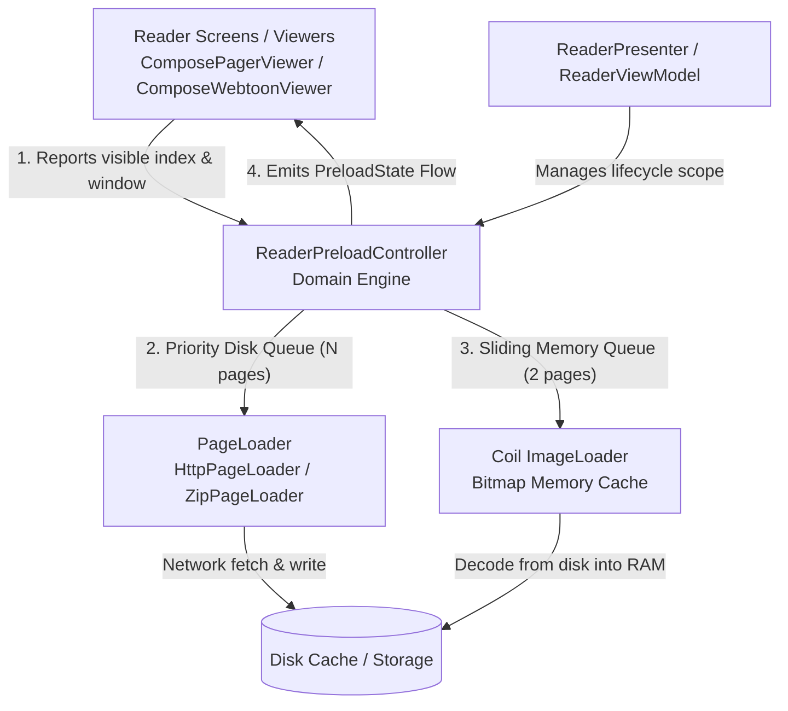

# Technical Proposal: Unified Reader Preloader Engine & Two-Tier Pipeline

**Status:** Proposed / Architectural Blueprint  
**Author:** Neko Development Team  
**Date:** September 2026  
**Target Milestone:** Neko Reader Phase 2  
**Implementation State:** 🟡 Phase 1 Completed (Direction-Aware Indexing, Decoupled Disk Prefetch & Bounded Memory Cache); Phase 2 Proposed (Domain Extraction & State Machine)

---

## 1. Executive Summary

In **Phase 1**, we addressed the immediate runtime defects causing pages to fail to preload:
1. **Direction-Aware Preloading:** Fixed inverted RTL indexing in `ReaderPagerController` so reading manga preloads forward instead of scanning backwards into already-read pages.
2. **Preference Respect:** Connected the user preference `readerPreferences.preloadPageAmount()` (4–20 pages) to the preload calculation.
3. **Decoupled Two-Tier Preload Architecture:** Separated disk prefetching (network -> disk cache via `PageLoader.loadPage`, scaling to the user-selected window) from memory bitmap decoding (bounded strictly to 2 items ahead via Coil) to eliminate out-of-memory (OOM) hazards on high-density displays.
4. **Disposable Management & Lifecycle Cleanup:** Enqueued Coil requests with tracked `Disposable` references disposed on viewer teardown.
5. **Download Error Recovery:** Removed failed keys from tracking sets when uncancelled exceptions occur, allowing network transient errors to be retried.

While Phase 1 eliminated crashes and restored preloading functionality, the preloading logic remains embedded inside `@Composable` view functions (`ComposePagerViewer.kt` and `ComposeWebtoonViewer.kt`). 

**Phase 2** proposes extracting this logic into an independent, testable domain engine: **`ReaderPreloadController`**.

---

## 2. Problem Statement & Motivation

### Current Limitations in Phase 1
- **Duplicated Orchestration:** Over 150 lines of nearly identical coroutine launches, key management, debouncing, and Coil requests are duplicated between `ComposePagerViewer` and `ComposeWebtoonViewer`.
- **UI & Domain Coupling:** Preload state and queuing reside inside UI Composables (`remember { mutableSetOf<String>() }`). Recomposition boundaries, orientation changes, or viewer switching risk resetting in-flight preload state or leaking background coroutines.
- **Unstructured Execution:** Both disk fetching and memory decodes launch unbound concurrent coroutines without priority queues. A rapid scrub can trigger 20+ concurrent `loadPage` requests with no ordering guarantees.
- **Zero Observability:** Preload progress, queue depth, cache hit rates, and network errors are completely opaque to the rest of the application.
- **Webtoon Split-Page Fragility:** Tall-page detection and slicing in webtoons happens reactively via Compose effects rather than deterministically in the preload pipeline.

---

## 3. Target Architecture

### 3.1 High-Level Component Overview



---

## 4. Detailed Component Design

### 4.1 State Modeling

Preload state will be modeled as an immutable, observable StateFlow:

```kotlin
package eu.kanade.tachiyomi.ui.reader.loader

import kotlinx.coroutines.flow.StateFlow

sealed interface PreloadPageStatus {
    data object Idle : PreloadPageStatus
    data object DiskQueued : PreloadPageStatus
    data object DiskDownloading : PreloadPageStatus
    data object DiskReady : PreloadPageStatus
    data object MemoryDecoding : PreloadPageStatus
    data object MemoryReady : PreloadPageStatus
    data class Error(val cause: Throwable, val retryCount: Int) : PreloadPageStatus
}

data class ReaderPreloadState(
    val activeIndex: Int = 0,
    val windowRange: IntRange = IntRange.EMPTY,
    val memoryRange: IntRange = IntRange.EMPTY,
    val pageStatuses: Map<String, PreloadPageStatus> = emptyMap(),
    val isIdle: Boolean = true,
)
```

### 4.2 `ReaderPreloadController` Interface

```kotlin
package eu.kanade.tachiyomi.ui.reader.loader

import eu.kanade.tachiyomi.ui.reader.model.ReaderChapter
import eu.kanade.tachiyomi.ui.reader.model.ReaderUiItem
import kotlinx.coroutines.flow.StateFlow

interface ReaderPreloadController {
    val state: StateFlow<ReaderPreloadState>

    /**
     * Updates the current viewport position, recalculating priorities for both
     * disk download and memory decode pipelines.
     */
    fun onPositionChanged(
        currentIndex: Int,
        items: List<ReaderUiItem>,
        preloadAmount: Int,
        isRtl: Boolean,
        isWebtoon: Boolean,
    )

    /**
     * Preloads adjacent chapters when approaching chapter boundaries.
     */
    fun requestPreloadChapter(chapter: ReaderChapter)

    /**
     * Manually triggers a retry for a page that failed to preload.
     */
    fun retryPage(item: ReaderUiItem)

    /**
     * Clears all in-flight jobs and cached memory disposables.
     */
    fun release()
}
```

---

## 5. Two-Tier Execution Pipeline

### Tier 1: Disk Prefetch Pipeline (Network -> Disk)
- **Scope:** Full user-configured `preloadPageAmount` (up to 20 pages ahead).
- **Concurrency:** Bounded by an internal priority channel (`Channel<PreloadTask>`) with a maximum concurrency of 2–3 simultaneous downloads to prevent saturating bandwidth and exhausting OkHttp connection pools.
- **Priority Re-ordering:** When a user leaps forward (e.g. scrub bar or TOC jump), in-flight requests that fall outside the new window are cancelled or demoted, and requests closest to the new visible page take immediate priority.

### Tier 2: Memory Decode Pipeline (Disk -> RAM)
- **Scope:** Strictly limited to `[visibleIndex - 1 .. visibleIndex + 2]`.
- **Strategy:** Only pages that have achieved `DiskReady` status enter the memory decode queue.
- **Coil Integration:** Requests are enqueued with matching layout parameters (`Size.ORIGINAL`, `maxBitmapSize`, `Precision.EXACT`, `crossfade(true)`). Each request yields a `Disposable` stored in an active map. As pages exit the memory window (e.g., scrolled >3 pages behind), active disposables are cancelled and memory references released.

---

## 6. Webtoon Tall-Page Split Pipeline

In webtoon reading mode, pages exceeding GPU texture limits (`GLUtil.maxTextureSize`, typically 4096px) must be split into slices.

In Phase 2, tall-page inspection is integrated into the preloader:
1. As soon as a webtoon page reaches `DiskReady`, an IO worker inspects image header dimensions without decoding full bitmap pixels (`BitmapFactory.Options.inJustDecodeBounds = true`).
2. If `height > maxTextureSize`, slice geometry is calculated immediately.
3. Split items are injected into the item model before the user scrolls to them, preventing layout jumps and stuttering on screen.

---

## 7. Implementation Roadmap

| Milestone | Scope | Deliverables |
|---|---|---|
| **Milestone 1** | Pure Kotlin Engine | Implement `ReaderPreloadControllerImpl` with priority channel, StateFlow, and unit tests. |
| **Milestone 2** | Coil Bridge & Memory Window | Extract `MemoryCacheWarmManager` to manage Coil `Disposable` lifecycles and bounded sliding window. |
| **Milestone 3** | Viewer Integration | Replace inline preloading in `ComposePagerViewer` and `ComposeWebtoonViewer` with `ReaderPreloadController`. |
| **Milestone 4** | Webtoon Pre-split Pipeline | Move tall-page splitting logic into background prefetch pipeline. |
| **Milestone 5** | Debug Overlay & Telemetry | Optional developer debug HUD showing real-time disk/memory preload status bars. |

---

## 8. Verification & Testing Strategy

- **Unit Testing (100% JVM Testable):**
  - Verify LTR and RTL index windows across various boundary conditions (0 items, 1 item, near chapter end).
  - Verify that rapid scrubs cancel low-priority jobs and prioritize the new target page.
  - Verify that failed downloads update status to `PreloadPageStatus.Error` and allow subsequent retries.
  - Verify memory sliding window never exceeds `maxMemoryPreload` (2 items) regardless of user `preloadPageAmount`.
- **Memory Profiling:**
  - Track Android Heap under rapid 50-page reading sessions with `preloadPageAmount = 20`. Verify memory stays bounded below 150MB with zero uncompressed bitmap pileup.
