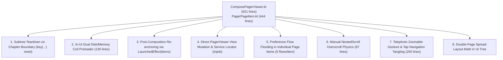
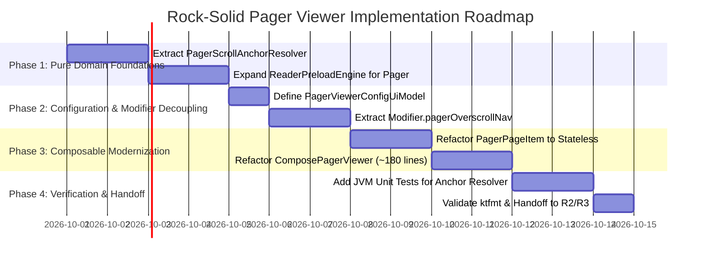

# Technical Proposal: High-Performance, Rock-Solid Architecture for ComposePagerViewer

**Status:** Proposed  
**Author:** Neko Development Team  
**Date:** September 2026  
**Target Milestone:** Neko 3.x Reader Decoupling & Paged Engine Stabilization  
**Execution Order:** Reader Track — Phase R1 / Step R3 Extension (Priority: High / Paged Engine Hardening)  
**Prerequisites:** Step R1 ([`decouple_reader_navigation_and_lifecycle_orchestration_proposal.md`](file:///run/media/nonproto/WD4T/programming/workspace-android/Neko/docs/proposals/reader/decouple_reader_navigation_and_lifecycle_orchestration_proposal.md)), Step R2 ([`decouple_reader_transition_page_proposal.md`](file:///run/media/nonproto/WD4T/programming/workspace-android/Neko/docs/proposals/reader/decouple_reader_transition_page_proposal.md))  
**Related Proposals:** [`rock_solid_webtoon_compose_viewer_proposal.md`](file:///run/media/nonproto/WD4T/programming/workspace-android/Neko/docs/proposals/reader/rock_solid_webtoon_compose_viewer_proposal.md), [`decouple_reader_compose_viewers_proposal.md`](file:///run/media/nonproto/WD4T/programming/workspace-android/Neko/docs/proposals/reader/decouple_reader_compose_viewers_proposal.md), [`reader_preloader_engine_proposal.md`](file:///run/media/nonproto/WD4T/programming/workspace-android/Neko/docs/proposals/reader/reader_preloader_engine_proposal.md)  
**Implementation Target:** [`ComposePagerViewer.kt`](file:///run/media/nonproto/WD4T/programming/workspace-android/Neko/app/src/main/java/org/nekomanga/presentation/screens/reader/viewer/ComposePagerViewer.kt), [`PagerPageItem.kt`](file:///run/media/nonproto/WD4T/programming/workspace-android/Neko/app/src/main/java/org/nekomanga/presentation/screens/reader/viewer/PagerPageItem.kt), [`PagerViewer.kt`](file:///run/media/nonproto/WD4T/programming/workspace-android/Neko/app/src/main/java/eu/kanade/tachiyomi/ui/reader/viewer/pager/PagerViewer.kt)  

---

## 📌 Baseline Audit & Problem Statement

Following the stabilization of [`ComposeWebtoonViewer.kt`](file:///run/media/nonproto/WD4T/programming/workspace-android/Neko/app/src/main/java/org/nekomanga/presentation/screens/reader/viewer/ComposeWebtoonViewer.kt) in `ref/rock-solid-webtoon-compose-viewer`, the horizontal and vertical paginated readers ([`ComposePagerViewer.kt`](file:///run/media/nonproto/WD4T/programming/workspace-android/Neko/app/src/main/java/org/nekomanga/presentation/screens/reader/viewer/ComposePagerViewer.kt) and [`PagerPageItem.kt`](file:///run/media/nonproto/WD4T/programming/workspace-android/Neko/app/src/main/java/org/nekomanga/presentation/screens/reader/viewer/PagerPageItem.kt)) represent the next major architectural bottleneck in Neko's reading pipeline.

Together spanning **1,065 lines of code**, these two composables bundle eight distinct runtime responsibilities into UI rendering:



While [`decouple_reader_compose_viewers_proposal.md`](file:///run/media/nonproto/WD4T/programming/workspace-android/Neko/docs/proposals/reader/decouple_reader_compose_viewers_proposal.md) drafted basic UI model extraction, it left the destructive subtree teardowns, race-prone post-composition re-anchoring, and internal preloading mechanisms unaddressed. This proposal establishes the technical blueprint to make `ComposePagerViewer` **rock-solid, zero-jitter, and fully decoupled**.

---

## 1. Root-Cause Analysis: The 6 Critical Architectural Hazards

### 1.1 Hazard 1: Subtree Teardown on `currentChapterId` Destroys PagerState & Caches
* **Code Reference:** [`ComposePagerViewer.kt#L87`](file:///run/media/nonproto/WD4T/programming/workspace-android/Neko/app/src/main/java/org/nekomanga/presentation/screens/reader/viewer/ComposePagerViewer.kt#L87)
  ```kotlin
  key(viewer, currentChapterId, isRtl, isVertical) {
      val pagerState = rememberPagerState(initialPage = initialPage, pageCount = { items.size })
      ...
  }
  ```
* **The Mechanism:** When the user swipes across a chapter transition card into a new chapter, `currentChapterId` changes in the ViewModel. Because the entire viewer body is wrapped in `key(viewer, currentChapterId, ...)`, Compose **completely discards the active composition subtree**, destroys `pagerState`, cancels all active page jobs, and reinstantiates the entire pager from scratch.
* **The Impact:**
  - The smooth swipe transition is interrupted by an abrupt visual freeze/re-creation.
  - Active Telephoto zoom states, Coil image cache bitmaps, and decoded textures are evicted and re-allocated.
  - Generates severe garbage collection pressure and noticeable frame drops at the exact moment the user expects continuous reading flow.

### 1.2 Hazard 2: Dual Disk/Memory Coil Preloader Contaminates the UI Layer
* **Code Reference:** [`ComposePagerViewer.kt#L218-L350`](file:///run/media/nonproto/WD4T/programming/workspace-android/Neko/app/src/main/java/org/nekomanga/presentation/screens/reader/viewer/ComposePagerViewer.kt#L218-L350)
* **The Mechanism:** `ComposePagerViewer` maintains local state variables:
  ```kotlin
  val preloadedDiskKeys = remember { mutableSetOf<String>() }
  val preloadedMemoryKeys = remember { mutableSetOf<String>() }
  val activeDisposables = remember { mutableMapOf<String, Disposable>() }
  ```
  It manually constructs Coil `ImageRequest` objects, binds them to `context.imageLoader.enqueue()`, invokes `page.chapter.pageLoader?.loadPage(page)`, and tracks `Disposable` cancellations in a `DisposableEffect`.
* **The Impact:**
  - Duplicate code: Identical to the anti-pattern previously purged from `ComposeWebtoonViewer`.
  - Rapid swiping causes cancel/restart storms with arbitrary `delay(50L)` debounce timers.
  - Memory leaks: If the Composable is disposed mid-swipe or rotated, asynchronous Coil requests risk leaking the surrounding Activity context.

### 1.3 Hazard 3: Post-Composition Re-anchoring via `LaunchedEffect(items)` Causes Page Flashing
* **Code Reference:** [`ComposePagerViewer.kt#L156-L182`](file:///run/media/nonproto/WD4T/programming/workspace-android/Neko/app/src/main/java/org/nekomanga/presentation/screens/reader/viewer/ComposePagerViewer.kt#L156-L182)
* **The Mechanism:** When adjacent chapters are appended or prepended to `items`, `ComposePagerViewer` attempts to re-align the active page by running `pagerState.scrollToPage(newIndex)` inside `LaunchedEffect(items)`.
* **The Impact:**
  - `LaunchedEffect` executes **after** composition and after layout measurement.
  - For 1–2 frames, `HorizontalPager` or `VerticalPager` measures and draws using the old page index (which now points to a different page or transition card).
  - The user sees a jarring 1-frame visual flash to the wrong page before snapping back.
  - Calling `scrollToPage()` abruptly aborts user swipe momentum.

### 1.4 Hazard 4: Preference Flooding and Injekt Resolution in Every Page Item
* **Code Reference:** [`PagerPageItem.kt#L71-L77, L118`](file:///run/media/nonproto/WD4T/programming/workspace-android/Neko/app/src/main/java/org/nekomanga/presentation/screens/reader/viewer/PagerPageItem.kt#L71-L77)
* **The Mechanism:** In [`PagerPageItem.kt`](file:///run/media/nonproto/WD4T/programming/workspace-android/Neko/app/src/main/java/org/nekomanga/presentation/screens/reader/viewer/PagerPageItem.kt), every page item executes:
  ```kotlin
  val readerPreferences: ReaderPreferences = remember { Injekt.get() }
  val imageScaleType by readerPreferences.imageScaleType().collectAsState()
  val doublePageGap by readerPreferences.doublePageGap().collectAsState()
  val invertDoublePages by readerPreferences.invertDoublePages().collectAsState()
  val readerThemePref by readerPreferences.readerTheme().collectAsState()
  val zoomStart by readerPreferences.zoomStart().collectAsState()
  ```
* **The Impact:**
  - In a chapter with 40 double-page spreads, **200 concurrent StateFlow collectors** and Injekt lookups run simultaneously.
  - Uses unconfined `collectAsState()` rather than lifecycle-safe `collectAsStateWithLifecycle()`, violating `.agents/AGENTS.md` rules and wasting CPU cycles while offscreen.

### 1.5 Hazard 5: Manual NestedScroll Overscroll Physics Trapped in Viewer
* **Code Reference:** [`ComposePagerViewer.kt#L419-L507`](file:///run/media/nonproto/WD4T/programming/workspace-android/Neko/app/src/main/java/org/nekomanga/presentation/screens/reader/viewer/ComposePagerViewer.kt#L419-L507)
* **The Mechanism:** An 88-line anonymous `NestedScrollConnection` object intercepts `onPreScroll`, `onPostScroll`, and `onPreFling` to accumulate pixel deltas, manually checking edge bounds (`currentPage == 0`, `currentPage == pageCount - 1`), computing RTL inversions, and triggering chapter switches.
* **The Impact:**
  - Untestable in JVM unit tests.
  - Fragile coordinate handling: Fails or triggers false positives during two-finger zoom pans.

### 1.6 Hazard 6: Direct Coupling to Legacy `PagerViewer` View Class
* **Code Reference:** [`ComposePagerViewer.kt#L66`](file:///run/media/nonproto/WD4T/programming/workspace-android/Neko/app/src/main/java/org/nekomanga/presentation/screens/reader/viewer/ComposePagerViewer.kt#L66) and [`PagerPageItem.kt#L66`](file:///run/media/nonproto/WD4T/programming/workspace-android/Neko/app/src/main/java/org/nekomanga/presentation/screens/reader/viewer/PagerPageItem.kt#L66)
* **The Mechanism:** Both composables directly accept `viewer: PagerViewer` and `downloadManager: DownloadManager`, mutating mutable properties (`viewer.currentPagePosition = pageIndex`, `viewer.requestedPagePosition = null`, `viewer.moveToNext()`).
* **The Impact:** Completely prevents previewing composables in Android Studio `@Preview` and tightly binds Compose rendering to deprecated View classes scheduled for deletion in Phase 3.

---

## 2. The 4 Pillars of the Rock-Solid Paged Architecture

```mermaid
flowchart TD
    subgraph Data & Domain Pipeline
        Chapters["ViewerChapters (curr, prev, next)"] --> Controller["ReaderPagerController\n(buildItems, joinItems)"]
        Controller --> Resolver["PagerScrollAnchorResolver\n(Pure Domain Positioning)"]
        Controller --> Preloader["ReaderPreloadEngine\n(Headless Disk/Memory Warmer)"]
    end

    subgraph Unidirectional UI State
        Controller --> State["PagerViewerUiState\n(items, config, isRtl, isVertical)"]
        Resolver --> AnchorTarget["AnchorTarget(index, item)"]
    end

    subgraph Pure Stateless Compose Layer
        State --> CPV["Stateless ComposePagerViewer (~180 lines)"]
        AnchorTarget -->|Pre-measure requestScrollToPage| CPV
        CPV --> Overscroll["Modifier.pagerOverscrollNavigation(...)"]
        CPV --> Pager["HorizontalPager / VerticalPager\n(Persistent PagerState, Stable Keys)"]
        Pager --> PPI["Stateless PagerPageItem\n(Zero Injekt, Pre-resolved Config)"]
        
        CPV -->|onPageSelected(page)| RVM["ReaderViewModel"]
        CPV -->|onTransitionSelected(transition)| RVM
        CPV -->|onActiveIndexChanged(index)| Preloader
    end
```

---

### Pillar 1: Persistent PagerState & Domain-Driven Scroll Anchor Resolver

**Rule:** *Never tear down `PagerState` across chapter boundaries; resolve page shifts deterministically before layout.*

1. **Eliminate Subtree Key Reset:**
   Remove `key(viewer, currentChapterId, isRtl, isVertical)`. `PagerState` is created once and persists as long as the reading orientation (`isVertical`) and direction (`isRtl`) remain unchanged.
2. **Domain-Pure `PagerScrollAnchorResolver`:**
   Mirroring [`WebtoonScrollAnchorResolver.kt`](file:///run/media/nonproto/WD4T/programming/workspace-android/Neko/app/src/main/java/eu/kanade/tachiyomi/ui/reader/viewer/webtoon/WebtoonScrollAnchorResolver.kt), extract index resolution into a pure, testable domain object:
   ```kotlin
   object PagerScrollAnchorResolver {
       data class AnchorTarget(
           val index: Int,
           val item: ReaderUiItem,
       )

       fun resolveReanchorTarget(
           items: List<ReaderUiItem>,
           lastActiveItem: ReaderUiItem?,
           currentVisibleIndex: Int,
           previousItems: List<ReaderUiItem>? = null,
       ): AnchorTarget? {
           val currentItem = items.getOrNull(currentVisibleIndex)
           val activeItem = lastActiveItem

           // Fast-path 1: Item at current index is already equivalent
           if (currentItem != null && activeItem != null && currentItem.isEquivalentTo(activeItem)) {
               return null
           }

           // Fast-path 2: Unshifted append (next chapter pages appended to end)
           val prevItemAtCurrent = previousItems?.getOrNull(currentVisibleIndex)
           if (currentItem != null && prevItemAtCurrent != null &&
               currentItem::class == prevItemAtCurrent::class &&
               currentItem.isEquivalentTo(prevItemAtCurrent)
           ) {
               return null
           }

           val targetItem = activeItem ?: currentItem ?: return null
           val newIndex = items.indexOfFirst { it.isEquivalentTo(targetItem) }

           return if (newIndex != -1 && newIndex != currentVisibleIndex) {
               AnchorTarget(newIndex, items[newIndex])
           } else {
               null
           }
       }
   }
   ```
3. **Pre-Measure Composition Re-anchoring:**
   Call `pagerState.requestScrollToPage(target.index)` synchronously during composition when `items !== lastProcessedItems`. This instructs Compose to measure at the correct page index on the very first layout pass, eliminating the 1-frame flash of the wrong page.

---

### Pillar 2: Headless Preload Engine Integration

**Rule:** *Compose renders pages; it does not warm network sockets or track image cache disposables.*

1. **Shared Headless Pipeline:** Extend [`ReaderPreloadEngine`](file:///run/media/nonproto/WD4T/programming/workspace-android/Neko/app/src/main/java/eu/kanade/tachiyomi/ui/reader/viewer/webtoon/ReaderPreloadEngine.kt) to support Paged navigation modes:
   ```kotlin
   fun updateActivePagerIndex(
       activeIndex: Int,
       items: List<ReaderUiItem>,
       preloadAmount: Int,
       isRtl: Boolean,
   ) {
       val preloadIndices = ReaderPagerController.getPreloadIndices(
           currentIndex = activeIndex,
           preloadAmount = preloadAmount,
           totalItems = items.size,
           isRtl = isRtl,
       )
       val memoryIndices = ReaderPagerController.getPreloadIndices(
           currentIndex = activeIndex,
           preloadAmount = 2,
           totalItems = items.size,
           isRtl = isRtl,
       ).toSet()

       for (index in preloadIndices) {
           val item = items.getOrNull(index) ?: continue
           preloadItem(item, preloadMemory = index in memoryIndices)
       }
   }
   ```
2. **Purge Disposable Tracking from Compose:** Strip 130 lines of `Disposable`, `ImageRequest.Builder`, and `loadPage` calls from [`ComposePagerViewer.kt`](file:///run/media/nonproto/WD4T/programming/workspace-android/Neko/app/src/main/java/org/nekomanga/presentation/screens/reader/viewer/ComposePagerViewer.kt).

---

### Pillar 3: Pure Stateless Presentation & Hoisted Configuration

**Rule:** *Page items accept plain data models; service locators and preferences are hoisted to the container.*

1. **`PagerViewerConfigUiModel` Definition:**
   ```kotlin
   @Immutable
   data class PagerViewerConfigUiModel(
       val initialIndex: Int = 0,
       val activeChapterId: Long? = null,
       val backgroundColor: Color = Color.Black,
       val isRtl: Boolean = false,
       val isVertical: Boolean = false,
       val animatedTransitions: Boolean = true,
       val imageScaleType: Int = 0,
       val doublePageGap: Boolean = false,
       val invertDoublePages: Boolean = false,
       val zoomStart: Int = 0,
       val navigator: ViewerNavigation = ViewerNavigation(),
       val preloadPageAmount: Int = 4,
       val onToggleMenu: () -> Unit = {},
       val onNavigateAdjacent: (forward: Boolean) -> Unit = {},
       val onRetryTransition: (ReaderChapter) -> Unit = {},
       val onNavigateToChapter: ((Chapter, ChapterNavTarget) -> Unit)? = null,
   )
   ```
2. **Stateless `PagerPageItem`:**
   Refactor [`PagerPageItem.kt`](file:///run/media/nonproto/WD4T/programming/workspace-android/Neko/app/src/main/java/org/nekomanga/presentation/screens/reader/viewer/PagerPageItem.kt) to accept:
   - `page: ReaderPage`
   - `extraPage: ReaderPage?`
   - `config: PagerViewerConfigUiModel`
   - Lambda callbacks: `onTap: (PointF) -> Unit`, `onLongTap: (ReaderPage) -> Unit`.
   All `Injekt.get()` calls and preference collections are completely removed from the page item.

---

### Pillar 4: Modular Pager Overscroll & Gesture Modifiers

**Rule:** *Complex scroll gestures must be encapsulated into decoupled, reusable Compose modifiers.*

1. **Extract `Modifier.pagerOverscrollNavigation`:**
   Encapsulate overscroll threshold checks, fling cancellation, and chapter navigation into a standalone modifier extension:
   ```kotlin
   fun Modifier.pagerOverscrollNavigation(
       pagerState: PagerState,
       isRtl: Boolean,
       isVertical: Boolean,
       items: List<ReaderUiItem>,
       thresholdPx: Float,
       onNavigateToChapter: (Chapter, ChapterNavTarget) -> Unit,
   ): Modifier
   ```
2. **Isolated Double-Page Splitter & Layout:**
   Extract paired double-page image measurement and layout into a dedicated composable ([`DoublePageLayout.kt`](file:///run/media/nonproto/WD4T/programming/workspace-android/Neko/app/src/main/java/org/nekomanga/presentation/screens/reader/viewer/DoublePageLayout.kt)), separating spread alignment math from single-page rendering.

---

## 3. The Target Architecture: ~180-Line `ComposePagerViewer`

```kotlin
package org.nekomanga.presentation.screens.reader.viewer

import androidx.compose.foundation.background
import androidx.compose.foundation.layout.Box
import androidx.compose.foundation.layout.fillMaxSize
import androidx.compose.foundation.pager.HorizontalPager
import androidx.compose.foundation.pager.PagerDefaults
import androidx.compose.foundation.pager.VerticalPager
import androidx.compose.foundation.pager.rememberPagerState
import androidx.compose.runtime.Composable
import androidx.compose.runtime.LaunchedEffect
import androidx.compose.runtime.getValue
import androidx.compose.runtime.mutableStateOf
import androidx.compose.runtime.remember
import androidx.compose.runtime.rememberUpdatedState
import androidx.compose.runtime.setValue
import androidx.compose.runtime.snapshotFlow
import androidx.compose.ui.Modifier
import androidx.compose.ui.platform.LocalDensity
import eu.kanade.tachiyomi.ui.reader.model.ChapterTransition
import eu.kanade.tachiyomi.ui.reader.model.ReaderPage
import eu.kanade.tachiyomi.ui.reader.model.ReaderUiItem
import eu.kanade.tachiyomi.ui.reader.viewer.pager.PagerScrollAnchorResolver
import kotlinx.coroutines.flow.distinctUntilChanged
import org.nekomanga.presentation.theme.Size

@Composable
fun ComposePagerViewer(
    items: List<ReaderUiItem>,
    config: PagerViewerConfigUiModel,
    onActiveItemChanged: (Int) -> Unit,
    onPageSelected: (ReaderPage, Boolean) -> Unit,
    onTransitionSelected: (ChapterTransition) -> Unit,
    modifier: Modifier = Modifier,
) {
    val pagerState = rememberPagerState(
        initialPage = config.initialIndex.coerceIn(0, (items.size - 1).coerceAtLeast(0)),
        pageCount = { items.size },
    )

    var lastActiveItem by remember { mutableStateOf(items.getOrNull(config.initialIndex)) }
    var lastProcessedItems by remember { mutableStateOf(items) }

    val currentItems by rememberUpdatedState(items)
    val currentConfig by rememberUpdatedState(config)

    // 1. Immediate pre-measure re-anchor during composition to eliminate 1-frame flashes
    if (items !== lastProcessedItems) {
        val target = PagerScrollAnchorResolver.resolveReanchorTarget(
            items = items,
            lastActiveItem = lastActiveItem,
            currentVisibleIndex = pagerState.currentPage,
            previousItems = lastProcessedItems,
        )
        if (target != null && target.index != pagerState.currentPage) {
            pagerState.requestScrollToPage(target.index)
            lastActiveItem = target.item
        }
    }

    // 2. Fallback post-composition anchor sync
    LaunchedEffect(items) {
        val target = PagerScrollAnchorResolver.resolveReanchorTarget(
            items = items,
            lastActiveItem = lastActiveItem,
            currentVisibleIndex = pagerState.currentPage,
            previousItems = lastProcessedItems,
        )
        try {
            if (target != null && target.index != pagerState.currentPage) {
                pagerState.scrollToPage(target.index)
                lastActiveItem = target.item
            }
        } finally {
            lastProcessedItems = items
        }
    }

    // 3. Track active page index and dispatch selections
    LaunchedEffect(pagerState) {
        snapshotFlow { pagerState.currentPage }
            .distinctUntilChanged()
            .collect { pageIndex ->
                val item = currentItems.getOrNull(pageIndex) ?: return@collect
                lastActiveItem = item
                onActiveItemChanged(pageIndex)

                when (item) {
                    is ReaderUiItem.Page -> onPageSelected(item.page, item.extraPage != null)
                    is ReaderUiItem.SplitPage -> onPageSelected(item.page, false)
                    is ReaderUiItem.Transition -> onTransitionSelected(item.transition)
                }
            }
    }

    val density = LocalDensity.current
    val thresholdPx = with(density) { Size.huge.toPx() }

    val flingBehavior = if (config.animatedTransitions) {
        PagerDefaults.flingBehavior(state = pagerState)
    } else {
        PagerDefaults.flingBehavior(state = pagerState, snapAnimationSpec = snap())
    }

    // 4. Declarative Render Tree
    Box(
        modifier = modifier
            .fillMaxSize()
            .background(config.backgroundColor)
            .pagerOverscrollNavigation(
                pagerState = pagerState,
                isRtl = config.isRtl,
                isVertical = config.isVertical,
                items = items,
                thresholdPx = thresholdPx,
                onNavigateToChapter = { ch, target -> config.onNavigateToChapter?.invoke(ch, target) },
            ),
    ) {
        if (config.isVertical) {
            VerticalPager(
                state = pagerState,
                modifier = Modifier.fillMaxSize(),
                beyondViewportPageCount = 1,
                flingBehavior = flingBehavior,
                key = { index -> items.getOrNull(index)?.key("pager") ?: "pager_null_$index" },
            ) { index ->
                val item = items.getOrNull(index) ?: return@VerticalPager
                PagerItemContent(item = item, config = currentConfig)
            }
        } else {
            HorizontalPager(
                state = pagerState,
                modifier = Modifier.fillMaxSize(),
                beyondViewportPageCount = 1,
                flingBehavior = flingBehavior,
                key = { index -> items.getOrNull(index)?.key("pager") ?: "pager_null_$index" },
            ) { index ->
                val item = items.getOrNull(index) ?: return@HorizontalPager
                PagerItemContent(item = item, config = currentConfig)
            }
        }
    }
}
```

---

## 4. Architectural Comparison Matrix

| Quality Metric | Current Baseline | Proposed Decoupling Docs | **Optimal Rock-Solid Solution** |
| :--- | :--- | :--- | :--- |
| **Combined Lines of Code** | 1,065 lines | ~700 lines | **~320 lines (Viewer: ~180, PageItem: ~140)** |
| **Subtree Lifecycle** | Destroyed on chapter boundary (`key(...)`) | Destroyed on chapter boundary | **Persistent `PagerState`, Zero Teardowns** |
| **Scroll Stability on Prepend** | Asynchronous `scrollToPage` post-render | Asynchronous `scrollToPage` | **Pre-measure `requestScrollToPage` in composition** |
| **Preload / Coil Caching** | Trapped in Compose with `Disposable` maps | Trapped in Compose with `Disposable` maps | **Headless `ReaderPreloadEngine` in Domain** |
| **Injekt / Preferences** | 6 lookups per page item (~200 concurrent) | Removed from Viewer, still in items | **Zero Injekt in Viewer or List Items** |
| **Overscroll Physics** | 88-line inline `NestedScrollConnection` | 88-line inline `NestedScrollConnection` | **Modular `Modifier.pagerOverscrollNavigation`** |
| **JVM Unit Testability** | 0% (Requires Android View hierarchy) | ~40% (Partial model extraction) | **100% (Pure Domain Anchor Resolver & Preloader)** |

---

## 5. Critical Edge Cases Matrix

| Category | Scenario / Trigger Condition | Severity | Architectural Resolution |
| :--- | :--- | :--- | :--- |
| **Chapter Boundary Swiping** | User swipes from last page of Ch 1 into Transition card into Ch 2 Page 0. | Critical (Subtree Teardown / Freeze) | Remove `key(viewer, currentChapterId, ...)`. Persistent `PagerState` with `PagerScrollAnchorResolver` maps page indices across boundaries seamlessly. |
| **Prepend Flash / Jitter** | Previous chapter loads while user is on Page 0, expanding list by 40 pages. | High (1-frame flash to wrong page) | `requestScrollToPage(target.index)` executes during composition before layout, preventing Compose from measuring at old index 0. |
| **Unshifted Appending** | Next chapter finishes loading while user is reading stationary on current chapter. | High (Stutter / Momentum Kill) | Fast-path 2 in `PagerScrollAnchorResolver` returns `null` when item at current index did not shift, preventing redundant scroll calls. |
| **Double-Page Spread Inversion** | User toggles "Invert Double Pages" or "Double Page Gap" in settings sheet. | Medium (Layout Misalignment) | Settings hoisted to `PagerViewerConfigUiModel`. Changing config triggers clean recomposition of spreads without resetting pager position. |
| **Rapid Swiping / Fling** | User flings through 10 pages in rapid succession. | Medium (Coil Request Flooding) | Headless `ReaderPreloadEngine` bounds memory preloading strictly to immediate 2-page window with cancellation of superseded indices. |
| **RTL Edge Drag** | User reaches start/end edge in Japanese (R2L) reading mode. | Medium (Overscroll Inversion Failure) | `Modifier.pagerOverscrollNavigation` encapsulates direction inversion math, isolating it from page rendering. |

---

## 6. Implementation & Migration Roadmap



### Phase 1: Pure Domain Foundations
1. Implement [`PagerScrollAnchorResolver.kt`](file:///run/media/nonproto/WD4T/programming/workspace-android/Neko/app/src/main/java/eu/kanade/tachiyomi/ui/reader/viewer/pager/PagerScrollAnchorResolver.kt) in `eu.kanade.tachiyomi.ui.reader.viewer.pager`.
2. Write pure JVM unit tests in [`PagerScrollAnchorResolverTest.kt`](file:///run/media/nonproto/WD4T/programming/workspace-android/Neko/app/src/test/java/eu/kanade/tachiyomi/ui/reader/viewer/pager/PagerScrollAnchorResolverTest.kt) covering forward seam transitions, backward expansions, unshifted appends, and clamped index resilience.
3. Generalize [`ReaderPreloadEngine.kt`](file:///run/media/nonproto/WD4T/programming/workspace-android/Neko/app/src/main/java/eu/kanade/tachiyomi/ui/reader/viewer/webtoon/ReaderPreloadEngine.kt) to support pager index calculations (`ReaderPagerController.getPreloadIndices`).

### Phase 2: Configuration & Modifier Decoupling
1. Create [`PagerViewerConfigUiModel.kt`](file:///run/media/nonproto/WD4T/programming/workspace-android/Neko/app/src/main/java/org/nekomanga/presentation/screens/reader/viewer/PagerViewerConfigUiModel.kt).
2. Extract overscroll physics into `PagerOverscrollNavigation.kt`.

### Phase 3: Composable Modernization
1. Refactor [`PagerPageItem.kt`](file:///run/media/nonproto/WD4T/programming/workspace-android/Neko/app/src/main/java/org/nekomanga/presentation/screens/reader/viewer/PagerPageItem.kt) into a stateless composable with zero `Injekt.get()` and zero preference collectors.
2. Refactor [`ComposePagerViewer.kt`](file:///run/media/nonproto/WD4T/programming/workspace-android/Neko/app/src/main/java/org/nekomanga/presentation/screens/reader/viewer/ComposePagerViewer.kt) to the ~180-line stateless structure, removing `key(viewer, currentChapterId, ...)`.

### Phase 4: Verification & Handoff
1. Verify with unit tests in `app/src/test/java/eu/kanade/tachiyomi/ui/reader/viewer/pager/`.
2. Format all files with `./gradlew ktfmtFormat`.
3. Complete handoff to Step R2 ([`decouple_reader_transition_page_proposal.md`](file:///run/media/nonproto/WD4T/programming/workspace-android/Neko/docs/proposals/reader/decouple_reader_transition_page_proposal.md)) and Step R3 ([`decouple_reader_compose_viewers_proposal.md`](file:///run/media/nonproto/WD4T/programming/workspace-android/Neko/docs/proposals/reader/decouple_reader_compose_viewers_proposal.md)).

---

## 7. Post-Implementation Handoff & Downstream Decoupling

Following the completion of this proposal:
1. **Transition Page Decoupling**: Removing `DownloadManager` and `Injekt.get()` from `PagerViewerConfigUiModel` is tracked under [**Step R2 (`decouple_reader_transition_page_proposal.md`)**](file:///run/media/nonproto/WD4T/programming/workspace-android/Neko/docs/proposals/reader/decouple_reader_transition_page_proposal.md).
2. **Complete Legacy Viewer Decommission**: Decommissioning `PagerViewer.kt`, `R2LPagerViewer.kt`, `L2RPagerViewer.kt`, and `VerticalPagerViewer.kt` to drive state directly from `ReaderViewModel` is tracked under [**Step R3 (`decouple_reader_compose_viewers_proposal.md`)**](file:///run/media/nonproto/WD4T/programming/workspace-android/Neko/docs/proposals/reader/decouple_reader_compose_viewers_proposal.md).
