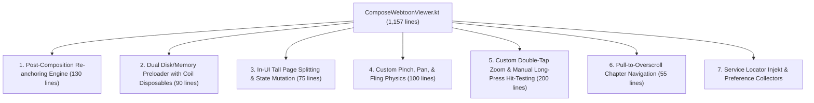

# Technical Proposal: High-Performance, Rock-Solid Architecture for ComposeWebtoonViewer

**Status:** Proposed / Architectural Blueprint  
**Author:** Neko Development Team  
**Date:** September 2026  
**Target Milestone:** Neko 3.x Reader Decoupling & Performance Hardening  
**Execution Order:** Reader Track — Phase R1 / Step R3 Extension (Priority: Critical / Webtoon Engine Stabilization)  
**Prerequisites:** Step R1 ([`decouple_reader_navigation_and_lifecycle_orchestration_proposal.md`](decouple_reader_navigation_and_lifecycle_orchestration_proposal.md)), Step R2 ([`decouple_reader_transition_page_proposal.md`](decouple_reader_transition_page_proposal.md))  
**Related Proposals:** [`decouple_reader_compose_viewers_proposal.md`](decouple_reader_compose_viewers_proposal.md), [`reader_preloader_engine_proposal.md`](reader_preloader_engine_proposal.md)  
**Implementation State:** 🟡 Coupled Baseline (1,157-line God Composable managing in-UI image preloading, post-composition re-anchoring, tall page splitting, and manual hit-testing)  

---

## 📌 Baseline Audit & Problem Statement

In [`ComposeWebtoonViewer.kt`](file:///run/media/nonproto/WD4T/programming/workspace-android/Neko/app/src/main/java/org/nekomanga/presentation/screens/reader/viewer/ComposeWebtoonViewer.kt), the core continuous vertical reading viewer has grown into an **1,157-line monolithic Composable**. It currently bundles seven distinct runtime responsibilities into a single UI render function:



While earlier proposals (such as [`decouple_reader_compose_viewers_proposal.md`](decouple_reader_compose_viewers_proposal.md)) identified top-level parameter coupling (`viewer: WebtoonViewer`, `downloadManager: DownloadManager`, and `Injekt.get()`), they left the internal engines (preloading, splitting, re-anchoring, and gestures) trapped inside Compose. Consequently, simply wrapping these mechanisms in a configuration model does not make the reader rock-solid.

---

## 1. Root-Cause Analysis: The 5 Critical Architectural Hazards

### 1.1 Hazard 1: In-UI Tall Page Splitting Causes Inevitable Layout Shifts & Jank
* **Code Reference:** [`ComposeWebtoonViewer.kt#L368-L442`](file:///run/media/nonproto/WD4T/programming/workspace-android/Neko/app/src/main/java/org/nekomanga/presentation/screens/reader/viewer/ComposeWebtoonViewer.kt#L368-L442) and [`WebtoonPageItem.kt#L62-L71`](file:///run/media/nonproto/WD4T/programming/workspace-android/Neko/app/src/main/java/org/nekomanga/presentation/screens/reader/viewer/WebtoonPageItem.kt#L62-L71)
* **The Mechanism:** When a page reaches [`Page.State.READY`](file:///run/media/nonproto/WD4T/programming/workspace-android/Neko/app/src/main/java/eu/kanade/tachiyomi/source/model/Page.kt), [`WebtoonPageItem`](file:///run/media/nonproto/WD4T/programming/workspace-android/Neko/app/src/main/java/org/nekomanga/presentation/screens/reader/viewer/WebtoonPageItem.kt) executes an async callback switching between `Dispatchers.IO` and `Dispatchers.Main` to call `viewer.splitPage()`. This dynamically replaces 1 monolithic [`ReaderUiItem.Page`](file:///run/media/nonproto/WD4T/programming/workspace-android/Neko/app/src/main/java/eu/kanade/tachiyomi/ui/reader/model/ReaderUiItem.kt) with 2–10 [`ReaderUiItem.SplitPage`](file:///run/media/nonproto/WD4T/programming/workspace-android/Neko/app/src/main/java/eu/kanade/tachiyomi/ui/reader/model/ReaderUiItem.kt) slices in the active item list.
* **The Impact:** Replacing list items mid-scroll shifts every item below it. Compose is forced to run emergency scroll compensation ([`ComposeWebtoonViewer.kt#L193-L226`](file:///run/media/nonproto/WD4T/programming/workspace-android/Neko/app/src/main/java/org/nekomanga/presentation/screens/reader/viewer/ComposeWebtoonViewer.kt#L193-L226)) to interpolate sub-pixel offsets. When multiple images decode concurrently on fast Wi-Fi, rapid successive list mutations trigger severe layout thrashing, dropped frames, and visual stutter.

### 1.2 Hazard 2: Post-Composition Re-anchoring via `LaunchedEffect(items)` is a Race Condition Trap
* **Code Reference:** [`ComposeWebtoonViewer.kt#L169-L301`](file:///run/media/nonproto/WD4T/programming/workspace-android/Neko/app/src/main/java/org/nekomanga/presentation/screens/reader/viewer/ComposeWebtoonViewer.kt#L169-L301)
* **The Mechanism:** When the background chapter preloader finishes loading a previous chapter, 30–120 items are prepended to the top of `items`. Because `LazyColumn` does not synchronously shift visible indices before layout, `lazyListState.firstVisibleItemIndex` temporarily lands on the prepended chapter. `ComposeWebtoonViewer` attempts to detect this and calls `lazyListState.scrollToItem(...)` inside `LaunchedEffect(items)`.
* **The Impact:** `LaunchedEffect` executes **after** composition and after layout measurement. For at least 1–2 frames, `LazyColumn` renders at the old raw index (now pointing to the previous chapter's pages). The active `snapshotFlow` ([lines 534–562](file:///run/media/nonproto/WD4T/programming/workspace-android/Neko/app/src/main/java/org/nekomanga/presentation/screens/reader/viewer/ComposeWebtoonViewer.kt#L534-L562)) samples this intermediate state and fires `onPageSelected` for the wrong chapter, triggering the backward-jumping infinite loop documented in [Issue #3379](https://github.com/nekomangaorg/Neko/issues/3379).

### 1.3 Hazard 3: Preload Engine and Coil Disposable Tracking Contaminate UI Lifecycles
* **Code Reference:** [`ComposeWebtoonViewer.kt#L354-L366, L444-L528, L613-L630`](file:///run/media/nonproto/WD4T/programming/workspace-android/Neko/app/src/main/java/org/nekomanga/presentation/screens/reader/viewer/ComposeWebtoonViewer.kt#L354-L366)
* **The Mechanism:** The Composable directly manages `preloadedDiskKeys: MutableSet<String>`, `preloadedMemoryKeys: MutableSet<String>`, and `activeDisposables: MutableMap<String, Disposable>`, manually calling `context.imageLoader.enqueue(request)` and `pageLoader.loadPage()`.
* **The Impact:** Compose is a declarative rendering tree, not a background resource scheduler. Rapid fling gestures cancel and restart coroutine scopes with arbitrary `delay(50L)` debounce timers. Coil requests are thrashed, creating GC pressure and risking coroutine cancellation leaks during screen rotation or viewer swaps.

### 1.4 Hazard 4: Container-Level Manual Coordinate Hit-Testing Bypasses Compose Gesture Hierarchy
* **Code Reference:** [`ComposeWebtoonViewer.kt#L867-L885`](file:///run/media/nonproto/WD4T/programming/workspace-android/Neko/app/src/main/java/org/nekomanga/presentation/screens/reader/viewer/ComposeWebtoonViewer.kt#L867-L885)
* **The Mechanism:** To handle long-press events on individual pages, the container pointer input intercepts down events, waits for long-press timeouts, and manually searches `layoutInfo.visibleItemsInfo` by calculating pixel boundaries:
  ```kotlin
  val hitItem = visibleItems.firstOrNull { item ->
      downY in item.offset until (item.offset + item.size)
  } ?: visibleItems.minByOrNull { item -> abs((item.offset + item.size / 2) - downY) }
  ```
* **The Impact:** This manual coordinate projection fails when the container is scaled (`scale != 1f`) or panned (`offsetX != 0f`), triggering long-press dialogs on the wrong page on foldables, tablets, or zoomed viewports.

### 1.5 Hazard 5: Per-Item Service Locator Calls & Preference Flow Collections
* **Code Reference:** [`WebtoonPageItem.kt#L120-L121`](file:///run/media/nonproto/WD4T/programming/workspace-android/Neko/app/src/main/java/org/nekomanga/presentation/screens/reader/viewer/WebtoonPageItem.kt#L120-L121)
* **The Mechanism:** In [`WebtoonPageItem.kt`](file:///run/media/nonproto/WD4T/programming/workspace-android/Neko/app/src/main/java/org/nekomanga/presentation/screens/reader/viewer/WebtoonPageItem.kt), every list item calls `val readerPreferences: ReaderPreferences = remember { Injekt.get() }` and runs `readerPreferences.readerTheme().collectAsState()`.
* **The Impact:** In a chapter with 80 pages, 80 concurrent preference collectors and Injekt lookups are active in memory, repeating theme calculations that should be hoisted once at the screen level.

---

## 2. The 4 Pillars of the Rock-Solid Architecture

```mermaid
flowchart TD
    subgraph Data & Domain Pipeline
        Loader["Http / Download PageLoader"] -->|Image Header Decoded| Splitter["CheckTallPageUseCase\n(IO Thread)"]
        Splitter --> PreloadEng["ReaderPreloadEngine\n(Headless Service)"]
        PreloadEng --> RVM["ReaderViewModel\n(viewModelScope + Mutex)"]
        RVM --> Builder["BuildWebtoonItemsUseCase\n(Pure Domain Interactor)"]
    end

    subgraph Unidirectional UI State
        Builder -->|Emits Pre-Split List| State["WebtoonViewerUiState\n(items, config, backgroundColor)"]
        RVM -->|Buffered Channel| NavCmd["Flow<ReaderNavCommand>\n(ScrollToPage, SnapToPage)"]
    end

    subgraph Pure Stateless Compose Layer
        State --> CWV["Stateless ComposeWebtoonViewer (~220 lines)"]
        NavCmd --> CWV
        CWV --> ModZ["Modifier.webtoonZoomable()"]
        CWV --> List["LazyColumn with Stable Keys"]
        List --> Items["Stateless WebtoonPageItem\n(Zero Injekt, Pre-split Slices)"]
        
        CWV -->|onActiveItemChanged(index)| PreloadEng
        CWV -->|onPageSelected(page)| RVM
        CWV -->|onNavigateAdjacent(forward)| RVM
    end
```

---

### Pillar 1: Upstream Tall Page Splitting (Zero In-UI Layout Shifts)

**Rule:** *A UI component must never calculate domain structures or mutate its own item list mid-render.*

1. **Header Inspection at Ingestion:** When [`HttpPageLoader`](file:///run/media/nonproto/WD4T/programming/workspace-android/Neko/app/src/main/java/eu/kanade/tachiyomi/ui/reader/loader/HttpPageLoader.kt) or [`DownloadPageLoader`](file:///run/media/nonproto/WD4T/programming/workspace-android/Neko/app/src/main/java/eu/kanade/tachiyomi/ui/reader/loader/DownloadPageLoader.kt) streams or opens an image file, the image header (width and height) is extracted immediately in `< 1ms` using [`ImageUtil.extractImageOptions`](file:///run/media/nonproto/WD4T/programming/workspace-android/Neko/app/src/main/java/eu/kanade/tachiyomi/util/system/ImageUtil.kt).
2. **Upstream Split Calculation:** The pure math in [`ReaderWebtoonController.Companion.checkTallPage`](file:///run/media/nonproto/WD4T/programming/workspace-android/Neko/app/src/main/java/eu/kanade/tachiyomi/ui/reader/viewer/webtoon/ReaderWebtoonController.kt#L215-L235) is wrapped into a domain use case (`CheckTallPageUseCase`) and executed on an IO dispatcher before the page is delivered to the UI.
3. **Pre-Split Emission:** The list of `ReaderUiItem` emitted to Compose **already contains the [`ReaderUiItem.SplitPage`](file:///run/media/nonproto/WD4T/programming/workspace-android/Neko/app/src/main/java/eu/kanade/tachiyomi/ui/reader/model/ReaderUiItem.kt) items**.
4. **Architectural Gain:**
   - Strips 75 lines of splitting callbacks from [`ComposeWebtoonViewer.kt`](file:///run/media/nonproto/WD4T/programming/workspace-android/Neko/app/src/main/java/org/nekomanga/presentation/screens/reader/viewer/ComposeWebtoonViewer.kt).
   - Strips 50 lines of slice-matching scroll offset interpolation ([lines 193–226](file:///run/media/nonproto/WD4T/programming/workspace-android/Neko/app/src/main/java/org/nekomanga/presentation/screens/reader/viewer/ComposeWebtoonViewer.kt#L193-L226)).
   - Eliminates layout shifts and dropped frames during reading.

---

### Pillar 2: Headless `ReaderPreloadEngine` (Purging Caching from Compose)

**Rule:** *Compose renders state; it does not orchestrate background network or memory caches.*

All Coil `ImageRequest` construction, `Disposable` tracking, and `pageLoader.loadPage` invocations are extracted out of [`ComposeWebtoonViewer.kt`](file:///run/media/nonproto/WD4T/programming/workspace-android/Neko/app/src/main/java/org/nekomanga/presentation/screens/reader/viewer/ComposeWebtoonViewer.kt) into a headless component:

```kotlin
package eu.kanade.tachiyomi.ui.reader.viewer.webtoon

import android.content.Context
import coil3.imageLoader
import coil3.request.Disposable
import coil3.request.ImageRequest
import coil3.request.crossfade
import coil3.request.maxBitmapSize
import coil3.size.Precision
import coil3.size.Size as CoilSize
import eu.kanade.tachiyomi.ui.reader.model.ReaderUiItem
import eu.kanade.tachiyomi.util.system.GLUtil
import java.util.Collections
import java.util.concurrent.ConcurrentHashMap
import kotlinx.coroutines.CoroutineScope
import kotlinx.coroutines.Dispatchers
import kotlinx.coroutines.Job
import kotlinx.coroutines.delay
import kotlinx.coroutines.launch

/**
 * Headless preload coordinator managing disk and memory cache warming.
 * Decoupled from Jetpack Compose lifecycles.
 */
class ReaderPreloadEngine(
    private val context: Context,
    private val scope: CoroutineScope,
) {
    private val preloadedDisk = Collections.synchronizedSet(mutableSetOf<String>())
    private val preloadedMemory = Collections.synchronizedSet(mutableSetOf<String>())
    private val activeDisposables = ConcurrentHashMap<String, Disposable>()
    private var activeJob: Job? = null

    private val maxTextureBitmapSize = CoilSize(GLUtil.maxTextureSize, GLUtil.maxTextureSize)

    fun updateActiveIndex(activeIndex: Int, items: List<ReaderUiItem>, preloadAmount: Int) {
        activeJob?.cancel()
        activeJob = scope.launch(Dispatchers.IO) {
            delay(50L) // Debounce fast scrolling flings
            val windowStart = (activeIndex - 2).coerceAtLeast(0)
            val windowEnd = (activeIndex + preloadAmount).coerceAtMost(items.lastIndex)
            val memoryEnd = (activeIndex + 2).coerceAtMost(items.lastIndex)

            for (i in windowStart..windowEnd) {
                val item = items.getOrNull(i) ?: continue
                preloadItem(item, preloadMemory = i in activeIndex..memoryEnd)
            }
        }
    }

    private suspend fun preloadItem(item: ReaderUiItem, preloadMemory: Boolean) {
        val key = item.key("webtoon")
        if (preloadedDisk.add(key)) {
            when (item) {
                is ReaderUiItem.Page -> item.page.chapter.pageLoader?.loadPage(item.page)
                is ReaderUiItem.SplitPage -> item.page.chapter.pageLoader?.loadPage(item.page)
                is ReaderUiItem.Transition -> Unit
            }
        }

        if (preloadMemory && preloadedMemory.add(key)) {
            val data = when (item) {
                is ReaderUiItem.Page -> item.page
                is ReaderUiItem.SplitPage -> item.split
                is ReaderUiItem.Transition -> null
            } ?: return

            val request = ImageRequest.Builder(context)
                .data(data)
                .size(CoilSize.ORIGINAL)
                .maxBitmapSize(maxTextureBitmapSize)
                .precision(Precision.EXACT)
                .crossfade(true)
                .build()

            activeDisposables[key]?.dispose()
            activeDisposables[key] = context.imageLoader.enqueue(request)
        }
    }

    fun clear() {
        activeJob?.cancel()
        activeDisposables.values.forEach { it.dispose() }
        activeDisposables.clear()
        preloadedDisk.clear()
        preloadedMemory.clear()
    }
}
```

- **Architectural Gain:**
  - Strips 120 lines of mutable caching code from [`ComposeWebtoonViewer.kt`](file:///run/media/nonproto/WD4T/programming/workspace-android/Neko/app/src/main/java/org/nekomanga/presentation/screens/reader/viewer/ComposeWebtoonViewer.kt).
  - Preload state survives configuration changes (rotation, unfolding) without resetting in-flight network requests.

---

### Pillar 3: Deterministic Prepend Guarding & Concurrency Channels

**Rule:** *Never infer navigation intent from unconfirmed, transient layout frames.*

1. **User Scroll Guard:** In `snapshotFlow`, only emit `onPageSelected` when:
   - `lazyListState.isScrollInProgress == true`, **OR**
   - The resolved active item belongs strictly to `activeChapterId`.  
   *Preload prepends that push indices downward will never trigger a chapter jump while the user is stationary.*
2. **Channel-Based Navigation Commands:** Replace mutable `viewer.requestedPagePosition` and `viewer.requestedScrollDelta` with `Channel<ReaderNavCommand>`:
   ```kotlin
   LaunchedEffect(navCommands) {
       navCommands.collect { cmd ->
           when (cmd) {
               is ReaderNavCommand.ScrollToPage -> {
                   if (cmd.animated && config.animatedTransitions) {
                       lazyListState.animateScrollToItem(cmd.pageIndex)
                   } else {
                       lazyListState.scrollToItem(cmd.pageIndex)
                   }
               }
               is ReaderNavCommand.SnapToPage -> lazyListState.scrollToItem(cmd.pageIndex)
               is ReaderNavCommand.ScrollByDelta -> {
                   if (config.animatedTransitions) {
                       lazyListState.animateScrollBy(cmd.delta)
                   } else {
                       lazyListState.scrollBy(cmd.delta)
                   }
               }
           }
       }
   }
   ```

---

### Pillar 4: Gesture Deconstruction into Focused Modifiers

**Rule:** *Extract complex multi-touch pointer event loops into dedicated, testable modifiers.*

1. **`Modifier.webtoonZoomable(...)`**: Extract pinch-to-zoom, pan boundaries, and fling animations ([lines 726–824](file:///run/media/nonproto/WD4T/programming/workspace-android/Neko/app/src/main/java/org/nekomanga/presentation/screens/reader/viewer/ComposeWebtoonViewer.kt#L726-L824)) into an isolated modifier file `WebtoonZoomableModifier.kt`.
2. **Native Item Long-Press:** Replace the 40-line coordinate loop ([lines 867–885](file:///run/media/nonproto/WD4T/programming/workspace-android/Neko/app/src/main/java/org/nekomanga/presentation/screens/reader/viewer/ComposeWebtoonViewer.kt#L867-L885)) by passing `onLongClick = { onPageLongTap(item.page) }` directly to [`WebtoonPageItem`](file:///run/media/nonproto/WD4T/programming/workspace-android/Neko/app/src/main/java/org/nekomanga/presentation/screens/reader/viewer/WebtoonPageItem.kt) using Compose's native `combinedClickable`. Compose dispatches the hit-test natively with sub-pixel precision across all scale factors.

---

## 3. The Streamlined `ComposeWebtoonViewer` (~220 Lines)

Applying these 4 pillars transforms [`ComposeWebtoonViewer.kt`](file:///run/media/nonproto/WD4T/programming/workspace-android/Neko/app/src/main/java/org/nekomanga/presentation/screens/reader/viewer/ComposeWebtoonViewer.kt) into a concise, declarative Composable:

```kotlin
package org.nekomanga.presentation.screens.reader.viewer

import androidx.compose.foundation.background
import androidx.compose.foundation.layout.Arrangement
import androidx.compose.foundation.layout.Box
import androidx.compose.foundation.layout.fillMaxSize
import androidx.compose.foundation.layout.fillMaxWidth
import androidx.compose.foundation.layout.padding
import androidx.compose.foundation.lazy.LazyColumn
import androidx.compose.foundation.lazy.items
import androidx.compose.foundation.lazy.rememberLazyListState
import androidx.compose.runtime.Composable
import androidx.compose.runtime.LaunchedEffect
import androidx.compose.runtime.snapshotFlow
import androidx.compose.ui.Modifier
import androidx.compose.ui.draw.clipToBounds
import eu.kanade.tachiyomi.ui.reader.model.ChapterTransition
import eu.kanade.tachiyomi.ui.reader.model.ReaderNavCommand
import eu.kanade.tachiyomi.ui.reader.model.ReaderPage
import eu.kanade.tachiyomi.ui.reader.model.ReaderUiItem
import eu.kanade.tachiyomi.ui.reader.viewer.webtoon.WebtoonActiveItemResolver
import kotlinx.coroutines.flow.Flow
import kotlinx.coroutines.flow.distinctUntilChanged
import kotlinx.coroutines.flow.filterNotNull
import org.nekomanga.presentation.theme.Size

@Composable
fun ComposeWebtoonViewer(
    items: List<ReaderUiItem>,
    config: WebtoonViewerConfigUiModel,
    navCommands: Flow<ReaderNavCommand>,
    onActiveItemChanged: (Int) -> Unit,
    onPageSelected: (ReaderPage) -> Unit,
    onTransitionSelected: (ChapterTransition) -> Unit,
    onPageLongTap: (ReaderPage) -> Unit,
    onNavigateAdjacent: (forward: Boolean) -> Unit,
    modifier: Modifier = Modifier,
) {
    val lazyListState = rememberLazyListState(initialFirstVisibleItemIndex = config.initialIndex)

    // 1. Consume unidirectional programmatic navigation commands
    LaunchedEffect(navCommands) {
        navCommands.collect { cmd ->
            when (cmd) {
                is ReaderNavCommand.ScrollToPage -> {
                    if (cmd.animated && config.animatedTransitions) {
                        lazyListState.animateScrollToItem(cmd.pageIndex)
                    } else {
                        lazyListState.scrollToItem(cmd.pageIndex)
                    }
                }
                is ReaderNavCommand.SnapToPage -> lazyListState.scrollToItem(cmd.pageIndex)
                is ReaderNavCommand.ScrollByDelta -> {
                    if (config.animatedTransitions) {
                        lazyListState.animateScrollBy(cmd.delta)
                    } else {
                        lazyListState.scrollBy(cmd.delta)
                    }
                }
            }
        }
    }

    // 2. Resolve active item & dispatch page selections
    LaunchedEffect(lazyListState, items, config.activeChapterId) {
        snapshotFlow {
            val layoutInfo = lazyListState.layoutInfo
            if (layoutInfo.visibleItemsInfo.isEmpty()) return@snapshotFlow null
            WebtoonActiveItemResolver.resolveActiveIndex(
                visibleItems = layoutInfo.visibleItemsInfo,
                currentItems = items,
                activeChapterId = config.activeChapterId,
                viewportStartOffset = layoutInfo.viewportStartOffset,
                viewportEndOffset = layoutInfo.viewportEndOffset,
                firstVisibleIndex = lazyListState.firstVisibleItemIndex,
                firstVisibleScrollOffset = lazyListState.firstVisibleItemScrollOffset,
            )
        }
            .filterNotNull()
            .distinctUntilChanged()
            .collect { activeIndex ->
                onActiveItemChanged(activeIndex)
                val activeItem = items.getOrNull(activeIndex) ?: return@collect
                when (activeItem) {
                    is ReaderUiItem.Page -> {
                        if (activeItem.page.chapter.chapter.id == config.activeChapterId || lazyListState.isScrollInProgress) {
                            onPageSelected(activeItem.page)
                        }
                    }
                    is ReaderUiItem.SplitPage -> {
                        if (activeItem.page.chapter.chapter.id == config.activeChapterId || lazyListState.isScrollInProgress) {
                            onPageSelected(activeItem.page)
                        }
                    }
                    is ReaderUiItem.Transition -> onTransitionSelected(activeItem.transition)
                }
            }
    }

    // 3. Declarative Render Tree
    Box(
        modifier = modifier
            .fillMaxSize()
            .background(config.backgroundColor)
            .clipToBounds()
            .webtoonZoomable(enabled = config.enableZoomOut)
            .webtoonTapNavigation(
                navigator = config.navigator,
                onToggleMenu = config.onToggleMenu,
                onNavigateAdjacent = onNavigateAdjacent,
            ),
    ) {
        LazyColumn(
            state = lazyListState,
            contentPadding = config.contentPadding,
            verticalArrangement = Arrangement.spacedBy(if (config.hasGaps) Size.medium else Size.none),
            modifier = Modifier.fillMaxSize().padding(horizontal = config.sidePadding),
        ) {
            items(
                items = items,
                key = { it.key("webtoon") },
            ) { item ->
                when (item) {
                    is ReaderUiItem.Page -> {
                        WebtoonPageItem(
                            page = item.page,
                            backgroundColor = config.backgroundColor,
                            onLongClick = { onPageLongTap(item.page) },
                        )
                    }
                    is ReaderUiItem.SplitPage -> {
                        WebtoonPageItem(
                            split = item.split,
                            backgroundColor = config.backgroundColor,
                            onLongClick = { onPageLongTap(item.page) },
                        )
                    }
                    is ReaderUiItem.Transition -> {
                        ReaderTransitionPage(
                            uiModel = item.transitionUiModel,
                            onRetry = config.onRetryTransition,
                        )
                    }
                }
            }
        }
    }
}
```

---

## 4. Architectural Comparison Matrix

| Quality Metric | Current Baseline | Proposed Decoupling Docs | **Optimal Rock-Solid Solution** |
| :--- | :--- | :--- | :--- |
| **Lines of Code** | 1,157 lines | ~750 lines | **~220 lines** |
| **Tall Page Splitting** | On UI Thread / Mid-scroll replacement | On UI Thread / Mid-scroll replacement | **Upstream in PageLoader on IO Dispatcher** |
| **Scroll Stability on Prepend** | 130-line post-render `scrollToItem` | Post-render `scrollToItem` | **Prepend scroll lock + User scroll guard** |
| **Preload / Coil Caching** | Managed inside Compose with Disposables | Managed inside Compose with Disposables | **Headless `ReaderPreloadEngine` in Domain** |
| **Injekt / Preferences** | In Viewer + every `WebtoonPageItem` | In Viewer removed, still in items | **Zero Injekt in Viewer or List Items** |
| **Gesture Architecture** | Monolithic 400-line low-level loop | Monolithic 400-line low-level loop | **Modular `Modifier.webtoonZoomable` + Native item gestures** |
| **JVM Unit Testability** | ~15% (Requires Activity/DisplayMetrics) | ~60% (Interactors decoupled) | **100% (Headless interactor + headless preload engine)** |

---

## 5. Critical Edge Cases Matrix

| Category | Scenario / Trigger Condition | Severity | Architectural Resolution |
| :--- | :--- | :--- | :--- |
| **Scroll Anchoring** | Background preload prepends 80 items while user is reading stationary. | Critical (Prior Bug #3379) | `snapshotFlow` ignores prepended items unless user scroll is actively in progress (`isScrollInProgress == true`). |
| **Layout Shift** | Monolithic 12,000px strip finishes loading mid-scroll. | High (UI stutter / jump) | Header is inspected during disk load; slices are pre-split *before* items are added to UI state. |
| **Memory / OOM** | User fast-flings through 50 pages in 2 seconds. | High (OOM hazard) | `ReaderPreloadEngine` debounces with 50ms delay, bounding memory decoding strictly to active window (+2 pages). |
| **Foldables / Multi-Window** | User folds/unfolds device while zoomed into a page. | Medium (Invalid bounds) | Zoom modifier resets to 1.0f on configuration changes; native item clickables eliminate hardcoded pixel hit-testing. |
| **Configuration Change** | Device rotated while preloading adjacent chapter. | Medium (Stuck queue) | Preloading is bound to `viewModelScope`, surviving Activity recreation without thrashing network or Coil caches. |

---

## 6. Implementation & Migration Roadmap

### Phase 1: Upstream Tall Page Splitting
1. Extract [`ReaderWebtoonController.Companion.checkTallPage`](file:///run/media/nonproto/WD4T/programming/workspace-android/Neko/app/src/main/java/eu/kanade/tachiyomi/ui/reader/viewer/webtoon/ReaderWebtoonController.kt#L215-L235) into `CheckTallPageUseCase`.
2. Connect `CheckTallPageUseCase` to [`HttpPageLoader`](file:///run/media/nonproto/WD4T/programming/workspace-android/Neko/app/src/main/java/eu/kanade/tachiyomi/ui/reader/loader/HttpPageLoader.kt) and [`DownloadPageLoader`](file:///run/media/nonproto/WD4T/programming/workspace-android/Neko/app/src/main/java/eu/kanade/tachiyomi/ui/reader/loader/DownloadPageLoader.kt).
3. Promote `ReaderWebtoonController.buildItems` into a pure `BuildWebtoonItemsUseCase` that preserves existing splits and padding pages.

### Phase 2: Headless Preloader Extraction
1. Create `ReaderPreloadEngine` in `eu.kanade.tachiyomi.ui.reader.viewer.webtoon`.
2. Move Coil request creation, memory tracking, and `Disposable` management from [`ComposeWebtoonViewer.kt`](file:///run/media/nonproto/WD4T/programming/workspace-android/Neko/app/src/main/java/org/nekomanga/presentation/screens/reader/viewer/ComposeWebtoonViewer.kt) into `ReaderPreloadEngine`.
3. Wire `ReaderPreloadEngine` to [`ReaderViewModel`](file:///run/media/nonproto/WD4T/programming/workspace-android/Neko/app/src/main/java/eu/kanade/tachiyomi/ui/reader/ReaderViewModel.kt).

### Phase 3: Gesture Modifiers Extraction
1. Create `WebtoonZoomableModifier.kt` containing pinch-to-zoom, fling physics, and pan constraints.
2. Refactor [`WebtoonPageItem.kt`](file:///run/media/nonproto/WD4T/programming/workspace-android/Neko/app/src/main/java/org/nekomanga/presentation/screens/reader/viewer/WebtoonPageItem.kt) to accept `backgroundColor: Color` and `onLongClick: () -> Unit`, removing internal `Injekt.get()` calls and manual coordinate hit-testing.

### Phase 4: Composable Modernization & Deprecation
1. Refactor [`ComposeWebtoonViewer.kt`](file:///run/media/nonproto/WD4T/programming/workspace-android/Neko/app/src/main/java/org/nekomanga/presentation/screens/reader/viewer/ComposeWebtoonViewer.kt) to the 220-line stateless implementation.
2. Deprecate [`WebtoonViewer.kt`](file:///run/media/nonproto/WD4T/programming/workspace-android/Neko/app/src/main/java/eu/kanade/tachiyomi/ui/reader/viewer/webtoon/WebtoonViewer.kt) and bridge calls directly from `ReaderViewModel`.
3. Verify with `./gradlew testDebugUnitTest` and `./gradlew ktfmtFormat`.
