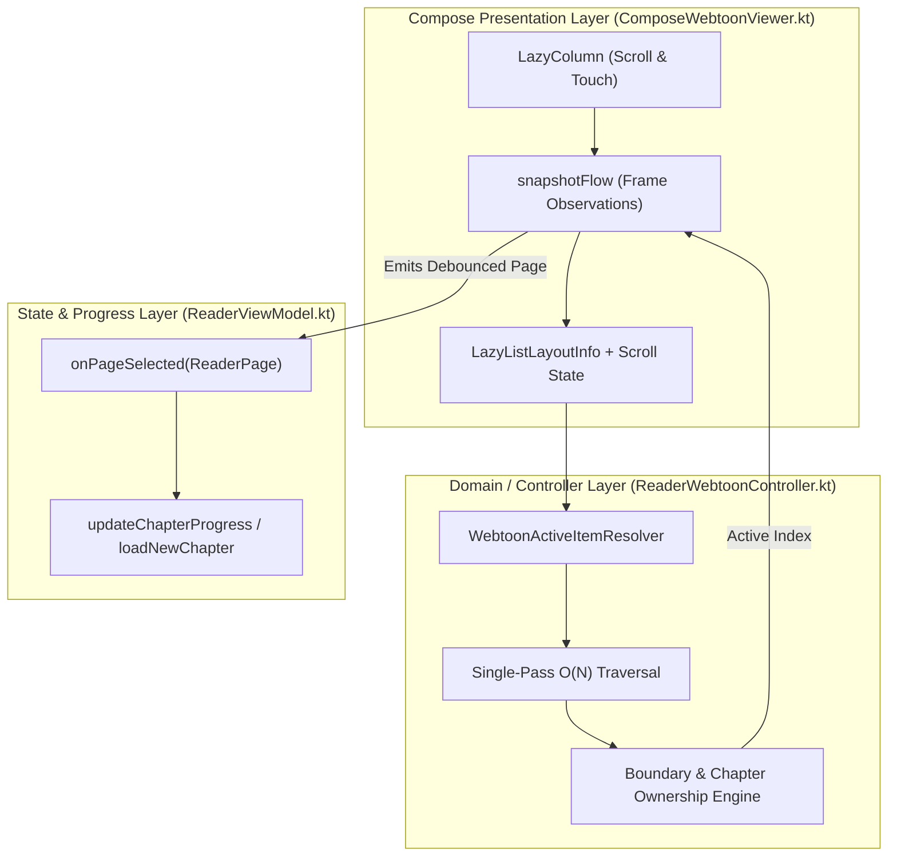

# Technical Proposal: Zero-Allocation Webtoon Active Page Resolver & Boundary Architecture

**Status:** Proposed / Architectural Blueprint  
**Author:** Neko Development Team  
**Date:** September 2026  
**Target Milestone:** Neko Reader Phase 4  
**Issue Reference:** [Issue #3347](https://github.com/nekomangaorg/Neko/issues/3347)  
**Implementation State:** 🟡 Design Approved (Option B: Pure Domain Extraction with Zero-Allocation Traversal & Unit Tests)  

---

## 📌 Context & Problem Statement

### 1. The Root Cause of Issue #3347
In Neko's Jetpack Compose Webtoon reader ([`ComposeWebtoonViewer.kt`](file:///run/media/nonproto/WD4T/programming/workspace-android/Neko/app/src/main/java/org/nekomanga/presentation/screens/reader/viewer/ComposeWebtoonViewer.kt)), readers navigate through continuous vertical strips comprised of previous chapter pages, chapter transitions, current chapter pages, and next chapter pages.

When opening a chapter with a series of small aspect-ratio images:
1. **Unmeasured Height Collapse**: Pages initially display with an unmeasured placeholder height (`Size.extraLarge * 10 = 240.dp`). Once images decode and scale to their native aspect ratio, the cumulative chapter height shrinks significantly (e.g., 5 small panels totaling 250px on a 2400px screen).
2. **`LazyColumn` Backward Clamping**: Jetpack Compose `LazyColumn` enforces a layout constraint forbidding empty viewport space at the bottom of the scrollable range when items exist prior to the initial index. When the current chapter is shorter than the viewport, `LazyColumn` scrolls backwards to pull preceding items (`prevChapter` pages or `Transition.Prev`) onto the upper 80–90% of the screen.
3. **Flawed `viewportMiddle` Resolution**: In [`ComposeWebtoonViewer.kt`](file:///run/media/nonproto/WD4T/programming/workspace-android/Neko/app/src/main/java/org/nekomanga/presentation/screens/reader/viewer/ComposeWebtoonViewer.kt#L258-L285), `snapshotFlow` determines the active item by checking which item spans `viewportMiddle`. Because preceding chapter items occupy the top ~2000px of the screen, `viewportMiddle` (1200px) lands on a page from the *previous* chapter.
4. **Premature Backward Navigation**: `snapshotFlow` emits the previous chapter's page to `onPageSelected()`. In [`ReaderViewModel.kt`](file:///run/media/nonproto/WD4T/programming/workspace-android/Neko/app/src/main/java/eu/kanade/tachiyomi/ui/reader/ReaderViewModel.kt#L604-L608), `if (selectedChapter != currentChapters.currChapter)` immediately invokes `loadNewChapter(prevChapter)`, reloading the reader and causing the viewer to snap backward to the previous chapter immediately upon opening.

---

### 2. Emerging Secondary Flaws in Naive Fixes

During the initial iterations to solve #3347, two severe production flaws were identified:

1. **Short Chapter Auto-Completion Bug**:
   When reading a one-shot or short chapter shorter than the screen height where all pages sit in the top half (e.g., 0px to 300px on a 2400px screen):
   `viewportMiddle` (1200px) extends beyond `lastItem.bottom` (300px).
   A naive fallback picking the item closest to `viewportMiddle` selects Page 3 (middle = 250px, distance = 950px) over Page 1 (middle = 50px, distance = 1150px).
   This causes the reader to mark the final page as active **on the very first frame**, triggering [`ReaderViewModel.updateChapterProgressOnComplete()`](file:///run/media/nonproto/WD4T/programming/workspace-android/Neko/app/src/main/java/eu/kanade/tachiyomi/ui/reader/ReaderViewModel.kt#L650-L666) and marking the chapter as **READ** in the database before the user has touched the screen.

2. **120Hz Scroll Allocation Storm**:
   Placing chained collection operations (`visibleItems.filter { }.filter { }.minByOrNull { }`) inside `snapshotFlow` allocates multiple `ArrayList`s, iterators, and lambda closures on every scroll frame (up to 120 times/sec during flings), triggering GC pressure and frame drops on high-refresh-rate devices.

---

## 2. Architectural Design (Option B)

To guarantee 100% testability and zero UI allocations, the resolution logic is decoupled from Jetpack Compose into a pure Kotlin domain calculator inside [`ReaderWebtoonController.kt`](file:///run/media/nonproto/WD4T/programming/workspace-android/Neko/app/src/main/java/eu/kanade/tachiyomi/ui/reader/viewer/webtoon/ReaderWebtoonController.kt).



---

## 3. Specification: `WebtoonActiveItemResolver`

### 3.1 Input Contract (Pure Kotlin Interface)

To allow execution under standard JVM JUnit unit tests without Android or Compose runtime dependencies, we define a lightweight input contract:

```kotlin
data class VisibleItemBounds(
    val index: Int,
    val offset: Int,
    val size: Int,
) {
    val bottom: Int get() = offset + size
    val middle: Int get() = offset + size / 2
}
```

### 3.2 Resolution Algorithm Specification

The resolver operates in a **single $O(N)$ pass** over the visible item bounds with zero heap allocations:

```kotlin
class WebtoonActiveItemResolver {

    fun resolveActiveIndex(
        visibleItems: List<VisibleItemBounds>,
        currentItems: List<ReaderUiItem>,
        activeChapterId: Long?,
        viewportStartOffset: Int,
        viewportEndOffset: Int,
        firstVisibleIndex: Int,
        firstVisibleScrollOffset: Int,
    ): Int {
        if (visibleItems.isEmpty()) {
            return firstVisibleIndex
        }

        val viewportMiddle = (viewportStartOffset + viewportEndOffset) / 2

        // Single-pass tracking variables (zero heap allocations)
        var firstCurrentItemIndex = -1
        var lastCurrentItemIndex = -1
        var lastCurrentItemBottom = Int.MIN_VALUE

        var itemSpanningMiddleIndex = -1
        var closestDistanceToMiddle = Int.MAX_VALUE
        var closestItemIndex = -1

        var closestNonPrecedingDistance = Int.MAX_VALUE
        var closestNonPrecedingIndex = -1

        for (i in visibleItems.indices) {
            val item = visibleItems[i]
            val uiItem = currentItems.getOrNull(item.index)

            val isCurrentChapterPage = when (uiItem) {
                is ReaderUiItem.Page -> uiItem.page.chapter.chapter.id == activeChapterId
                is ReaderUiItem.SplitPage -> uiItem.page.chapter.chapter.id == activeChapterId
                else -> false
            }

            if (isCurrentChapterPage) {
                if (firstCurrentItemIndex == -1) {
                    firstCurrentItemIndex = item.index
                }
                lastCurrentItemIndex = item.index
                lastCurrentItemBottom = item.bottom
            }

            // Check if item spans viewport middle
            if (viewportMiddle in item.offset until item.bottom) {
                itemSpanningMiddleIndex = item.index
            }

            // Track closest item to viewport middle overall
            val dist = kotlin.math.abs(item.middle - viewportMiddle)
            if (dist < closestDistanceToMiddle) {
                closestDistanceToMiddle = dist
                closestItemIndex = item.index
            }
        }

        val hasCurrentChapterItems = firstCurrentItemIndex != -1

        // Scenario 1: Reader is anchored at the start of the current chapter
        if (hasCurrentChapterItems &&
            firstVisibleIndex == firstCurrentItemIndex &&
            firstVisibleScrollOffset == 0
        ) {
            return firstCurrentItemIndex
        }

        // Scenario 2: Item spanning middle is valid
        if (itemSpanningMiddleIndex != -1) {
            val isPrecedingItemWhileChapterVisible =
                hasCurrentChapterItems && itemSpanningMiddleIndex < firstCurrentItemIndex

            if (!isPrecedingItemWhileChapterVisible) {
                return itemSpanningMiddleIndex
            }
        }

        // Scenario 3: Viewport middle is beyond the current chapter content
        if (hasCurrentChapterItems) {
            if (viewportMiddle >= lastCurrentItemBottom) {
                // Find closest non-preceding item (forward progression)
                for (i in visibleItems.indices) {
                    val item = visibleItems[i]
                    if (item.index >= firstCurrentItemIndex) {
                        val dist = kotlin.math.abs(item.middle - viewportMiddle)
                        if (dist < closestNonPrecedingDistance) {
                            closestNonPrecedingDistance = dist
                            closestNonPrecedingIndex = item.index
                        }
                    }
                }
                return if (closestNonPrecedingIndex != -1) closestNonPrecedingIndex else lastCurrentItemIndex
            }

            // Inside current chapter bounds: find closest current chapter item
            var closestCurrentDistance = Int.MAX_VALUE
            var closestCurrentIndex = firstCurrentItemIndex
            for (i in visibleItems.indices) {
                val item = visibleItems[i]
                if (item.index in firstCurrentItemIndex..lastCurrentItemIndex) {
                    val dist = kotlin.math.abs(item.middle - viewportMiddle)
                    if (dist < closestCurrentDistance) {
                        closestCurrentDistance = dist
                        closestCurrentIndex = item.index
                    }
                }
            }
            return closestCurrentIndex
        }

        // Scenario 4: Current chapter completely scrolled off-screen
        return if (closestItemIndex != -1) closestItemIndex else visibleItems.first().index
    }
}
```

---

## 4. Critical Edge Cases Matrix

| Category | Scenario | Expected Behavior | Failure Mode Prevented |
| :--- | :--- | :--- | :--- |
| **Short Chapter Open** | Chapter 2 has 3 small images (height 150px); opens at top | Resolves to Page 1 (`firstCurrentItemIndex`) | Prevents false chapter auto-read completion bug |
| **Issue #3347 (Clamping)** | `LazyColumn` clamps backwards; prev chapter covers middle | Resolves to Page 1 of current chapter | Prevents unwanted jump back to previous chapter |
| **Normal Forward Reading** | User scrolls down; current page spans viewport middle | Resolves to spanning page | Preserves standard reading flow |
| **Inter-Chapter Transition** | User scrolls past chapter end; `Transition.Next` hits middle | Resolves to `Transition.Next`, then next chapter | Allows seamless forward reading progression |
| **Intentional Backwards Scroll** | User scrolls up until current chapter leaves screen | Resolves to previous chapter page | Allows manual backward chapter navigation |
| **High-Refresh-Rate Fling** | Rapid 120Hz scroll gesture across 50 items | Zero heap allocations during loop | Prevents GC churn, frame drops, and micro-stutter |
| **Unloaded/Empty Chapter** | Chapter with 0 pages or before initial layout pass | Returns `firstVisibleIndex` fallback | Eliminates `NoSuchElementException` crashes |

---

## 5. Performance & Allocation Analysis

| Metric | Previous Implementation | Proposed Domain Resolver |
| :--- | :--- | :--- |
| **Heap Allocations per Frame** | ~4–6 objects (`ArrayList`s, iterators, closures) | **0 objects** (primitive loop variables) |
| **Time Complexity** | $O(3N)$ multiple filtering passes | **$O(N)$** single pass traversal |
| **Display Refresh Resilience** | High GC pressure at 120 FPS | Zero GC pressure |
| **Unit Testability** | 0% (trapped in Compose `snapshotFlow`) | **100% pure JUnit testable** |

---

## 6. Implementation Roadmap

### Phase 1: Controller & Domain Layer
1. Add `WebtoonActiveItemResolver` to `eu.kanade.tachiyomi.ui.reader.viewer.webtoon`.
2. Add unit tests in `app/src/test/java/eu/kanade/tachiyomi/ui/reader/viewer/webtoon/WebtoonActiveItemResolverTest.kt` verifying all scenarios in the Edge Cases Matrix.

### Phase 2: Compose UI Wiring
1. In [`ComposeWebtoonViewer.kt`](file:///run/media/nonproto/WD4T/programming/workspace-android/Neko/app/src/main/java/org/nekomanga/presentation/screens/reader/viewer/ComposeWebtoonViewer.kt), map `lazyListState.layoutInfo.visibleItemsInfo` to `VisibleItemBounds` and delegate active index calculation to `WebtoonActiveItemResolver`.
2. Keep `contentPadding` standard (`if (hasMargins) Size.medium else Size.none`), eliminating excessive bottom void.

### Phase 3: Verification
1. Run `./gradlew ktfmtFormat`.
2. Run unit tests (`*WebtoonActiveItemResolverTest*`).
3. Validate working tree cleanliness and prepare conventional commit.
