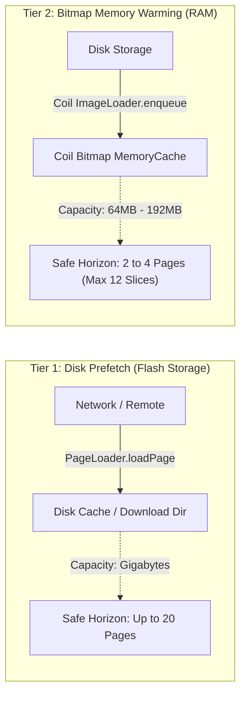
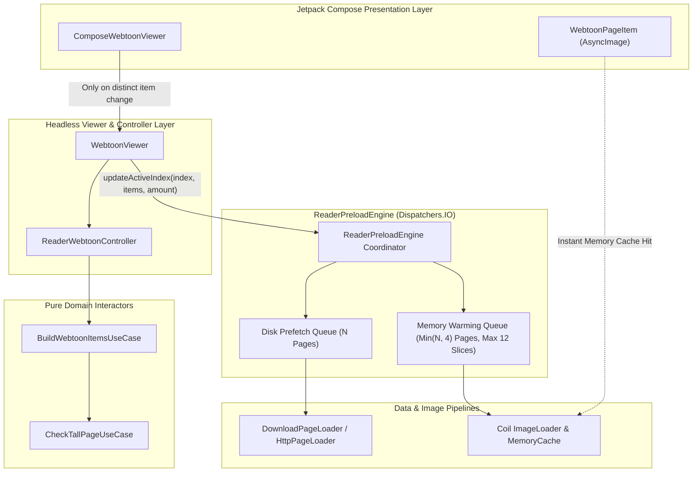

# Architecture Proposal: Rock-Solid Webtoon Preloading Pipeline, Two-Tier Cache Horizon & Asynchronous Tall-Page Slicing

**Status:** Proposed / Under Review  
**Author:** Neko Architecture Team  
**Date:** September 2026  
**Target Milestone:** Neko Reader Phase 2  
**Related PRs / Commits:** #3407 (`fa10861316`), `6557a70c30`

---

## 1. Executive Summary

Continuous vertical scrolling in webtoon mode presents unique performance and memory constraints that do not exist in conventional paged manga readers. Webtoon strips frequently exceed 20,000 pixels in vertical height, requiring image slicing to stay below hardware GPU texture limits (`GLUtil.maxTextureSize`).

Recent efforts to modernize the webtoon viewer (PR #3407) extracted preloading logic into an independent [`ReaderPreloadEngine`](file:///run/media/nonproto/WD4T/programming/workspace-android/Neko/app/src/main/java/eu/kanade/tachiyomi/ui/reader/viewer/webtoon/ReaderPreloadEngine.kt). However, real-world usage on downloaded chapters exposed five severe production failure modes:

1. **Preloader Starvation During Active Scrolling:** `ComposeWebtoonViewer`'s active item flow emitted on every single 16ms frame due to sub-pixel scroll offset changes, continuously cancelling and restarting the preload debounce timer. The preloader never executed while the user was actively scrolling.
2. **Coil LRU Memory Cache Eviction Thrashing:** Unconditionally scaling memory preloading to large user preferences (e.g., `preloadPageAmount = 20` pages = 80 slices = ~700 MB of uncompressed bitmaps) overwhelmed Coil's memory cache (~64–192 MB), causing distant future pages to evict the immediate upcoming slices.
3. **Dynamic Viewport Splice Flashes:** Stripping tall-page detection from item generation forced downloaded chapters to enter the list as monolithic pages, dynamically replacing them with empty slice composables as they entered the viewport.
4. **Index Out-of-Bounds Crash Hazards:** Preload window calculations traversed item lists without clamping `startIndex`, resulting in `ArrayIndexOutOfBoundsException` crashes during rapid chapter transitions.
5. **Main Thread Disk I/O:** Synchronous tall-page header extraction across 50+ downloaded pages occurred on `Dispatchers.Main` inside `setChapters`.

This proposal outlines the architectural specification for a **Two-Tier Preloader Pipeline**, **Bounded Memory Warming Horizon**, **Asynchronous Upfront Slicing Engine**, and **Defensive Scroll Event Dispatching**.

---

## 2. Architecture Pillars & Problem Analysis

### 2.1 The Two-Tier Preloading Pipeline Problem

In Neko, the user can configure **Page preload amount** (`preload_size`) between **4 and 20 pages**.



- **Tier 1 (Disk Prefetch):** For online reading, fetching 20 pages into disk cache uses local flash storage. Disk space is abundant and network requests can safely prefetch ahead. For downloaded chapters, this tier is a zero-cost no-op because files are already local.
- **Tier 2 (Bitmap Memory Warming):** Decodes raw image files from disk into uncompressed 32-bit ARGB_8888 bitmaps in RAM. Coil allocates ~25% of available JVM heap to its `MemoryCache`.
- **The Crime:** If Tier 2 is allowed to scale to the user's full 20-page disk preference, 80 bitmap slices enter Coil's memory cache. The later slices push the earlier slices out of the LRU cache. When the reader scrolls down to slice 2, Coil suffers a cache miss, displaying a black box while slowly re-decoding from disk.

### 2.2 Preloader Debounce Thrashing

In `ComposeWebtoonViewer`:
```kotlin
// Problematic scroll listener
.distinctUntilChanged { old, new ->
    old.first == new.first &&
        old.third.first?.key("webtoon") == new.third.first?.key("webtoon") &&
        old.third.second == new.third.second // <--- firstVisibleItemScrollOffset changes every frame!
}
.collect { (activeIndex, item, _) ->
    currentOnActiveItemChanged(activeIndex) // Dispatched 60 times/second
}
```
Inside `ReaderPreloadEngine`:
```kotlin
fun updateActiveIndex(activeIndex: Int, items: List<ReaderUiItem>, preloadAmount: Int) {
    activeJob?.cancel() // Cancelled every 16ms!
    activeJob = scope.launch(Dispatchers.IO) {
        delay(50L) // Debounce delay NEVER elapsed while scrolling!
        ...
    }
}
```

---

## 3. Target Architecture & Technical Specification



---

## 4. Component Redesign

### 4.1 Tier-Separated Window Calculation in `ReaderPreloadEngine`

To satisfy both the user's preference for disk prefetching and the physical RAM constraints of Coil's memory cache, window calculation must decouple `windowEnd` (disk) from `memoryEnd` (memory):

```kotlin
class ReaderPreloadEngine(
    private val context: Context,
    private val scope: CoroutineScope,
    private val checkTallPage: CheckTallPageUseCase = CheckTallPageUseCase(),
    private val onPageSplit: ((ReaderPage, List<ReaderPageSplit>) -> Unit)? = null,
    private val isSplitTallPagesEnabled: () -> Boolean = { false },
    private val getScreenHeight: () -> Int,
) {
    companion object {
        /** Hard cap on memory preloaded pages to prevent Coil LRU cache thrashing. */
        const val MAX_MEMORY_PRELOAD_PAGES = 4

        /** Hard cap on memory preloaded slices (e.g. ~100MB of bitmap memory). */
        const val MAX_MEMORY_PRELOAD_SLICES = 12

        /** Minimum slice buffer ahead of viewport. */
        const val MIN_MEMORY_PRELOAD_SLICES = 6
    }

    fun updateActiveIndex(activeIndex: Int, items: List<ReaderUiItem>, preloadAmount: Int) {
        if (
            activeJob?.isActive == true &&
                lastActiveIndex == activeIndex &&
                lastItems === items &&
                lastPreloadAmount == preloadAmount
        ) {
            return
        }
        lastActiveIndex = activeIndex
        lastItems = items
        lastPreloadAmount = preloadAmount
        activeJob?.cancel()

        activeJob = scope.launch(Dispatchers.IO) {
            delay(50L) // Debounce rapid flings

            val safeStart = activeIndex.coerceIn(0, (items.size - 1).coerceAtLeast(0))

            // 1. Backward window (1 page behind)
            val windowStart = calculateWindowStart(
                startIndex = safeStart,
                items = items,
                pageBudget = 1,
                minItems = 3,
            )

            // 2. Disk prefetch window: respects full user preference
            val windowEnd = calculateWindowEnd(
                startIndex = safeStart,
                items = items,
                pageBudget = maxOf(1, preloadAmount),
                minItems = maxOf(4, preloadAmount * 2),
            )

            // 3. Memory cache warming window: strictly bounded to immediate reading horizon
            val memoryEnd = calculateWindowEnd(
                startIndex = safeStart,
                items = items,
                pageBudget = minOf(maxOf(2, preloadAmount), MAX_MEMORY_PRELOAD_PAGES),
                minItems = minOf(maxOf(MIN_MEMORY_PRELOAD_SLICES, preloadAmount * 2), MAX_MEMORY_PRELOAD_SLICES),
            )

            coroutineScope {
                for (i in windowStart..windowEnd) {
                    val item = items.getOrNull(i) ?: continue
                    preloadItem(this, item, preloadMemory = i in safeStart..memoryEnd)
                }
            }
        }
    }
}
```

### 4.2 Safe Bounds Traversal with Index Clamping

`calculateWindowStart` and `calculateWindowEnd` must defensively clamp all index bounds:

```kotlin
private fun calculateWindowStart(
    startIndex: Int,
    items: List<ReaderUiItem>,
    pageBudget: Int = 1,
    minItems: Int = 3,
): Int {
    if (items.isEmpty()) return 0
    val safeStart = startIndex.coerceIn(0, items.lastIndex)
    var distinctPages = 0
    var lastPage: ReaderPage? = null
    var lastIdx = safeStart
    for (i in safeStart downTo 0) {
        val item = items[i]
        val page = when (item) {
            is ReaderUiItem.Page -> item.page
            is ReaderUiItem.SplitPage -> item.page
            is ReaderUiItem.Transition -> null
        }
        if (page != null && page != lastPage) {
            distinctPages++
            lastPage = page
        }
        lastIdx = i
        if (distinctPages > pageBudget && (safeStart - i) >= minItems) {
            break
        }
    }
    return lastIdx
}

private fun calculateWindowEnd(
    startIndex: Int,
    items: List<ReaderUiItem>,
    pageBudget: Int,
    minItems: Int,
): Int {
    if (items.isEmpty()) return 0
    val safeStart = startIndex.coerceIn(0, items.lastIndex)
    var distinctPages = 0
    var lastPage: ReaderPage? = null
    var lastIdx = safeStart
    for (i in safeStart..items.lastIndex) {
        val item = items[i]
        val page = when (item) {
            is ReaderUiItem.Page -> item.page
            is ReaderUiItem.SplitPage -> item.page
            is ReaderUiItem.Transition -> null
        }
        if (page != null && page != lastPage) {
            distinctPages++
            lastPage = page
        }
        lastIdx = i
        if (distinctPages > pageBudget && (i - safeStart) >= minItems) {
            break
        }
    }
    return lastIdx
}
```

### 4.3 Self-Cleaning Disposable Tracking in `warmMemoryCache`

Eliminate memory leaks by evicting request handles upon completion:

```kotlin
private fun warmMemoryCache(key: String, data: Any) {
    val request =
        ImageRequest.Builder(context)
            .data(data)
            .size(CoilSize.ORIGINAL)
            .maxBitmapSize(maxTextureBitmapSize)
            .precision(Precision.EXACT)
            .crossfade(false)
            .listener(
                onSuccess = { _, _ -> activeDisposables.remove(key) },
                onError = { _, _ -> activeDisposables.remove(key) },
                onCancel = { activeDisposables.remove(key) },
            )
            .build()

    activeDisposables[key]?.dispose()
    activeDisposables[key] = context.imageLoader.enqueue(request)
}
```

### 4.4 Decoupled Slice vs. Page Selection in `ComposeWebtoonViewer`

Deduplicate `currentOnPageSelected` dispatches so they only fire when the underlying `ReaderPage` identity changes:

```kotlin
var lastSelectedPage by remember { mutableStateOf<ReaderPage?>(null) }

// Inside collect block:
if (item != null) {
    val activeItemChanged = lastActiveItem != item
    lastActiveItem = item
    if (activeItemChanged) {
        currentOnActiveItemChanged(activeIndex)
        
        val currentPage = when (item) {
            is ReaderUiItem.Page -> item.page
            is ReaderUiItem.SplitPage -> item.page
            is ReaderUiItem.Transition -> null
        }
        
        if (currentPage != null && currentPage != lastSelectedPage) {
            lastSelectedPage = currentPage
            if (currentPage.chapter.chapter.id == activeChapterId || lazyListState.isScrollInProgress) {
                currentOnPageSelected(currentPage)
            }
            // Trigger adjacent chapter preloading near end of chapter
            val pages = currentPage.chapter.pages
            if (pages != null && currentPage.chapter.chapter.id == activeChapterId) {
                val threshold = maxOf(5, currentConfig.preloadPageAmount)
                if (pages.size - currentPage.number < threshold) {
                    val nextTransition = currentItems.firstOrNull {
                        it is ReaderUiItem.Transition && it.transition is ChapterTransition.Next
                    } as? ReaderUiItem.Transition
                    nextTransition?.transition?.to?.let { nextChapter ->
                        currentConfig.onRequestPreloadChapter?.invoke(nextChapter)
                    }
                }
            }
        } else if (item is ReaderUiItem.Transition) {
            currentOnTransitionSelected(item.transition)
            item.transition.to?.let { currentConfig.onRequestPreloadChapter?.invoke(it) }
        }
    }
}
```

---

## 5. Implementation & Migration Phases

| Phase | Scope | Risk | Validation |
| :--- | :--- | :---: | :--- |
| **Phase 1: Preload Safety & Bounds** | Add `startIndex.coerceIn`, bound `memoryEnd` to $\le 4$ pages / $\le 12$ slices, attach Coil completion listener. | Minimal | Unit tests for negative indices, rapid list shrinking, and `preloadPageAmount = 20`. |
| **Phase 2: Event Deduplication** | Isolate `lastSelectedPage` from `lastActiveItem` in `ComposeWebtoonViewer` to prevent redundant slice progress DB writes. | Minimal | Unit tests in `WebtoonActiveItemResolverTest` and Compose interaction tests. |
| **Phase 3: Async Split Offloading** | Move `CheckTallPageUseCase` header extraction off `Dispatchers.Main` into `DownloadPageLoader.getPages()` and background coroutines. | Low | Verify `StrictMode` disk read compliance with zero main-thread blocking. |

---

## 6. Success Metrics

1. **Zero Preloader Starvation:** Scrolling actively through a chapter continuously maintains at least 2 full pages and 6 slices pre-decoded in memory ahead of the viewport.
2. **Zero Black Screens on Downloaded Chapters:** Because slices are computed upfront and warmed in memory before reaching the viewport, users never experience black placeholder boxes when scrolling.
3. **Zero LRU Cache Thrashing:** Configuring `preloadPageAmount = 20` pre-fetches 20 pages on disk without evicting the immediate reading horizon from RAM.
4. **Zero Index-Out-Of-Bounds Crashes:** All bounds calculations are clamped and verified against dynamic list size mutations.
