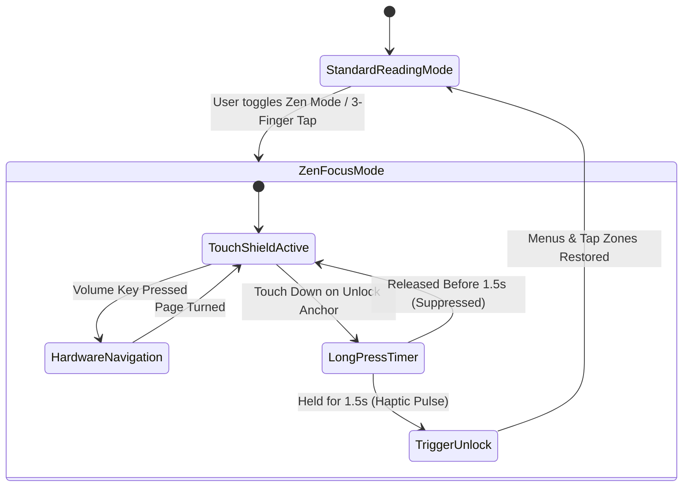

# Technical Proposal: Zen Focus Reading Mode & Touch Shield

**Status:** Proposed / Under Review  
**Author:** Neko Development Team  
**Date:** August 2026  
**Target Milestone:** Neko 3.3 Reader Polish & Ergonomics  
**Implementation State:** 🟡 Partially Present Baseline (Fullscreen & Hide Page Numbers exist; Touch Shield & Focus Lock are New)  

---

## 📌 Codebase Audit & Baseline Notes

> [!NOTE]
> **Current Codebase Baseline:**
> Neko already provides individual reader toggles for fullscreen mode ([`ReaderPreferences.fullscreen()`](file:///run/media/nonproto/WD4T/programming/workspace-android/Neko/app/src/main/java/org/nekomanga/domain/reader/ReaderPreferences.kt#L28)), hiding page numbers ([`ReaderPreferences.showPageNumber()`](file:///run/media/nonproto/WD4T/programming/workspace-android/Neko/app/src/main/java/org/nekomanga/domain/reader/ReaderPreferences.kt#L24)), cropping borders, and hiding toolbars on tap.
>
> **What This Proposal Adds:**
> A dedicated, unified Focus Lock with Touch Shield. When active, all touch interaction zones are shielded to prevent accidental page turns or menu triggers (ideal when reading in bed or transit). Navigation is routed exclusively through volume buttons or external controllers, unlocked with a firm 1.5-second haptic long-press, paired with an ultra-dim night luminance filter.

---

## 1. Executive Summary & Vision

Reading manga or webtoons on handheld mobile devices often leads to accidental screen touches, unintended page skipping, unwanted overlay prompts, and visual distraction from system cutouts or notification bars.

While Neko provides individual granular settings (such as hiding page numbers, hiding status bars, and toggling fullscreen), there is no unified **Zen Focus Reading Mode** that locks down touch inputs and maximizes art immersion.

### The Objective
This proposal introduces a dedicated **Zen Focus Reading Mode & Touch Shield** in Neko's Reader module. When activated, all touch interaction zones for menus and page turns are shielded against accidental taps, all non-essential UI is suppressed, and navigation is handed over exclusively to hardware volume buttons or dedicated low-friction gesture zones with a haptic unlock mechanism.

### Key Highlights:
1. **1-Tap Quick Zen Mode Toggle**: Accessible directly from the Reader bottom toolbar or via a configurable multi-tap shortcut (e.g. three-finger tap).
2. **Touch Shield (Accidental Tap Protection)**: Suppresses accidental single-tap menu triggers and unintentional page flips while reading in bed, transit, or with one hand.
3. **Hardware & Sub-surface Navigation**: Supports volume rocker page turns, bluetooth remote controllers, or gentle edge-swipe gestures while Zen Mode is engaged.
4. **Haptic Long-Press Escape**: Safe, intuitive exit mechanism—long-pressing any corner of the screen for 1.5 seconds triggers a subtle haptic feedback vibration to unlock controls.
5. **Ultra-Dim Night Reading Filter**: An optional sub-zero software luminance filter built into Zen Mode to reduce eye strain in complete darkness below Android's default minimum brightness.

---

## 2. Architectural Design



---

## 3. Core Domain & Data Layer Changes

### 3.1 Reader Preferences Extension ([ReaderPreferences.kt](file:///run/media/nonproto/WD4T/programming/workspace-android/Neko/app/src/main/java/org/nekomanga/domain/reader/ReaderPreferences.kt))

```kotlin
fun zenModeEnabled() = this.preferenceStore.getBoolean("pref_zen_mode_key", false)
fun zenModeTouchShield() = this.preferenceStore.getBoolean("pref_zen_touch_shield", true)
fun zenModeUltraDim() = this.preferenceStore.getBoolean("pref_zen_ultra_dim", false)
fun zenModeUltraDimLevel() = this.preferenceStore.getInt("pref_zen_ultra_dim_level", 25) // 0 - 100%
```

### 3.2 Reader UI State Extension

```kotlin
data class ReaderZenState(
    val isZenModeActive: Boolean = false,
    val isTouchShieldLocked: Boolean = false,
    val unlockProgress: Float = 0.0f, // 0.0 to 1.0 during long press
)
```

---

## 4. UI / UX Design Specifications

### 4.1 Activation & Overlay Hiding ([ReaderActivity.kt](file:///run/media/nonproto/WD4T/programming/workspace-android/Neko/app/src/main/java/eu/kanade/tachiyomi/ui/reader/ReaderActivity.kt))
- When Zen Mode is engaged:
  - System status bar and navigation pill are set to `BEHAVIOR_DEFAULT` immersive hide.
  - Page number badge, transition overlays, and bottom sheet triggers disappear with a smooth fade.
  - A discreet padlock icon 🔒 briefly pulses in the top-right corner before fading to 0% opacity.

### 4.2 Haptic Unlock Experience
- When the screen is touched during Touch Shield mode, a tiny circular progress ring tracks the hold duration at the touch point.
- Upon reaching 1.5 seconds, a firm haptic click (`HapticFeedbackType.LongPress` / `VibrationEffect.EFFECT_CLICK`) confirms unlock and smoothly restores reader toolbars.

---

## 5. Technical Footprint & Integration

1. **Reader Activity & Viewers**:
   - Update `ReaderActivity.kt` and `BaseViewer.kt` to intercept touch events via `dispatchTouchEvent` when `isTouchShieldLocked` is active.
   - Forward volume key events directly to `viewer.moveToNext()` / `viewer.moveToPrevious()`.
2. **Reader Toolbar**:
   - Add `ReaderBottomButton.ZenMode` to `ReaderBottomButton.kt`.
3. **Settings Screen**:
   - Add a "Zen Mode & Ergonomics" group to [ReaderSettingsScreen.kt](file:///run/media/nonproto/WD4T/programming/workspace-android/Neko/app/src/main/java/org/nekomanga/presentation/screens/settings/screens/ReaderSettingsScreen.kt).

---

## 6. Implementation Plan & Milestones

- [ ] **Step 1**: Implement `ReaderZenState` and preference bindings.
- [ ] **Step 2**: Build the Touch Shield event interceptor and haptic long-press unlock animation in Compose.
- [ ] **Step 3**: Integrate software ultra-dim color shader overlay for dark reading.
- [ ] **Step 4**: Add bottom toolbar toggle and reader gesture shortcuts.
